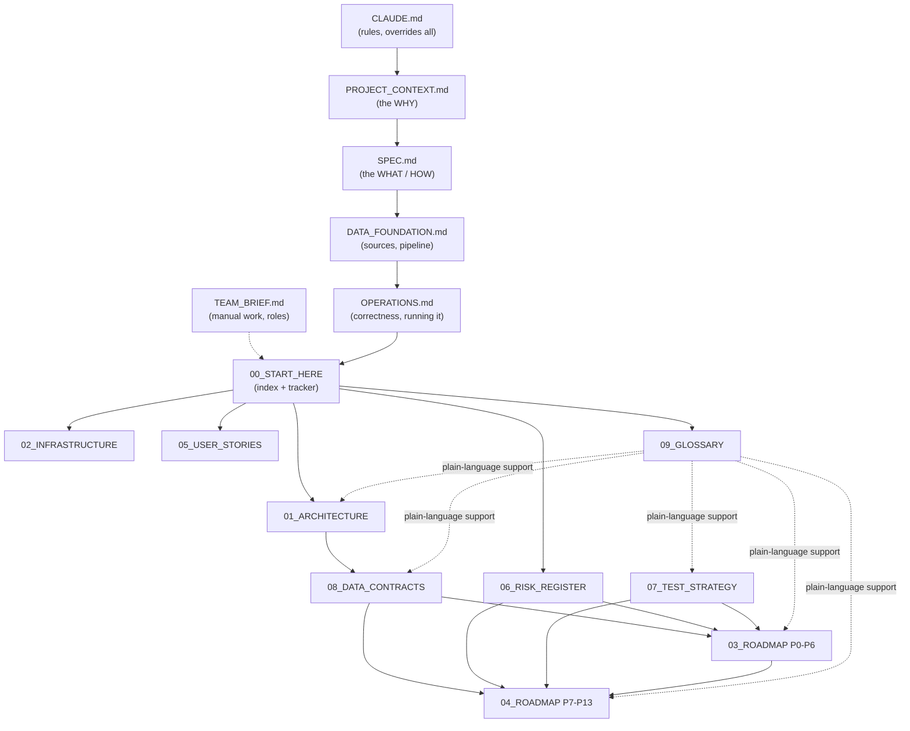
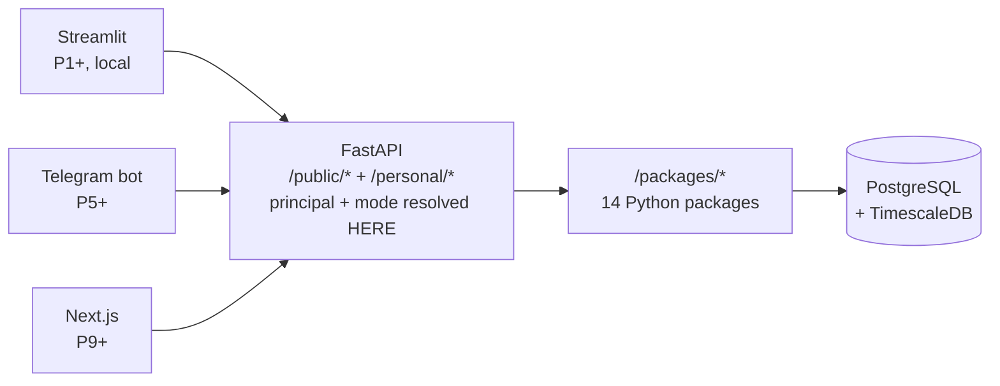

# 00 — START HERE

**What this document is for.** This is the entry point to the build plan for `quant_model`.
The six documents in the repository root (`CLAUDE.md`, `PROJECT_CONTEXT.md`, `SPEC.md`,
`DATA_FOUNDATION.md`, `OPERATIONS.md`, `TEAM_BRIEF.md`) describe *what the system is and
why*. This `docs/` set describes *how it gets built, in what order, and how you prove at
each step that it actually works*. If you are picking this up cold — or picking it up again
after three months away — read this file first, then follow the reading order in §4.

**Status as of 2026-08-30:** nothing has been built. The repository contains the six
specification documents, this `docs/` set, an empty `package.json`, and `node_modules/`.
There is no `.git`, no Python 3.12, no database, no code. We are at **P0, not started**.

> **A seven-reviewer pre-build audit ran on 2026-08-30.** It found defects that would have
> stopped the first migration from running and left two gates unfalsifiable. Its findings and
> the exact fix for each are in **[10_PRE_BUILD_CORRECTIONS](10_PRE_BUILD_CORRECTIONS.md)**,
> which now has the highest precedence in the set. **Read it before P0.** Some corrections are
> already applied to these files; the rest are marked 🔧 with the text to write.

---

## Table of contents

1. [The one-paragraph version](#1-the-one-paragraph-version)
2. [The document set](#2-the-document-set)
3. [How the documents relate to each other](#3-how-the-documents-relate-to-each-other)
4. [Reading order — three routes depending on why you are here](#4-reading-order)
5. [The canonical phase map — P0 to P13](#5-the-canonical-phase-map)
6. [WHERE WE ARE — the live progress tracker](#6-where-we-are--the-live-progress-tracker)
7. [The rules that override everything](#7-the-rules-that-override-everything)
8. [Architecture decisions already made](#8-architecture-decisions-already-made)
9. [The master gap register — TG1 to TG23](#9-the-master-gap-register--tg1-to-tg20)
10. [How to use this set while building](#10-how-to-use-this-set-while-building)
11. [Conventions used throughout](#11-conventions-used-throughout)
12. [Keeping these documents true](#12-keeping-these-documents-true)

---

## 1. The one-paragraph version

We are building a centralised financial data hub for Nigerian and US listed companies:
financial statements, historical data, macroeconomic backdrop, news, and valuation tools.
The hard and valuable part is turning Nigerian financial PDFs into clean, queryable,
provenance-tracked data — nobody has done this well, and the dataset is the moat. On top of
that data layer sits a quantitative stack: technical indicators, a rigorous backtesting
harness, calibrated machine-learning signals, multi-agent research memos, portfolio
tracking, and eventually execution. The system runs in two modes from a single codebase:
**personal mode** (the owner and family — it may give direct BUY/SELL recommendations,
because it is their own capital) and **public mode** (everyone else — data only, no advice,
until an SEC licence is obtained). Build everything to public standard; restrict who can log
in, not what the system can do.

---

## 2. The document set

| # | Document | What it answers | Read it when |
|---|---|---|---|
| 00 | **START_HERE** (this file) | Where am I, what exists, what next | Every time you return |
| 01 | [Architecture](01_ARCHITECTURE.md) | What talks to what, and why | Before writing any code that crosses a boundary |
| 02 | [Infrastructure](02_INFRASTRUCTURE.md) | Where it runs, how it stays alive, what it costs | Setting up your machine, deploying, or when something breaks at 2am |
| 03 | [Roadmap Part 1 — P0–P6](03_ROADMAP_PART1_PHASES_0-6.md) | The build plan for the data foundation | Starting any phase from P0 to P6 |
| 04 | [Roadmap Part 2 — P7–P13](04_ROADMAP_PART2_PHASES_7-13.md) | The build plan for the quant and product stack | Starting any phase from P7 to P13 |
| 05 | [User Stories](05_USER_STORIES.md) | Who wants this, what they do with it, how we know it worked | Deciding whether a feature is worth building |
| 06 | [Risk Register](06_RISK_REGISTER.md) | What will go wrong, what won't, and what to do about it | Before committing to a phase; when something feels off |
| 07 | [Test Strategy](07_TEST_STRATEGY.md) | How to prove it works and isn't silently lying | At every phase gate, and when adding any feature |
| 08 | [Data Contracts](08_DATA_CONTRACTS.md) | Exact inputs and outputs for every module and table | Writing or calling any interface |
| 09 | [Glossary](09_GLOSSARY.md) | What every term means, in plain words | ⚠️ **Incomplete — only Section 1 of 10 exists.** See the notice at the top of the file |
| **10** | **[Pre-Build Corrections](10_PRE_BUILD_CORRECTIONS.md)** | **What the pre-build audit found wrong, and the exact fix for each** | **Before P0, and before touching the DDL, the mode gate, the backtest gate or the backup script. Highest precedence in the set.** |
| — | [UNIVERSE](UNIVERSE.md) | **Which 25 companies exist in this system**, and why each earns its place | Before collecting a single PDF. Changing it after a backtest invalidates that backtest |

**Source documents in the repository root** — these remain authoritative for *intent*; the
`docs/` set never contradicts them, only sequences and elaborates them:

| Document | Role | Precedence |
|---|---|---|
| `CLAUDE.md` | Operating rules for anyone (human or agent) working in this repo | Overrides all |
| `PROJECT_CONTEXT.md` | The why: thesis, access model, B2B/acquisition layer, standing rules | 1st |
| `SPEC.md` | The what/how: roadmap, DDL, monorepo, T1–T21, build invariants | 2nd |
| `DATA_FOUNDATION.md` | "Doc A": verified data sources, PDF pipeline, base schema, legal research | 3rd |
| `OPERATIONS.md` | Correctness gaps and running it for years | 4th |
| `TEAM_BRIEF.md` | Onboarding: manual work, roles, bottlenecks, stage gates | Context |

**Precedence when documents disagree** (matches [CLAUDE.md](../CLAUDE.md), amended 2026-08-30):
`10_PRE_BUILD_CORRECTIONS` → the ADRs in [01_ARCHITECTURE](01_ARCHITECTURE.md) §9 →
PROJECT_CONTEXT → the rest of `docs/` → SPEC → DATA_FOUNDATION → OPERATIONS.

If a `docs/` file contradicts a root file the root file wins and the `docs/` file is a bug —
**except** where the deviation is recorded as an ADR. Those are deliberate and dated, and they
override the root docs on the point they decide. Three are live: **ADR-0001** puts PostgreSQL
in P0, **ADR-0002** adds `/packages/scheduler` to SPEC.md §3.1's monorepo, and **ADR-0005**
stands FastAPI up in P0 rather than at SPEC.md's T16/v1.0.

---

## 3. How the documents relate to each other

In words: the root documents set intent. This index points at nine working documents.
**Architecture** defines the shape, which **Data Contracts** makes precise, which the two
**Roadmap** halves consume phase by phase. **Test Strategy** and **Risk Register** cut
across every phase. **User Stories** justify the work. **Glossary** supports all of them.

---

## 4. Reading order

Pick the route that matches why you opened this.

### Route A — "I am about to start building" (first time)
1. This file, all of it.
2. [10_PRE_BUILD_CORRECTIONS](10_PRE_BUILD_CORRECTIONS.md) — all of it. It is the shortest
   file here and it changes the DDL, two gates, and the backup script.
3. [09_GLOSSARY](09_GLOSSARY.md) — skim it, knowing only Section 1 of 10 was written; you
   need to know it exists so you can look things up without breaking flow.
3. [01_ARCHITECTURE](01_ARCHITECTURE.md) — the whole thing. This is the mental model.
4. [06_RISK_REGISTER](06_RISK_REGISTER.md) §2 "The short list" and §3 "Things you do not
   need to worry about" — 20 minutes, and it recalibrates where your attention should go.
5. [02_INFRASTRUCTURE](02_INFRASTRUCTURE.md) §2 local development — get your machine ready.
6. [03_ROADMAP_PART1](03_ROADMAP_PART1_PHASES_0-6.md) P0 — and start.

### Route B — "I am starting a specific phase"
1. §6 of this file, to confirm the phase's entry criteria are genuinely met.
2. The phase's section in [03](03_ROADMAP_PART1_PHASES_0-6.md) or
   [04](04_ROADMAP_PART2_PHASES_7-13.md) — entry criteria, manual work, build, test
   checkpoint, exit criteria.
3. The relevant module contracts in [08_DATA_CONTRACTS](08_DATA_CONTRACTS.md).
4. The phase's risk rows in [06_RISK_REGISTER](06_RISK_REGISTER.md) §7 risk-by-phase matrix.
5. The phase gate in [07_TEST_STRATEGY](07_TEST_STRATEGY.md) §3.

### Route C — "Something is wrong / I need to decide something"
- A number looks wrong → [07_TEST_STRATEGY](07_TEST_STRATEGY.md) §6 silent-failure catalogue
  and [06_RISK_REGISTER](06_RISK_REGISTER.md) §6.
- Something is down or a connector went quiet →
  [02_INFRASTRUCTURE](02_INFRASTRUCTURE.md) §11 runbook.
- I do not know if this feature is worth it → [05_USER_STORIES](05_USER_STORIES.md).
- I do not know if I should keep going → [06_RISK_REGISTER](06_RISK_REGISTER.md) §8 decision
  gates and §9 the honest verdict.
- I do not understand a word → [09_GLOSSARY](09_GLOSSARY.md).

---

## 5. The canonical phase map

Every document in this set uses these phase numbers and names. They never change. The
"Spec version" column maps to `SPEC.md` §1.3; the "Tasks" column maps to `SPEC.md` §4.2.

| Phase | Name | Spec version | Tasks | The one-line outcome |
|---|---|---|---|---|
| **P0** | Foundation & Rails | (pre-v0.1) | repo, DDL, API skeleton, T15 core, CI | A running, tested, multi-user skeleton with the mode gate already enforced |
| **P1** | Macro Backdrop | v0.1 | T1 | FRED / CBN / NBS / DMO series on screen with as-of dates |
| **P2** | US Company Data | v0.2 | T2 | EDGAR filings ingested; ratios and DCF from your own assumptions |
| **P3** | Nigerian Manual Analyzer | v0.3 | T3 + OPERATIONS Pt 1 | Upload a Nigerian PDF, get a normalised statement with provenance |
| **P4** | Nigerian Automated Ingestion | v0.4 | T4 | The PDF pipeline runs itself, with a human review queue |
| **P5** | News, Sentiment & Daily Brief | v0.5 | T5, T6, T7 | A brief arrives every morning without you asking |
| **P6** | Scenarios & Indicators | v0.6–v0.7 | T8, T9 | Your own assumptions drive valuations; indicators computed and stored |
| **P7** | **Backtesting — THE GATE** | v0.8 | T10, T11 | A backtester you can trust, with the real NGX cost stack |
| **P8** | ML Signals | v0.9 | T12, T13 | Calibrated probabilities, and no signal without a passing backtest |
| **P9** | Memos & Hosted Web App | v1.0 | T14, T16 | Multi-agent research memos; a real web app the family logs into |
| **P10** | Portfolio & Alerts | v1.2 | T17, T18 | Positions, P&L, Nigerian tax handling, alerts that fire once |
| **P11** | Paper Trading | v1.5 | T19 | Simulated fills using the same costs as the backtester |
| **P12** | Public Beta | v2.0 | T20 | A data-only public surface with the compliance suite green |
| **P13** | Personal Execution | v2.5 | T21 | US via API, NGX via manual ticket, behind a hard safety layer |

**T15 (compliance middleware) is not a phase.** Its core lands in P0 and it is hardened in
every phase through P12. This is deliberate: the mode gate is the one thing that cannot be
retrofitted.

**Two ordering decisions worth understanding:**

1. **P7 (backtesting) comes before P8 (ML signals).** This inverts the intuitive order and
   it is the most important sequencing decision in the project. A model that has not been
   validated by a backtester you trust is not an edge, it is a story. `SPEC.md` §4.1 makes
   it an invariant: no signal trades without a passing recorded `backtest_run`.
2. **Execution (P13) is last and personal-only.** Not because it is hard, but because
   everything upstream must be proven before real money moves.

---

## 6. WHERE WE ARE — the live progress tracker

> **Update this table at every phase transition.** It is the only place in the document set
> that claims what is done. Keeping it honest is what stops you from building on sand.

**Current phase: P0 — Foundation & Rails. Status: 🧪 BUILT (spine), 16 of 17 checks passed.**

The spine from [10_PRE_BUILD_CORRECTIONS](10_PRE_BUILD_CORRECTIONS.md) §6.1 is built and
verified on 2026-09-02: 17 tables migrated on Neon PostgreSQL 18.6, the mode gate enforced and
adversarially tested, 159 tests passing with zero skips, a backup dumped and actually restored.
**It is 🧪 and not ✅ for one reason: check 13 (CI green on a PR) cannot run — there is no
GitHub remote yet.** The workflow is written and waiting. See "what is left" below.

| Phase | Status | Started | Completed | Gate passed? | Notes |
|---|---|---|---|---|---|
| P0 Foundation & Rails | 🧪 Built | 2026-09-01 | — | 16/17 | Check 13 blocked: no remote |
| P1 Macro Backdrop | 🔨 In progress | 2026-09-03 | — | 11/13 | 8 of 13 series live · 71,662 rows |
| P2 US Company Data | ⬜ Not started | — | — | — | |
| P3 NG Manual Analyzer | ⬜ Not started | — | — | — | |
| P4 NG Automated Ingestion | ⬜ Not started | — | — | — | Hardest phase in the first half |
| P5 News & Daily Brief | ⬜ Not started | — | — | — | |
| P6 Scenarios & Indicators | ⬜ Not started | — | — | — | Blocked by gap G1 until scheduled |
| P7 Backtesting (THE GATE) | ⬜ Not started | — | — | — | Most important phase |
| P8 ML Signals | ⬜ Not started | — | — | — | |
| P9 Memos & Web App | ⬜ Not started | — | — | — | |
| P10 Portfolio & Alerts | ⬜ Not started | — | — | — | |
| P11 Paper Trading | ⬜ Not started | — | — | — | |
| P12 Public Beta | ⬜ Not started | — | — | — | Only phase with real legal exposure |
| P13 Personal Execution | ⬜ Not started | — | — | — | |

**Status key:** ⬜ Not started · 🔨 In progress · 🧪 Built, gate not yet passed ·
✅ Complete (gate passed) · ⏸️ Paused · ❌ Abandoned (record why)

**A phase is only ✅ when its test checkpoint passes**, not when the code is written.
"Built but not verified" is 🧪, and 🧪 is not permission to start the next phase.

**P1, stated precisely.** Built and tested: P1.0 the document store, P1.1 the connector
contract, P1.2 FRED, P1.4 the API, P1.5 the scheduler and health check, P1.6 the dashboard,
P1.7 the manual CSV path. Checks 1–10 of the P1 checkpoint pass.

**P1.3 CBN is built and four series carry real data.** 6,052 NFEM USD/NGN observations back
to 2001-12-10, 18 months of the Monetary Policy Rate, and 18 months of headline and core CPI,
ingested from CBN's own endpoints and rendering with as-of dates and freshness. The
point-in-time view is proven on real history: USD/NGN as known on 2015-06-30 returns
₦196.4500, against ₦1,320.7160 today.

**The CPI figures are a mirror and are labelled as one.** Nigeria's CPI is compiled by NBS;
CBN republishes it, and CBN is what we can currently reach. Those figures therefore land in
`NG_CPI_YOY_CBN` / `NG_CPI_CORE_CBN`, and the NBS-attributed primaries stay **empty on
purpose** — attribution shown to a reader comes from the series, so filling `NG_CPI_YOY` from
CBN bytes would print NBS's name over CBN's data. An empty primary beside a populated mirror
is what keeps `docs/03` P1.3's warning about second-hand Nigerian sources visible.

**The two monthly CBN series need opposite `known_as_of` treatment**, and the dashboard now
shows both: CPI for period 2026-07-31 published 2026-08-31, beside the MPR with both dates
equal. The MPC announces immediately, so a month's policy rate was public within that month;
a month's CPI is computed after it ends. Month-end for CPI would have been textbook
lookahead. CBN publishes no release date, so `known_as_of` is **bounded** at the last day of
the following month — never earlier than the real release. [NEEDS VERIFICATION] against NBS's
release calendar.

**R-02 had already happened before we wrote a line.** The `.asp` URLs the source documents
name are 404 — CBN rebuilt the site and the tables now render client-side. The data is
reachable as JSON, which is better than scraping HTML but is an undocumented endpoint with no
contract, so P1.7's manual CSV path stays wired rather than being retired.

**FRED is loaded.** The key was set on 2026-09-09 and all four FRED series came in: 60,835 US
10-year Treasury observations, 3,361 US CPI, 920 fed funds, and 440 rows of the World Bank
Nigeria CPI mirror. **Eight of thirteen series now hold real data — 71,662 observations.**

**What is still missing is data, not code.** Five series remain empty, all Nigerian: NBS
(headline CPI, core CPI, GDP) and DMO (public debt, bond stop rates) have no machine-readable
source. NBS publishes through a data portal and a microdata archive, neither a drop-in; DMO is
PDF, and `docs/03` P1.3 defers it to P4 where the PDF toolchain exists. The route today is
[data/manual/README.md](../data/manual/README.md), which needs no key.

The exit criterion is *"ten series populated with real values"*. Eight is not ten — but note
that two of the eight are `_CBN` mirrors of NBS figures, so the honest count of *distinct*
macro facts is lower still.

> 🔴 **Rotate the FRED API key.** It was exposed on 2026-09-09: a failed request put it into
> `connector_runs.error` and into terminal output. The stored row was scrubbed and the code
> now redacts credentials from every error before storing (`redact_secrets`), but a key that
> has appeared in output must be treated as compromised regardless of clean-up. Free to
> replace at `fredaccount.stlouisfed.org/apikeys`.

No macro figures were invented to close that gap. A fabricated CPI print carrying a
provenance chain that claims NBS published it is precisely what this system exists to
prevent, and a dev database is exactly where such a number quietly becomes "the number we
have".

**Checkpoint status: 11 of 13.** Checks 1–10 pass. Check 11 (open the dashboard beside the
source page and confirm the number *and the date*) is half done — value and date come from
the same JSON record and a test pins the mapping, but the visual cross-check against CBN's
rendered page is still worth doing by eye. Check 12 needs an NBS CPI figure to reconcile
against its release, and there is none yet.

**A known limitation, recorded rather than smoothed over.** CBN republishes corrected rates
without saying when it corrected them — six USD dates carry two rows and four disagree, one
by 3.4%. The later record is kept and the superseded vintage is not, so a backtest deciding
on 2024-02-22 would have acted on a rate this table no longer holds. Inventing a correction
date would put a fabricated value in the column whose whole purpose is to say when something
was knowable. Closing it needs a CBN publication calendar or our own daily snapshots — P3/P7
work, and it belongs in P7's pre-registration.

### What exists right now

| Thing | Status |
|---|---|
| Specification documents (6 in root) | ✅ Written |
| This planning set (`docs/`, 11 files) | ✅ Written · audited 2026-08-30 · [09 glossary](09_GLOSSARY.md) incomplete (§1 of 10) |
| Pre-build audit | ✅ Complete — [10_PRE_BUILD_CORRECTIONS](10_PRE_BUILD_CORRECTIONS.md) |
| Git repository | ✅ Initialised, `main` + `p0-spine`; `.env` git-ignored before the first commit |
| Python environment | ✅ CPython **3.12.14** via `uv`, `.venv` at the repo root |
| `uv` | ✅ 0.12.8 (winget; **not on the inherited PATH** — restart the shell, or call it by absolute path) |
| PostgreSQL client (`psql`, `pg_dump`) | ⚠️ Still not on PATH, and no longer needed: the DB is Neon and the backup path runs `postgres:18` in Docker |
| Docker | ✅ 29.6.1 (Desktop must be *running* for backup/restore) |
| Node (needed at P9) | ✅ v24.14.0 |
| Monorepo scaffold | ✅ 4 packages (`common`, `compliance`, `ingestion`, `scheduler`), the rest reserved — `packages/README.md` |
| Database / DDL applied | ✅ **Neon PostgreSQL 18.6**, 17 spine tables + `alembic_version` ([ADR-0008](adr/0008-neon-managed-postgres.md)). The other ~35 tables are deferred per [10](10_PRE_BUILD_CORRECTIONS.md) §6.1 |
| FastAPI service | ✅ `/health`, `/v1/public/ping`, `/v1/personal/ping` — mode gate, bearer auth, audit row per request |
| Any application code | ✅ The spine. No financial logic, by design |
| CI pipeline | 🧪 `.github/workflows/ci.yml` written; **never executed — no remote** |
| Test suite | ✅ 159 passing, 0 skipped (`tests/unit`, `tests/compliance`) |
| Backup | ✅ Dumped, verified, copied, **and restored** 2026-09-02 — [REVIEW_CADENCE](REVIEW_CADENCE.md) row 2. Off-site: still zero |
| ADR log | ✅ [0001–0008](adr/README.md) |

### The immediate next actions

Ordered. The first four are the difference between P0.4 running and not running.

- [x] ~~Read [10_PRE_BUILD_CORRECTIONS](10_PRE_BUILD_CORRECTIONS.md) end to end~~
- [x] ~~Install the missing prerequisites (§1 there)~~ — `uv` and Python 3.12 done.
      **Postgres client tools deliberately skipped** (Neon + Docker `postgres:18` replace them).
      **BitLocker is still not enabled** — `OPERATIONS.md` §2.5 names an unencrypted laptop in
      its threat model, and both backup copies live on this disk
- [ ] **Create the private GitHub remote and push.** This is the only thing standing between
      P0 and ✅: check 13 (CI green on a PR) cannot run without it. Then protect `main` with
      **required status checks, approvals OFF while solo** ([10](10_PRE_BUILD_CORRECTIONS.md)
      §6.4 — GitHub will not let you approve your own PR)
- [x] ~~Install the pre-commit hooks~~ — installed 2026-09-03 and run over all files:
      gitleaks, ruff, ruff-format, yaml/toml, large files, private keys, `no-commit-to-branch`
- [ ] **Create a Backblaze B2 account before P3 collects documents at scale**
      ([ADR-0009](adr/0009-object-storage-and-immutability.md)). ~$0.10/month at this volume.
      It needs a payment method, so the build cannot do it for itself, and P3.1 assumes the
      storage already exists. Belongs in P3's entry criteria
- [x] ~~Apply the schema corrections into [08_DATA_CONTRACTS](08_DATA_CONTRACTS.md)~~ —
      **done 2026-08-30.** 52 tables, all FK targets resolve, `period_type` present, the
      invalid composite FK fixed, point-in-time keys corrected
- [x] ~~Make the four ⏸️ decisions in §8 there~~ — **all four answered 2026-08-30.** Data
      purchase: one paid month, fetcher built first. Family tier: own + family capital, no
      fee, capped at 6. Extraction: 95% headline / 90% all / 85% abandon. Universe:
      [UNIVERSE.md](UNIVERSE.md)
- [ ] **Verify every ticker and delisting date in [UNIVERSE.md](UNIVERSE.md)** against NGX's
      listing directory — half a day, and it gates PDF collection
- [ ] Decide the remaining open questions in `PROJECT_CONTEXT.md` §8
- [ ] Begin P0 per [03_ROADMAP_PART1](03_ROADMAP_PART1_PHASES_0-6.md), **split per
      [10](10_PRE_BUILD_CORRECTIONS.md) §6.1** — the spine in a week, not the whole of P0 in
      three

---

## 7. The rules that override everything

Reproduced from `CLAUDE.md` so they are in front of you at the start of every session. The
full list is in `PROJECT_CONTEXT.md` §10.

| Rule | What it means in practice |
|---|---|
| **Build scope ≠ access control** | Build everything to public standard. Restrict who can log in, not what the system can do. Today's restriction to owner + family is a staging decision, not a product ceiling. |
| **Advice is mode-gated, not absent** | Free in personal mode, gated in public mode until licensed. One codebase with `MODE=personal\|public`, never two. |
| **Never expose personal-mode output to a non-family user pre-licence** | Access control in code, not policy. `CLAUDE.md` calls this "the only line with real legal risk." |
| **Show the work in every mode** | Even a BUY carries its assumptions, inputs, and as-of dates. |
| **Provenance on every figure** | Source document, page, as-of date. Non-negotiable. |
| **No silent overwrites** | Corrections are versioned, attributed, and noted. |
| **Staleness is visible** | Every series shows its as-of date and flags when overdue. |
| **Data licensing before ingestion** | Confirm redistribution rights before a source enters the dataset. |
| **Data layer has priority** | When time is scarce, the data layer wins. |

**Build-time invariants** (`SPEC.md` §4.1) — load these on every coding task:

- **Backtest gate before capital** — no signal trades without a passing recorded
  `backtest_run` (DSR, net-of-cost after the full NGX cost stack, beating both a
  logistic-regression baseline and buy-and-hold).
- **Never infer missing financial data** — absent line items are null, never estimated.
- **Point-in-time only** — features respect `known_as_of`; restated financials use the
  version known at the decision date.
- **Mode is server-derived** — never trust a client-supplied `mode`. Default to `public`.
- **One task, one PR**, tests required.

**And the rule that is easiest to break by accident:** never assume a single user.
Portfolios, watchlists, risk limits, alerts, spend caps, and audit rows are keyed by
principal. Position sizing takes account equity as a per-user parameter, never a config
constant. A single-user trading layer is a full rewrite to open up.

---

## 8. Architecture decisions already made

These were settled on 2026-08-28 and are consistent with the source documents. Full context,
consequences, and rejected alternatives are in
[01_ARCHITECTURE](01_ARCHITECTURE.md) §9 (ADRs).

| # | Decision | Why |
|---|---|---|
| **AD-1** | **Python everywhere except the v1.0 frontend.** All 13 `/packages/*` and `/services/api` are Python. | The only non-Python component in the entire system is the Next.js frontend arriving in P9. |
| **AD-2** | **FastAPI stands up in P0, not P9.** | `SPEC.md` places the API at T16/v1.0, but T15 is "front-loaded, all versions" with files `/compliance`, `/api`, and §4.1 requires mode to be server-derived. A Streamlit-only app has no server to derive mode from. **This is a deliberate, documented deviation from SPEC.md's literal task ordering.** |
| **AD-3** | **Streamlit is a thin client, never a place logic lives.** | It renders what the API returns. This is what makes swapping it for Next.js in P9 a presentation change rather than a rewrite. Business logic in a Streamlit callback is a defect. |
| **AD-4** | **Multi-user from day one.** | `CLAUDE.md` calls single-user "the expensive shortcut to avoid". Everything keyed by principal from P0. |
| **AD-5** | **Delivery surfaces in order:** Streamlit (P1+, local) → Telegram bot (P5+) → Next.js (P9+), all over the same FastAPI. | The API is the stable contract; surfaces are replaceable. |

---

## 9. The master gap register — TG1 to TG23

Twenty gaps found by mapping `SPEC.md` §4.2's task list (T1–T21) against the other five source
documents. **These are real holes: work the system needs that no task schedules.** Work nobody
scheduled does not get done, and an unscheduled dependency is the kind of thing that stops a
phase dead on the morning you planned to start it.

The `TG` prefix means "task, gap-filling" and keeps these distinct from `SPEC.md`'s T-numbers and
from `DATA_FOUNDATION.md` §7.4's separate T-numbering, which also runs T1–T16.

**This table is canonical.** Full risk treatment in [06_RISK_REGISTER](06_RISK_REGISTER.md) §5;
the stories each one blocks are in [05_USER_STORIES](05_USER_STORIES.md) §9.

| ID | Gap | Why it bites | Lands in |
|---|---|---|---|
| **TG1** | **Price-history ingestion has no task.** T9 (indicators) computes on `price_history` and T11 (backtest) needs OHLCV bars — nothing fills either. | Hard blocker for P6 and P7, and invisible until the morning you start P6. | P2 (US), P4 (NGX) |
| **TG2** | **All six `OPERATIONS.md` Part 1 correctness tables are unscheduled** — corporate actions (§1.1, "the highest-priority gap"), trading calendar, FX, ticker history, fiscal alignment, unit conversion. | Un-adjusted prices silently corrupt every indicator and backtest downstream. | P0 schema, P3 data |
| **TG3** | **Auth/identity has no task.** "auth" is one word inside T16 (P9). | Multi-user is mandated from day one and mode derives from the principal in P0. | P0 |
| **TG4** | **Backup and disaster recovery is unscheduled** (`OPERATIONS.md` §2.1). | The dataset is the moat. Losing it is the only unrecoverable failure. | P0 |
| **TG5** | **The data-licensing gate has no enforcing task.** | `PROJECT_CONTEXT.md` §9.3 calls it "the one that kills deals". | P0, enforced every phase |
| **TG6** | **Nothing builds the golden test set**, which `TEAM_BRIEF.md` §2.2-C calls "the highest leverage task in the project". | T4's acceptance criteria assume it already exists. | P3 |
| **TG7** | **The canonical chart of accounts has no owning task and no versioning story.** | Changing it after extraction has run means re-extracting everything. Banks force the change. | P2 draft → P3 freeze |
| **TG8** | **Nothing owns the scheduler / job runner.** `SPEC.md` §3.1's monorepo dropped it. | A connector that never runs fails silently. | P1 → P4 |
| **TG9** | **The storage-engine decision is contradictory and unscheduled** — `DATA_FOUNDATION.md` says DuckDB, `SPEC.md`'s DDL is Postgres-flavoured. | Rework risk; the DDL is written in one dialect or the other. | P0 (ADR-0001) |
| **TG10** | **The manual override has no task.** T4's review queue covers new extractions, not correcting a figure already on screen. | Trust erosion; violates the no-silent-overwrite rule. | P3 |
| **TG11** | **There is no `watchlists` table**, though T7's brief is specified to pull "watchlist moves". | Cheap now, annoying later. | P0 schema, P5 use |
| **TG12** | **`adjustment_factors` has no point-in-time dimension.** A corporate action can be announced after its ex-date. | A subtle leak in P7's adjusted-price handling. | P3 |
| **TG13** | **Two different thresholds are both written as "85%", and the pass bar is missing.** `TEAM_BRIEF.md` Part 4 sets **≥85% on 10 filings** as v0.4's *stage gate*; `TEAM_BRIEF.md` Part 3 uses the same 85% as the *abandon / buy-EODHD* trigger. A pass bar and an abandon bar cannot be the same number. A third unrelated 0.85 (per-extraction review routing, P4.3) is adjacent enough to be conflated with both. | **The P4 gate is unfalsifiable while the pass bar equals the abandon floor** — clearing "abandon" reads as passing. | **Resolved — see [10_PRE_BUILD_CORRECTIONS](10_PRE_BUILD_CORRECTIONS.md) §3, task P4.0.** Numbers now set: 95% headline / 90% all-items pass bar, 85% abandon floor. |
| **TG14** | **Nothing specifies who double-checks the golden set.** And the premise is **mis-cited**: no root document requires a second person — `TEAM_BRIEF.md` §2.3 asks only that the golden set be built by someone *accountable* for it. The requirement is this document set's own good idea, presented as inherited. | The set encodes one person's assumptions — and the project is explicitly solo, so the realistic answer is "no second person exists". That must be *recorded*, not left open behind a 🔴 gate. | P3 — **force the decision**: name the second person and the date, or record that none was available and raise production sampling to weekly for P4's first two months |
| **TG15** | **No test asserts the paper trader and backtester share a cost-model *instance*.** | Two implementations drift, discovered with real money. | P11 |
| **TG16** | **The banned-phrase list has no owner or review cadence.** | It ages badly, giving false confidence at the phase with legal exposure. | P0, quarterly |
| **TG17** | **No task owns object storage** for source documents. | The "retrievable forever" provenance promise quietly fails. | P0 |
| **TG18** | **No restore-drill cadence is defined.** | Drills happen once and then never. | P0, quarterly |
| **TG19** | **No environment-parity check** between local and production. | A migration that works locally fails on deploy. | P0 |
| **TG20** | **`system_config` has no owner for regulatory effective-dates** — and no DDL anywhere, though it is table 44 in `08 §2.0`. | The NGX movement rule and Nigerian CGT both moved during planning. | P0, quarterly |
| **TG21** | **Clock and timezone discipline is undefined.** No document states the storage timezone, the NGX session boundary in UTC, or which calendar date a WAT close belongs to. Identified in `02 §1.3` as "a genuine hole", then lost when `G`-numbers were renumbered to `TG` — its only surviving trace was a dead anchor. | Off-by-one-day errors that look like data errors, and one day of silent lookahead in every point-in-time join. NGX closes 14:30 WAT = 13:30 UTC. | **P0** |
| **TG22** | **Bulk CSV/Parquet export is promised and scheduled nowhere.** `PROJECT_CONTEXT.md` §9.4 requires it, `05` names "no bulk export" as an analyst churn trigger, and it appears in no endpoint table, no phase task, and no gap row. | Its natural implementation (a stream over a `SELECT`) **bypasses three of the five compliance mechanisms** — no Pydantic payload to type-check, no field-name discipline, no lintable body. It is also the sharpest redistribution exposure. | Design **P0**, build P12 |
| **TG23** | **No mechanism counts backtest trials.** `backtest_runs.k_trials` is an integer the caller supplies, and DSR is meaningless without an honest K. Every reference to it in the document set is an appeal to honesty. | **The backtest gate — the project's central safety mechanism — can be passed by writing a small number.** | **P7**, schema in P0 |

**The four that block a phase outright:** TG1 (P6/P7 cannot start), TG6 (P4's gate is
meaningless), TG13 (P4's gate is unfalsifiable), TG3 (P0's mode gate has no principal).

**The three that are silent and therefore worst:** TG2 (corrupt prices), TG12 (leaked adjustment
knowledge), TG20 (stale thresholds). None of them raise an error.

> **Audit note, 2026-08-30.** The pre-build audit checked every TG against the phase it claims
> to land in, asking whether a *named task with acceptance criteria and a test* actually closes
> it. Result: **6 fully scheduled, 7 partial, 7 not scheduled at all.** The systemic cause is
> worth naming, because it will recur: **gaps discovered while writing `02`, `07` and `08` were
> recorded in those documents' own "gaps surfaced" appendices and never written back into `03`
> or `04`, which are the only documents containing build tasks.** A gap recorded in an appendix
> is not scheduled work.
>
> **Not scheduled anywhere:** TG12, TG13, TG16, TG17, TG18, TG19, TG20 — and note that TG17
> (object storage) is *depended on* by P3.1, which assumes it already exists. Fixes and new
> tasks for all seven are in [10_PRE_BUILD_CORRECTIONS](10_PRE_BUILD_CORRECTIONS.md) §6.2.
>
> **Two upgrades in severity.** **TG12 moves from 🟡/P3 to 🔴/P0** — the schema makes its own
> P7 test unsatisfiable, and the correct DDL already existed in `OPERATIONS.md` before `08`
> dropped two of its columns. **TG13 was mis-stated**: the number is not missing, it is
> *doubled* — the pass bar and the abandon floor are both "85%", so clearing "abandon" reads as
> passing.
>
> **TG15 is specified as the wrong test** — the gap requires a shared cost-model *instance*;
> the acceptance criteria test that the two modules import the same *class*, which two
> differently-configured instances also satisfy.

## 10. How to use this set while building

**Starting a phase.** Open the phase in the roadmap document. Work top to bottom: entry
criteria → manual work → build → test checkpoint → exit criteria. Do not skip the manual
work section; several phases are gated by human data work rather than by code, and
discovering that late costs days.

**Working with AI agents.** `SPEC.md` §4.3 gives sample prompts for the highest-leverage
tasks. Give an agent: the phase section from the roadmap, the relevant module contract from
[08_DATA_CONTRACTS](08_DATA_CONTRACTS.md), and the invariants from §7 above. One task, one
PR, tests required.

**When you disagree with a document.** These are working documents, not scripture. But
change them deliberately: record the decision as an ADR in
[01_ARCHITECTURE](01_ARCHITECTURE.md) §9, update every document the change touches, and note
it in the tracker in §6. `OPERATIONS.md` §3.1 and `TEAM_BRIEF.md` §254 both cover how to
change the plan mid-build.

**When you are short on time.** The standing rule is that the data layer has priority.
Concretely: correctness work (G2) beats new features, provenance beats convenience, and a
test checkpoint you skipped is technical debt with compound interest.

**When you feel behind.** Read [06_RISK_REGISTER](06_RISK_REGISTER.md) §3 — the things you
genuinely do not need to worry about. A large fraction of this project is well-trodden
ground, and knowing which parts are safe is what lets you spend your attention on the parts
that are not.

---

## 11. Conventions used throughout

**Risk markers.** Applied honestly throughout the set. A document where everything is green
would be useless.

| Marker | Means | What you do about it |
|---|---|---|
| 🟢 **SOLID** | Well understood, low variance, failure is obvious and cheap | Nothing. Do not spend worry here. |
| 🟡 **WATCH** | Will work, but has a known failure mode or a dependency that can move | Note the early-warning signal; check it periodically |
| 🔴 **FRAGILE** | Genuinely likely to go wrong, or the estimate could be off by multiples | Read the three approaches given for it and pick one deliberately |

**Every 🔴 carries at least three distinct approaches** with trade-offs and a
recommendation. That is a standing requirement of this document set, not a nicety.

**Other conventions:**

- `- [ ]` checklists are actionable items you tick as you go.
- **[NEEDS VERIFICATION]** marks anything not confirmed by a source document. Treat it as a
  question, never as a fact. This matters most for Nigerian market mechanics, fee
  percentages, regulatory thresholds, and costs — a wrong number here becomes a wrong number
  in production.
- Inline citations like `(SPEC.md §4.1)` point at the root document so you can verify any
  claim.
- Durations are effort ranges ("3–5 working days"), never calendar dates. You set the pace.
- `P0`–`P13` are phases (this set). `T1`–`T21` are tasks (`SPEC.md` §4.2). `v0.1`–`v2.5` are
  versions (`SPEC.md` §1.3). `G1`–`Gn` are spec gaps. `R-01`–`R-nn` are risks. `US-001`–
  `US-nnn` are user stories.

---

## 12. Keeping these documents true

A planning document that has drifted from reality is worse than no planning document,
because you will trust it. Three habits keep this set honest:

1. **Update §6 at every phase transition.** Status, dates, and whether the gate actually
   passed. This is the cheapest and most important habit in the list.
2. **Record decisions as ADRs.** When you decide something that contradicts or extends these
   documents, write it down in [01_ARCHITECTURE](01_ARCHITECTURE.md) §9 with context,
   decision, consequences, and what you rejected. Six months later you will not remember why.
3. **Review at each phase gate.** `OPERATIONS.md` §3.4 defines review gates. At each one,
   ask: did the risk ratings hold? Did a 🟢 turn out to be 🔴? Did a gap appear? Amend the
   documents rather than remembering the correction.

The failure mode to avoid is the one `TEAM_BRIEF.md` Part 3 warns about — three products,
one team, no shared finish line. This document set exists to give you one finish line at a
time.
