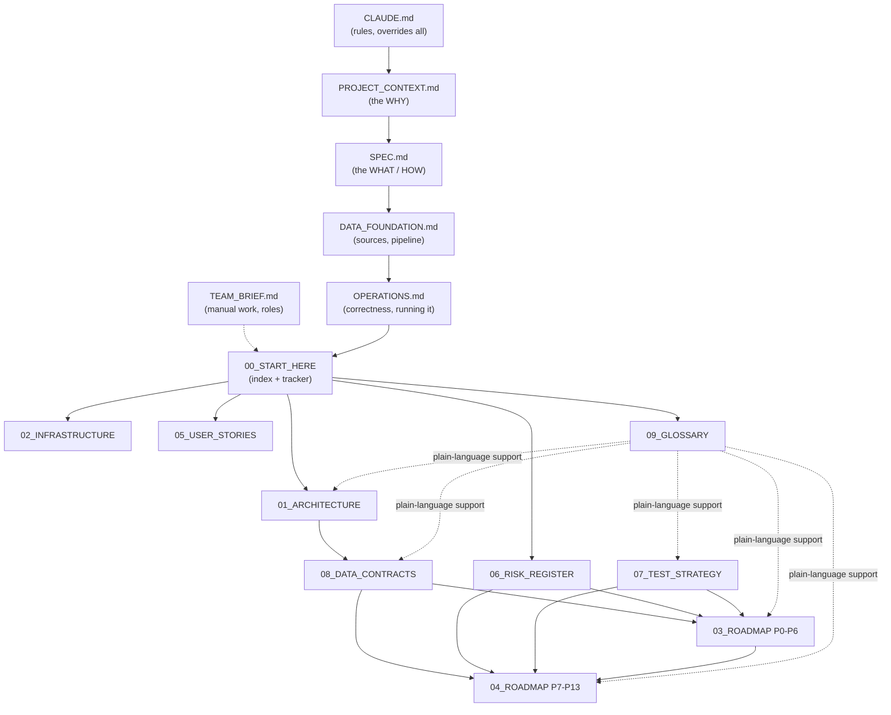
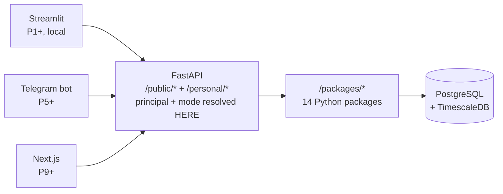

# 00 — START HERE

**What this document is for.** This is the entry point to the build plan for `quant_model`.
The six documents in the repository root (`CLAUDE.md`, `PROJECT_CONTEXT.md`, `SPEC.md`,
`DATA_FOUNDATION.md`, `OPERATIONS.md`, `TEAM_BRIEF.md`) describe *what the system is and
why*. This `docs/` set describes *how it gets built, in what order, and how you prove at
each step that it actually works*. If you are picking this up cold — or picking it up again
after three months away — read this file first, then follow the reading order in §4.

**Status as of 2026-08-30:** nothing has been built. The repository contains the six
specification documents, this `docs/` set, an empty `package.json`, and `node_modules/`.
There is no `.git`, no Python 3.12, no database, no code. We are at **P0, not started**.

> **A seven-reviewer pre-build audit ran on 2026-08-30.** It found defects that would have
> stopped the first migration from running and left two gates unfalsifiable. Its findings and
> the exact fix for each are in **[10_PRE_BUILD_CORRECTIONS](10_PRE_BUILD_CORRECTIONS.md)**,
> which now has the highest precedence in the set. **Read it before P0.** Some corrections are
> already applied to these files; the rest are marked 🔧 with the text to write.

---

## Table of contents

1. [The one-paragraph version](#1-the-one-paragraph-version)
2. [The document set](#2-the-document-set)
3. [How the documents relate to each other](#3-how-the-documents-relate-to-each-other)
4. [Reading order — three routes depending on why you are here](#4-reading-order)
5. [The canonical phase map — P0 to P13](#5-the-canonical-phase-map)
6. [WHERE WE ARE — the live progress tracker](#6-where-we-are--the-live-progress-tracker)
7. [The rules that override everything](#7-the-rules-that-override-everything)
8. [Architecture decisions already made](#8-architecture-decisions-already-made)
9. [The master gap register — TG1 to TG23](#9-the-master-gap-register--tg1-to-tg20)
10. [How to use this set while building](#10-how-to-use-this-set-while-building)
11. [Conventions used throughout](#11-conventions-used-throughout)
12. [Keeping these documents true](#12-keeping-these-documents-true)

---

## 1. The one-paragraph version

We are building a centralised financial data hub for Nigerian and US listed companies:
financial statements, historical data, macroeconomic backdrop, news, and valuation tools.
The hard and valuable part is turning Nigerian financial PDFs into clean, queryable,
provenance-tracked data — nobody has done this well, and the dataset is the moat. On top of
that data layer sits a quantitative stack: technical indicators, a rigorous backtesting
harness, calibrated machine-learning signals, multi-agent research memos, portfolio
tracking, and eventually execution. The system runs in two modes from a single codebase:
**personal mode** (the owner and family — it may give direct BUY/SELL recommendations,
because it is their own capital) and **public mode** (everyone else — data only, no advice,
until an SEC licence is obtained). Build everything to public standard; restrict who can log
in, not what the system can do.

---

## 2. The document set

| # | Document | What it answers | Read it when |
|---|---|---|---|
| 00 | **START_HERE** (this file) | Where am I, what exists, what next | Every time you return |
| 01 | [Architecture](01_ARCHITECTURE.md) | What talks to what, and why | Before writing any code that crosses a boundary |
| 02 | [Infrastructure](02_INFRASTRUCTURE.md) | Where it runs, how it stays alive, what it costs | Setting up your machine, deploying, or when something breaks at 2am |
| 03 | [Roadmap Part 1 — P0–P6](03_ROADMAP_PART1_PHASES_0-6.md) | The build plan for the data foundation | Starting any phase from P0 to P6 |
| 04 | [Roadmap Part 2 — P7–P13](04_ROADMAP_PART2_PHASES_7-13.md) | The build plan for the quant and product stack | Starting any phase from P7 to P13 |
| 05 | [User Stories](05_USER_STORIES.md) | Who wants this, what they do with it, how we know it worked | Deciding whether a feature is worth building |
| 06 | [Risk Register](06_RISK_REGISTER.md) | What will go wrong, what won't, and what to do about it | Before committing to a phase; when something feels off |
| 07 | [Test Strategy](07_TEST_STRATEGY.md) | How to prove it works and isn't silently lying | At every phase gate, and when adding any feature |
| 08 | [Data Contracts](08_DATA_CONTRACTS.md) | Exact inputs and outputs for every module and table | Writing or calling any interface |
| 09 | [Glossary](09_GLOSSARY.md) | What every term means, in plain words | ⚠️ **Incomplete — only Section 1 of 10 exists.** See the notice at the top of the file |
| **10** | **[Pre-Build Corrections](10_PRE_BUILD_CORRECTIONS.md)** | **What the pre-build audit found wrong, and the exact fix for each** | **Before P0, and before touching the DDL, the mode gate, the backtest gate or the backup script. Highest precedence in the set.** |
| — | [UNIVERSE](UNIVERSE.md) | **Which 25 companies exist in this system**, and why each earns its place | Before collecting a single PDF. Changing it after a backtest invalidates that backtest |

**Source documents in the repository root** — these remain authoritative for *intent*; the
`docs/` set never contradicts them, only sequences and elaborates them:

| Document | Role | Precedence |
|---|---|---|
| `CLAUDE.md` | Operating rules for anyone (human or agent) working in this repo | Overrides all |
| `PROJECT_CONTEXT.md` | The why: thesis, access model, B2B/acquisition layer, standing rules | 1st |
| `SPEC.md` | The what/how: roadmap, DDL, monorepo, T1–T21, build invariants | 2nd |
| `DATA_FOUNDATION.md` | "Doc A": verified data sources, PDF pipeline, base schema, legal research | 3rd |
| `OPERATIONS.md` | Correctness gaps and running it for years | 4th |
| `TEAM_BRIEF.md` | Onboarding: manual work, roles, bottlenecks, stage gates | Context |

**Precedence when documents disagree** (matches [CLAUDE.md](../CLAUDE.md), amended 2026-08-30):
`10_PRE_BUILD_CORRECTIONS` → the ADRs in [01_ARCHITECTURE](01_ARCHITECTURE.md) §9 →
PROJECT_CONTEXT → the rest of `docs/` → SPEC → DATA_FOUNDATION → OPERATIONS.

If a `docs/` file contradicts a root file the root file wins and the `docs/` file is a bug —
**except** where the deviation is recorded as an ADR. Those are deliberate and dated, and they
override the root docs on the point they decide. Three are live: **ADR-0001** puts PostgreSQL
in P0, **ADR-0002** adds `/packages/scheduler` to SPEC.md §3.1's monorepo, and **ADR-0005**
stands FastAPI up in P0 rather than at SPEC.md's T16/v1.0.

---

## 3. How the documents relate to each other

In words: the root documents set intent. This index points at nine working documents.
**Architecture** defines the shape, which **Data Contracts** makes precise, which the two
**Roadmap** halves consume phase by phase. **Test Strategy** and **Risk Register** cut
across every phase. **User Stories** justify the work. **Glossary** supports all of them.

---

## 4. Reading order

Pick the route that matches why you opened this.

### Route A — "I am about to start building" (first time)
1. This file, all of it.
2. [10_PRE_BUILD_CORRECTIONS](10_PRE_BUILD_CORRECTIONS.md) — all of it. It is the shortest
   file here and it changes the DDL, two gates, and the backup script.
3. [09_GLOSSARY](09_GLOSSARY.md) — skim it, knowing only Section 1 of 10 was written; you
   need to know it exists so you can look things up without breaking flow.
3. [01_ARCHITECTURE](01_ARCHITECTURE.md) — the whole thing. This is the mental model.
4. [06_RISK_REGISTER](06_RISK_REGISTER.md) §2 "The short list" and §3 "Things you do not
   need to worry about" — 20 minutes, and it recalibrates where your attention should go.
5. [02_INFRASTRUCTURE](02_INFRASTRUCTURE.md) §2 local development — get your machine ready.
6. [03_ROADMAP_PART1](03_ROADMAP_PART1_PHASES_0-6.md) P0 — and start.

### Route B — "I am starting a specific phase"
1. §6 of this file, to confirm the phase's entry criteria are genuinely met.
2. The phase's section in [03](03_ROADMAP_PART1_PHASES_0-6.md) or
   [04](04_ROADMAP_PART2_PHASES_7-13.md) — entry criteria, manual work, build, test
   checkpoint, exit criteria.
3. The relevant module contracts in [08_DATA_CONTRACTS](08_DATA_CONTRACTS.md).
4. The phase's risk rows in [06_RISK_REGISTER](06_RISK_REGISTER.md) §7 risk-by-phase matrix.
5. The phase gate in [07_TEST_STRATEGY](07_TEST_STRATEGY.md) §3.

### Route C — "Something is wrong / I need to decide something"
- A number looks wrong → [07_TEST_STRATEGY](07_TEST_STRATEGY.md) §6 silent-failure catalogue
  and [06_RISK_REGISTER](06_RISK_REGISTER.md) §6.
- Something is down or a connector went quiet →
  [02_INFRASTRUCTURE](02_INFRASTRUCTURE.md) §11 runbook.
- I do not know if this feature is worth it → [05_USER_STORIES](05_USER_STORIES.md).
- I do not know if I should keep going → [06_RISK_REGISTER](06_RISK_REGISTER.md) §8 decision
  gates and §9 the honest verdict.
- I do not understand a word → [09_GLOSSARY](09_GLOSSARY.md).

---

## 5. The canonical phase map

Every document in this set uses these phase numbers and names. They never change. The
"Spec version" column maps to `SPEC.md` §1.3; the "Tasks" column maps to `SPEC.md` §4.2.

| Phase | Name | Spec version | Tasks | The one-line outcome |
|---|---|---|---|---|
| **P0** | Foundation & Rails | (pre-v0.1) | repo, DDL, API skeleton, T15 core, CI | A running, tested, multi-user skeleton with the mode gate already enforced |
| **P1** | Macro Backdrop | v0.1 | T1 | FRED / CBN / NBS / DMO series on screen with as-of dates |
| **P2** | US Company Data | v0.2 | T2 | EDGAR filings ingested; ratios and DCF from your own assumptions |
| **P3** | Nigerian Manual Analyzer | v0.3 | T3 + OPERATIONS Pt 1 | Upload a Nigerian PDF, get a normalised statement with provenance |
| **P4** | Nigerian Automated Ingestion | v0.4 | T4 | The PDF pipeline runs itself, with a human review queue |
| **P5** | News, Sentiment & Daily Brief | v0.5 | T5, T6, T7 | A brief arrives every morning without you asking |
| **P6** | Scenarios & Indicators | v0.6–v0.7 | T8, T9 | Your own assumptions drive valuations; indicators computed and stored |
| **P7** | **Backtesting — THE GATE** | v0.8 | T10, T11 | A backtester you can trust, with the real NGX cost stack |
| **P8** | ML Signals | v0.9 | T12, T13 | Calibrated probabilities, and no signal without a passing backtest |
| **P9** | Memos & Hosted Web App | v1.0 | T14, T16 | Multi-agent research memos; a real web app the family logs into |
| **P10** | Portfolio & Alerts | v1.2 | T17, T18 | Positions, P&L, Nigerian tax handling, alerts that fire once |
| **P11** | Paper Trading | v1.5 | T19 | Simulated fills using the same costs as the backtester |
| **P12** | Public Beta | v2.0 | T20 | A data-only public surface with the compliance suite green |
| **P13** | Personal Execution | v2.5 | T21 | US via API, NGX via manual ticket, behind a hard safety layer |

**T15 (compliance middleware) is not a phase.** Its core lands in P0 and it is hardened in
every phase through P12. This is deliberate: the mode gate is the one thing that cannot be
retrofitted.

**Two ordering decisions worth understanding:**

1. **P7 (backtesting) comes before P8 (ML signals).** This inverts the intuitive order and
   it is the most important sequencing decision in the project. A model that has not been
   validated by a backtester you trust is not an edge, it is a story. `SPEC.md` §4.1 makes
   it an invariant: no signal trades without a passing recorded `backtest_run`.
2. **Execution (P13) is last and personal-only.** Not because it is hard, but because
   everything upstream must be proven before real money moves.

---

## 6. WHERE WE ARE — the live progress tracker

> **Update this table at every phase transition.** It is the only place in the document set
> that claims what is done. Keeping it honest is what stops you from building on sand.

**Current phases: P3, P4 and P5 are all part-built, and what remains in each is the
operator's rather than the code's.** P3's gate waits on the golden set and the NGX
universe; P4's on an Anthropic API key and that same golden set; P5.1 is closed and
fetching hourly. P2 is ✅ COMPLETE, 15 of 15, verified by the operator on 2026-09-15
against the SEC's own documents rather than against this system's word for them. P1 closed
the same day. **P0 alone remains 🧪, for the reason it always has: CI has never run.**

**The single thing blocking most of the rest is data, not code.** No Nigerian company is in
the database, so the NGX price connector caches raw responses and writes zero bars -
loudly, by design - and the extraction pipeline has no Nigerian filing to read.

The P0 spine from [10_PRE_BUILD_CORRECTIONS](10_PRE_BUILD_CORRECTIONS.md) §6.1 is built and
verified on 2026-09-02: 17 tables migrated on Neon PostgreSQL 18.6, the mode gate enforced and
adversarially tested, a backup dumped and actually restored. **It is 🧪 and not ✅ for one
reason: check 13 (CI green on a PR) has not been confirmed.** The workflow is written,
and `main` has since been pushed — `git ls-remote origin` on 2026-09-17 shows it at
`89a83b0` beside a `ci/first-run` branch. What is missing is evidence that a run passed:
nothing in the repo records one, and it takes someone opening the Actions tab to say.
That one is the operator's; see "the immediate next actions" below. **P1 and P2 are closed**, both verified by eye on 2026-09-15.

| Phase | Status | Started | Completed | Gate passed? | Notes |
|---|---|---|---|---|---|
| P0 Foundation & Rails | 🧪 Built | 2026-09-01 | — | 16/17 | Check 13 blocked: remote exists, `main` never pushed, CI never run |
| P1 Macro Backdrop | ✅ Complete | 2026-09-03 | 2026-09-15 | 13/13 | Check 11 confirmed 2026-09-15 · 10 of 13 series live · 28,053 rows · staleness thresholds verified (0016) |
| P2 US Company Data | ✅ Complete | 2026-09-13 | 2026-09-15 | 15/15 | 24 companies · 1,662 filings · 7,917 statement versions · 53,710 line items · 269,216 price bars · 3,270 corporate actions |
| P3 NG Manual Analyzer | 🔨 In progress | 2026-09-16 | — | — | **Code complete; the gate now waits on data, not code.** P3.1 ✅ the document store (0022, `ingestion/documents.py`) — a PDF is verified by content, page-counted from the file and stored once by hash. P3.2 ✅ entry rules, write endpoint and form (`normalize/manual.py`, `/v1/personal/statements`, `entry_page.py`). P3.3 ✅ **all six** TG2 paths: identity (0018, 0019), units, corporate actions, FX, fiscal alignment, and the trading calendar (0023, 32,072 days). P3.5 ✅ the manual override (TG10). TG7 ✅ chart v1 (0020, 65 keys) — **now exercised**: JPMorgan and Caterpillar are typed through it, 295 statements and 4,495 line items, which is what the freeze was waiting for. Checks 4, 5, 8 and 16 closed this phase. **Open:** P3.4 the golden set and ≥10 typed company-years (TEAM_BRIEF B, C, D), the NGX universe (no Nigerian company is in the database yet), and `index_membership` |
| P4 NG Automated Ingestion | 🔨 In progress | 2026-09-24 | — | 8/20 | **Every part that needs neither a key nor a golden set is built.** P4.1 ✅ the deterministic half (`extract/pdf.py`) - native/scanned/mixed classification, text and Markdown tables; the OCR branch is not built and no scanned fixture exists yet. P4.2 ✅ the contract, **grounding** (a figure must be on the page it cites) and the reconciler - everything but `messages.create`, which needs `ANTHROPIC_API_KEY`. P4.3 ✅ validation, `validate_candidate` (checking before the store, which P4.1's flowchart requires and `validate_period` could not do) and confidence routing. P4.4 ✅ queue, `/v1/personal/review/*`, `review_page.py`; corrections go through P3.2's form rather than a second write path to the same table. P4.5 ✅ the devaluation annotation; `fx_loss_net` is in chart v1. P4.6 ✅ bank and industrial shapes verified apart. P4.7 ✅ **the NGX cache is running** - `AFX Kwayisi` registered, both listing pages stored permanently, bars correctly refused until the securities exist. P4.8 ✅ closed: retries, per-host buckets, conditional requests (FRED 304s, 1.6MB a series), health rows. **Checks closed: 8, 9, 12, 13, 14, 15, 16, 18.** **Open:** 1, 2, 3, 7, 11, 17, 19, 20 - each needs the API key, the golden set, or both. The `llm_hybrid` write path is not built: `enter_statement` cannot serve as it, because it labels a figure hand-typed and demands a reviewer's name |
| P5 News & Daily Brief | 🔨 In progress | 2026-09-24 | — | — | P5.1 ✅ RSS ingestion (0025, `ingestion/rss.py`) - Nairametrics, BusinessDay and Punch, hourly and staggered, 44 real articles ingested. Three of the five feeds `docs/03` names cannot be ingested at all: Proshare serves its 404 page with **HTTP 200**, Reuters Africa is `Disallow: /`, and TheCable answers 403 to our agent. P5.2 🔨 ticker tagging. P5.3 and P5.4 ⬜ - P5.4 needs a Telegram bot token |
| P6 Scenarios & Indicators | 🧪 Built | 2026-09-24 | — | 13/13 | **All thirteen checks pass, on the universe that exists.** TG1 is half-closed and that is what let this start: 269,298 US bars, 3,272 corporate actions and a 32,072-day calendar are in; **no Nigerian security is, so the NG half of the phase is untouched and its entry criterion "price_history populated for both markets" was never met.** P6.1 ✅ the scenario engine (0028, `valuation/scenarios.py`) and `POST /v1/public/companies/{ticker}/scenario` - check 13 measured: naira 1,535→2,000 for an importer takes value per share -59.6%, an exporter +166.9%. P6.2 ✅ six indicators, seven specs, twelve columns, **842,088 rows across all 24 securities** (`indicators/`, 0028). Every library convention measured against an independent implementation rather than assumed - pandas-ta-classic is Wilder to ten decimal places, and the published StockCharts table that says otherwise is the thing that is wrong. P6.3 ✅ `known_as_of` is a running maximum over the inputs, in the primary key, `no_update` enforced. **Why 🧪 and not ✅:** the backfill runs from 2015, not 1970 - a full-history run adds ~1 GB to an 80 MB database, and only 11 of the 24 securities exist before 2010, so the deep history has a changing-composition problem SPEC 2A warns against. Extending is one parameter: 2010 +387 MB, 2000 +596 MB, 1970 +1.04 GB |
| P7 Backtesting (THE GATE) | ⬜ Not started | — | — | — | Most important phase |
| P8 ML Signals | ⬜ Not started | — | — | — | |
| P9 Memos & Web App | 🔨 In progress | 2026-09-24 | — | — | P9.5 ✅ **the web app** (`apps/web`, Next.js 15) - six routes against a written design contract (`apps/web/DESIGN.md`), verified on a production build at 320/768/1280 with no page-level horizontal overflow. Every figure carries its period, its `known_as_of` and the API's attribution verbatim; a build that cannot reach the API now fails rather than prerendering its own error state. P9.1-P9.4 ⬜ the memo agents - each needs `ANTHROPIC_API_KEY` |
| P10 Portfolio & Alerts | ⬜ Not started | — | — | — | |
| P11 Paper Trading | ⬜ Not started | — | — | — | |
| P12 Public Beta | ⬜ Not started | — | — | — | Only phase with real legal exposure |
| P13 Personal Execution | ⬜ Not started | — | — | — | |

**Status key:** ⬜ Not started · 🔨 In progress · 🧪 Built, gate not yet passed ·
✅ Complete (gate passed) · ⏸️ Paused · ❌ Abandoned (record why)

**A phase is only ✅ when its test checkpoint passes**, not when the code is written.
"Built but not verified" is 🧪, and 🧪 is not permission to start the next phase.

**P1, stated precisely.** Built and tested: P1.0 the document store, P1.1 the connector
contract, P1.2 FRED, P1.3 CBN and NBS-via-portal, P1.4 the API, P1.5 the scheduler and
health check, P1.6 the dashboard, P1.7 the manual CSV path. **Ten of thirteen series hold
real data — 28,053 observations, an honest count (see FRED below) — which meets the exit criterion's "ten series populated".**
Checks 1–10 and 12 of the P1 checkpoint pass.

**P1.3 CBN is built and four series carry real data.** 6,052 NFEM USD/NGN observations back
to 2001-12-10, 18 months of the Monetary Policy Rate, and 18 months of headline and core CPI,
ingested from CBN's own endpoints and rendering with as-of dates and freshness. The
point-in-time view is proven on real history: USD/NGN as known on 2015-06-30 returns
₦196.4500, against ₦1,320.7160 today.

**NBS is reachable after all, through the Nigeria Data Portal.** `docs/03` P1.3 says NBS has
no REST API, and `nigerianstat.gov.ng` still does not — but NBS also publishes through the
AfDB's Nigeria Data Portal, which has a documented JSON API. Two NBS-attributed series are now
filled from it: `NG_CPI_YOY` with 296 monthly observations back to April 2001, and
`NG_GDP_GROWTH_YOY` with 39 quarters from 2015Q1. Compiler and transport are kept apart: the
*series* is credited to NBS, who compile the figures; the *document* points at the portal's
own `data_sources` row, which is where the bytes came from and whose terms govern our copy.

**The GDP series is labelled with the base it is actually on.** The portal's dataset is at
2010 constant basic prices and stops at 2024Q3; NBS rebased to 2019 in mid-2025 and the
portal does not carry those figures. Migration 0008 changed `base_period` from "GDP 2019
rebasing" to "GDP 2010=100 constant basic prices", because a definition that names a base
the data is not on is a definition that lies. The series is flagged stale (712 days), which
is correct and should stay visible. Three real-growth indicators exist on the portal; the
one loaded is the one whose values match NBS's own headline text (Q3 2024 = 3.46%, Q2 2024 =
3.19%, Q3 2023 = 2.54%), and a test pins that reconciliation. Market-price growth (3.12% for
the same quarter), nominal growth, sector rows and annual rows are each refused by name.

**Check 12 found something, which is what check 12 is for.** Reconciling the NBS CPI against
its release exposed that `NG_CPI_YOY` (via the portal) and `NG_CPI_YOY_CBN` disagree by
about three points on every one of the ten months they share — 23.18% against 26.27% for
February 2025, 14.45% against 17.33% for November. **Both are NBS figures. They are different
vintages.** In its December 2025 CPI report, published mid-January 2026, NBS moved the
year-on-year reference from a single month to the 2024 twelve-month average and revised every
2025 print upward. CBN's endpoint carries only the revised series; the portal froze on the
originals. Three consequences, each acted on:

1. **The CBN mirror's 2025 rows had stored lookahead.** They were bounded at the end of the
   following month, which is right for a first print and wrong for a revision published a
   year later: the table said 26.27% was knowable on 2025-03-31 when the market had 23.18%
   until January 2026. Migration 0009 re-dates those twenty rows (headline and core,
   February–November 2025) to `known_as_of = 2026-01-31, revision = 2`, and the connector now
   emits them that way. Proven on the point-in-time query: February 2025 CPI as known on
   2025-04-30 is 23.18% from NBS and *not yet knowable* from CBN; as known on 2026-02-28, both.
2. **The NBS primary now holds the superseded vintage** and the mirror holds the current
   one. That is correct point-in-time data, not a defect — but the revised NBS series can only
   enter an NBS-attributed series from an NBS publication. The route is P1.7's manual CSV,
   fed from the December 2025 CPI report itself: one Collector task, ~30 minutes, and the
   first real use of the path P1.7 exists for.
3. **CBN's June 2025 row is a copy of May's** — 26.06% where NBS's revised June is 25.29%,
   every field identical. It is stored as CBN published it, because the mirror records what
   CBN says, and the connector now logs a month identical to its predecessor rather than
   silently accepting it. This is the concrete case behind `docs/03` P1.3's warning about
   second-hand Nigerian sources, and why the mirrors are labelled.

**The two monthly CBN series need opposite `known_as_of` treatment**, and the dashboard now
shows both: CPI for period 2026-07-31 published 2026-08-31, beside the MPR with both dates
equal. The MPC announces immediately, so a month's policy rate was public within that month;
a month's CPI is computed after it ends. CBN publishes no release date, so `known_as_of` is
**bounded** at the last day of the following month — never earlier than the real release —
and the portal's NBS series use the same rule, one period later for quarterly GDP. [NEEDS
VERIFICATION] against NBS's release calendar, which would replace the bounds with real dates.

**R-02 had already happened before we wrote a line.** The `.asp` URLs the source documents
name are 404 — CBN rebuilt the site and the tables now render client-side. The data is
reachable as JSON, which is better than scraping HTML but is an undocumented endpoint with no
contract, so P1.7's manual CSV path stays wired rather than being retired. The portal
returned 403 on a second request issued immediately after the first, which is how it was
discovered that `politeness_delay_sec` was declared on every connector and enforced nowhere;
`run_job` now spaces consecutive runs by it.

**FRED is loaded — and the first count of it was wrong by a factor of three.** The key was
set on 2026-09-09 and all four FRED series came in: 3,362 US CPI, 920 fed funds, 440 rows of
the World Bank Nigeria CPI mirror, and what this tracker recorded as "60,835 US 10-year
Treasury observations". 43,952 of those were an artefact of our own loading. ALFRED clips
`realtime_start` to the start of the real-time window asked for, so each of the four backfill
windows returned every observation already known before it dated *at* the window's first
day, and each was stored as a new vintage — 1990-01-02's yield of 7.94 four times over.
Point-in-time queries returned the right value throughout, because the duplicates carried
the value the query would have found anyway; the vintage count did not. Migration 0010
removed them (round-tripped: 60,835 → 16,883 → 60,835 → 16,883), and `Connector.write()`
now refuses a record whose value equals the latest earlier vintage of the same period — a
figure republished unchanged is the same vintage continuing, for every source.

**DGS10's scheduled job had never succeeded.** It asked FRED for every vintage, FRED refuses
more than 2,000 in one response, and the series had not refreshed since the one-off load.
The job now asks for a three-year look-back window, which is safe only because of the rule
above: live, it parsed 16,878 records, skipped 16,095 as unchanged, and inserted the two
trading days published since the load. The failure had been invisible for two reasons that
are both fixed: the console gave no per-step account of a run, and all four FRED jobs
recorded their runs as `fred`, so three healthy series hid the fourth. Runs are now
recorded per job — `fred:DGS10` — and the health check derives its expectations from the
job list it shares with the scheduler.

**The console now shows every step of every flow**, colour-coded by meaning (blue
information, green success, yellow warning, red error) and numbered by nesting (`2.1` is the
first step inside the second job), with every printed string redacted and tracebacks kept
free of local variables. `packages/common/console.py`; `LOG_FORMAT=json` for a log
aggregator. The first run under it is what surfaced both defects above.

**What is still missing is data, not code.** Three series remain empty: NBS core CPI (the
portal carries core as an index, not a published year-on-year rate, and deriving one would
be publishing our own statistic under NBS's name), and DMO's public debt and bond stop rates
(PDF; `docs/03` P1.3 defers them to P4 where the PDF toolchain exists). The route today is
[data/manual/README.md](../data/manual/README.md), which needs no key. Note that two of the
ten populated series are `_CBN` mirrors and one is a World Bank mirror, so the count of
*distinct* macro facts from primary sources is seven.

> 🔴 **Rotate the FRED API key.** It was exposed on 2026-09-09: a failed request put it into
> `connector_runs.error` and into terminal output. The stored row was scrubbed and the code
> now redacts credentials from every error before storing (`redact_secrets`), but a key that
> has appeared in output must be treated as compromised regardless of clean-up. Free to
> replace at `fredaccount.stlouisfed.org/apikeys`.

No macro figures were invented to close any gap. A fabricated CPI print carrying a
provenance chain that claims NBS published it is precisely what this system exists to
prevent, and a dev database is exactly where such a number quietly becomes "the number we
have".

**Checkpoint status: 12 of 13, and the thirteenth is half done.** Checks 1–10 pass. Check 12
is done, with the finding above. Check 13 (unplug the internet and reload) is done in code
rather than with a cable, because ADR-0008 changed its meaning: the database is Neon, so
"the internet is down" takes the data with it, not just the sources. What survives that —
and is proven in `tests/compliance/test_degraded_database.py` — is that nothing crashes and
nothing leaks: `/health` answers 503, the series endpoint answers a JSON error with no
traceback and no connection string, and the dashboard renders its banner saying what is
wrong and how to start the API. **The one thing left is by eye: check 11** — open the
dashboard beside CBN's MPR page and confirm the number *and the date*. Value and date come
from the same JSON record and a test pins the mapping; the visual cross-check is the
operator's, and it is the last item between P1 and ✅.

**Known limitations, recorded rather than smoothed over.** CBN republishes corrected rates
without saying when it corrected them — six USD dates carry two rows and four disagree, one
by 3.4%. The later record is kept and the superseded vintage is not, so a backtest deciding
on 2024-02-22 would have acted on a rate this table no longer holds. The portal has the same
shape of problem for GDP: it carries NBS's latest revision of each quarter, not the first
print, so a revised quarter sits under a `known_as_of` bounded at its first release. Both
are the size of the publisher's revisions, both need a source that publishes vintages or our
own daily snapshots — P3/P7 work — and both belong in P7's pre-registration.

**P2, stated precisely.** Started 2026-09-13 on branch `p2-us-company-data`, with P1 at 🧪
and P0 at 🧪 for reasons that are the operator's, not code's. **P2.1 is built and live:**
migration 0011 (seven statement tables, chart of accounts v0.1, exchanges), the EDGAR
submissions and companyfacts connectors, `packages/normalize` (periods, chart, the versioned
statement writer), and `packages/common/pit.py` with the mandatory decision date. Apple is
ingested end to end — 72 filings, 333 statement versions, 2,369 line items — and FY2025
revenue reads 416,161m, known 2025-10-31, as the roadmap's own example expects.

**Point-in-time is proven on a real restatement.** Apple's retrospective adoption of the new
revenue-recognition standards in January 2010 lifted FY2009 revenue from 36,537m to
42,905m. Both vintages are held; as known on 2009-12-31 the accessor returns the first, from
2010-01-25 the second. That is P2 check 15 on live data.

**What the first live run taught.** Six of the chart's alternate XBRL tags could
legitimately differ from their primaries (restricted-cash-inclusive cash, `ProfitLoss`
beside `NetIncomeLoss`, `LongTermDebt` beside the non-current one …). A later 10-Q that
carried only the alternate then resolved the same period to a different number, and the
writer recorded six restatements of cash that never happened. Those alternates are out,
and `docs/08` §2.3 now states the rule: an alternate must name the *same* measure. The 45
restatements that remain were each read; all are the filer's — the 2010 one above, Apple
re-tagging its cash-flow D&A in the FY2018 10-K, explicit zeros in later comparatives —
or v0.1 coverage gaps that resolve as NULL and then a value, which is honest.

**P2 is built, 2026-09-14.** The whole of it: P2.3 (`price_history`, migration 0012, the
Yahoo chart connector storing as-traded closes with the provider's splits multiplied back
out, verified at Apple's 1987, 2000, 2005, 2014 and 2020 split boundaries), P2.4
(`packages/valuation` — 26 ratios and a DCF with hand-computed worksheets in
`tests/known_answer`), `shares_outstanding` (0013), the entity graph created empty (0014),
the four public company routes and `apps/streamlit/company_page.py` for the by-eye checks,
and the universe: **24 of 24 US companies loaded end to end**, every price series current
to 2026-09-11, `pit_sanity` violations zero, orphan line items zero.

**P2 checkpoint: 15 of 15, closed 2026-09-15.** Checks 1–12 and 15 in code; 13 and 14 by
eye, and the operator did not take the page's word for it — they pulled Apple's 10-K and the
SEC's structured feed independently and compared both against what the API and the page
hold. **Check 13: all three figures match** (revenue 416,161m, total assets 359,241m, and an
`interest_expense` that is correctly blank — no such line and no such XBRL fact in the
FY2024 or FY2025 10-K; the last one was FY2023's 3,933m, which the page still shows). They
went past the three: **all 19 FY2025 values we hold match the filing tag for tag**, zero
mismatches, and the internal identities hold (revenue − cost of revenue = gross profit;
liabilities + equity = total assets). **Check 14: value per share fell 12.93%** between a 9%
and a 10% discount rate (105.89 → 92.19), inside the 12–13% the plan predicts, recomputed by
hand from the echoed inputs and agreeing to the cent. Check 9 reads as
[08](08_DATA_CONTRACTS.md) §2.4 corrected it: `close_raw` as traded, no stored adjusted
column.

**P1 check 11 closed the same day.** The three US series agree with FRED's own feed on every
shared date, zero disagreements across the full history; the naira rate was current. The
staleness flags were the finding: 8 series flagged, of which 3 were genuine and 5 were the
flag's own arithmetic — fixed in migration 0016, below.

**What the operator's verification and the first unattended night taught** (2026-09-15/16),
each now fixed with a test:

* **Two jobs storing one document collided.** Every EDGAR job fetches the shared SEC ticker
  file first. A night of missed jobs fired together when the laptop woke, and two died —
  one on Windows' *"the process cannot access the file because it is being used by another
  process"* (both writers used one `.partial` name), one on
  `duplicate key value violates unique constraint "source_documents_sha256_key"` (both
  missed the select, both inserted). The store now writes under a per-writer temp name and
  treats losing the race as success — the name *is* the hash, so the winner wrote the same
  bytes — and `store_raw` inserts inside a savepoint and takes the winner's row. The
  scheduler now runs one job at a time, which is also what the EDGAR connector's
  process-wide 10 req/s throttle has always assumed.
* **The staleness flag was crying wolf** (migration 0016). `_staleness` measures the age of
  the newest *period held*, so a threshold must cover a whole period **plus** the publisher's
  lag; seeded at the lag alone, every healthy monthly series flagged from day 21 of its
  cycle. Thresholds are now measured from our own vintages, and a test holds the rule for
  every series — which immediately found two more that no dashboard had flagged, because
  they hold no data yet. Flags went from 8 to 3, and all 3 are genuine: NBS CPI stopped at
  November 2025, GDP at Q3 2024, and the US 10-year is behind because runs were missed while
  the laptop slept.

**What the universe load taught** — three defects, each a filer's data meeting a constraint
that did its job, each now a rule in [08](08_DATA_CONTRACTS.md) §2.3 with a regression test:
an alternate XBRL tag must name the same measure (Apple: six false restatements of cash); a
fact whose period ends after its own filing date is dropped, never re-dated (Walmart: three
in 21,874, one of which aborted the company); a period a filing reports under two context
start dates is one statement (Cisco: gross profit under a slipped start date). And a re-run
of the loader after a restatement now judges each old filing against the version in force
on its date, so the stale warning means what it says.

**Recorded limitations.** XBRL begins in mid-2009, so a pre-2009 period's `known_as_of` is
its first XBRL appearance — later than the truth, never earlier. Multi-class companies
(Alphabet, Meta) carry no cover-page share count in companyfacts, which drops every
dimensioned fact; since 2026-09-14 `EdgarInstanceSharesConnector` reads the count per class
from each 10-K and 10-Q's XBRL instance instead, `shares_outstanding` holds one row per class
(`share_class` = the axis member), and a multiple sums the classes counted at one date —
Alphabet's A + B + C, 12.23bn as of 2026-07-15. EDGAR maps `XOM` to ExxonMobil's 2026 holding
company and `DIS` to the 2019 one, with the history under the old CIKs; since 2026-09-14 the
successor map in `packages/ingestion/edgar.py` (each entry's evidence is the successor's own
8-K12B) records the old CIK as a time-bounded identifier of the security and writes its
filings under the continuing company — Exxon now reads 71 filings from 2006, Disney 74 —
and the nightly refresh covers both registrants. Coca-Cola's companyfacts carried
nothing filed after 2026-04-30 at load time. Every exchange-listed instrument EDGAR names for
a company (notes, preferreds) is an identifier of its one security; the primary is the lowest
id. Statements refresh nightly since 2026-09-14 — one `edgar:<ticker>` job per name at 03:00
UTC, six minutes apart, before the CBN jobs — beside the price jobs; the first live run, on
Coca-Cola, found EDGAR's companyfacts byte-identical to the load, so the overdue flag there
describes the source's lag, not ours.

### What exists right now

| Thing | Status |
|---|---|
| Specification documents (6 in root) | ✅ Written |
| This planning set (`docs/`, 11 files) | ✅ Written · audited 2026-08-30 · [09 glossary](09_GLOSSARY.md) incomplete (§1 of 10) |
| Pre-build audit | ✅ Complete — [10_PRE_BUILD_CORRECTIONS](10_PRE_BUILD_CORRECTIONS.md) |
| Git repository | ✅ Initialised, `main` + `p0-spine`; `.env` git-ignored before the first commit |
| Python environment | ✅ CPython **3.12.14** via `uv`, `.venv` at the repo root |
| `uv` | ✅ 0.12.8 (winget; **not on the inherited PATH** — restart the shell, or call it by absolute path) |
| PostgreSQL client (`psql`, `pg_dump`) | ⚠️ Still not on PATH, and no longer needed: the DB is Neon and the backup path runs `postgres:18` in Docker |
| Docker | ✅ 29.6.1 (Desktop must be *running* for backup/restore) |
| Node (needed at P9) | ✅ v24.14.0 |
| Monorepo scaffold | ✅ 4 packages (`common`, `compliance`, `ingestion`, `scheduler`), the rest reserved — `packages/README.md` |
| Database / DDL applied | ✅ **Neon PostgreSQL 18.6**, 35 tables + `alembic_version`, at migration 0023 ([ADR-0008](adr/0008-neon-managed-postgres.md)), verified against the live database on 2026-09-17. The rest are deferred per [10](10_PRE_BUILD_CORRECTIONS.md) §6.1 |
| FastAPI service | ✅ `/health`, ping, the macro series routes, `/v1/public/companies{,/{t}/statements,/ratios,/ratios/history,/dividends,/filings,/dcf}`, `/v1/public/filings/recent` and `/v1/public/operations/connectors` — mode gate, bearer auth, audit row per request, every response type registered |
| Screens | ✅ Four thin Streamlit clients: the company page, the macro dashboard, the operations page, and the statement entry form (P3.2) (every job judged ok / warning / error / never ran, every data set's as-of) — `python -m streamlit run apps/streamlit/<page>.py` |
| Any application code | ✅ The spine. No financial logic, by design |
| CI pipeline | 🧪 `.github/workflows/ci.yml` written. **`main` has been pushed** — `git ls-remote origin` on 2026-09-17 shows `main` at `89a83b0`, plus `ci/first-run`, `p0-spine` and `p2-us-company-data`. Whether a run has ever gone green is still unconfirmed: nothing in the repo records one, so check 13 stays open until someone reads the Actions tab |
| Test suite | ✅ 509 passing in `tests/unit` + `tests/known_answer` and 199 in `tests/compliance`, 0 skipped; live-network tests are opt-in. Run with `-p no:randomly`: `test_edgar.py` has real isolation leakage under random ordering, which is a known defect of that file rather than of the code it tests |
| Backup | ✅ Dumped, verified, copied, **and restored** 2026-09-02 — [REVIEW_CADENCE](REVIEW_CADENCE.md) row 2. Off-site: still zero |
| ADR log | ✅ [0001–0010](adr/README.md) |

### The immediate next actions

Ordered. The first four are the difference between P0.4 running and not running.

- [x] ~~Read [10_PRE_BUILD_CORRECTIONS](10_PRE_BUILD_CORRECTIONS.md) end to end~~
- [x] ~~Install the missing prerequisites (§1 there)~~ — `uv` and Python 3.12 done.
      **Postgres client tools deliberately skipped** (Neon + Docker `postgres:18` replace them).
      **BitLocker is still not enabled** — `OPERATIONS.md` §2.5 names an unencrypted laptop in
      its threat model, and both backup copies live on this disk
- [ ] **Create the private GitHub remote and push.** This is the only thing standing between
      P0 and ✅: check 13 (CI green on a PR) cannot run without it. Then protect `main` with
      **required status checks, approvals OFF while solo** ([10](10_PRE_BUILD_CORRECTIONS.md)
      §6.4 — GitHub will not let you approve your own PR)
- [x] ~~Install the pre-commit hooks~~ — installed 2026-09-03 and run over all files:
      gitleaks, ruff, ruff-format, yaml/toml, large files, private keys, `no-commit-to-branch`
- [x] ~~**P2 checks 13 and 14, and P1 check 11, by eye**~~ — done 2026-09-15, independently
      of the page: the 10-K and the SEC feed pulled directly, all 19 FY2025 values matched,
      the DCF recomputed by hand, FRED compared across its full history
- [ ] **Stop the laptop sleeping through the schedule, or move the schedule.** The 03:00 run
      of 2026-09-16 fired at 03:15 on wake, and that morning's 06:15 FRED jobs were skipped
      entirely (asleep 06:10–08:59). The `schtasks` entry in [02](02_INFRASTRUCTURE.md) §2.3
      survives a logout but not sleep; the choices are a sleep setting, a wake timer, or a
      host that stays on (§5 there)
- [ ] **P3.3's last TG2 path: §1.2 the trading calendar.** Identity (0018) and units
      (`packages/common/units.py`) landed 2026-09-16. `OPERATIONS.md`'s priority order defers
      the calendar to "before v0.7 indicators", so it is due in P6 and not before — and
      `docs/08` §2.1 already carries its DDL
- [ ] **The magnitude check `OPERATIONS.md` §1.6 asks for, in P4 beside the other validators.**
      Not built with `units.py` on purpose: `docs/06` R-22 weighs it as approach (2), "catches
      gross errors, misses a plausible one", against the conversion function as (1), and
      `docs/` outranks `OPERATIONS`. It is also unretrofittable — `needs_review` is set at
      insert and `forbid_update_except_supersession` allows no later UPDATE — so it belongs
      where its siblings live: P4.2's arithmetic validation, beside the cross-year identity
      tie R-22 names as the real backstop
- [x] ~~**Migrate `companies.cik` into the identity table**~~ — **done 2026-09-16,
      migration 0019.** The half of [10](10_PRE_BUILD_CORRECTIONS.md) §2.11 that 0018 left.
      The column carried no unique constraint and no index, so nothing but the connector's
      own `WHERE cik = ?` stopped two companies claiming one CIK; `no_overlapping_ids` now
      refuses it at the row. All 24 CIKs preserved, `valid_from` derived from filing dates
      and predecessor bounds rather than invented, and both successions came out gap-free
- [ ] **Dated *ticker* resolution is unavailable until identifier intervals are real.**
      `resolve_security` takes a date and is tested on real intervals, but every live ticker
      row holds `valid_from = 2026-09-13`, the day EDGAR was first observed — a lower bound,
      not a claim. So `find_security` resolves as of today on purpose; passing the decision
      date would 404 every historical read, and inventing a start date would breach
      `SPEC.md` §4.1. Unblocked by [TEAM_BRIEF](../TEAM_BRIEF.md) §2.2-F, the ticker alias
      table with real dates — operator work, ~half a day
- [ ] **One question a week from the Kaizen ledger** ([05](05_USER_STORIES.md) §11) — the
      questions a person actually asks, each with its honest status; the first five to pick are
      named in §11.3. Each is one PR: route, test, screen, and the status flipped in the ledger
- [ ] **Create a Backblaze B2 account before P3 collects documents at scale**
      ([ADR-0009](adr/0009-object-storage-and-immutability.md)). ~$0.10/month at this volume.
      It needs a payment method, so the build cannot do it for itself, and P3.1 assumes the
      storage already exists. Belongs in P3's entry criteria
- [x] ~~Apply the schema corrections into [08_DATA_CONTRACTS](08_DATA_CONTRACTS.md)~~ —
      **done 2026-08-30.** 52 tables, all FK targets resolve, `period_type` present, the
      invalid composite FK fixed, point-in-time keys corrected
- [x] ~~Make the four ⏸️ decisions in §8 there~~ — **all four answered 2026-08-30.** Data
      purchase: one paid month, fetcher built first. Family tier: own + family capital, no
      fee, capped at 6. Extraction: 95% headline / 90% all / 85% abandon. Universe:
      [UNIVERSE.md](UNIVERSE.md)
- [~] **Verify every ticker and delisting date in [UNIVERSE.md](UNIVERSE.md)** — **researched
      2026-09-16, awaiting the operator's confirmation.** 22 of 25 ticker strings were right;
      three were not, and each would have failed silently. `WAPCO` became **`HBMNG`** in July
      2026 when Holcim sold Lafarge Africa to Huaxin. `11PLC` was never a ticker — the symbol
      stayed `MOBIL` through the 2017 rename to delisting. And **`FLOURMILL` has been delisted
      since 30 Dec 2024**, so the split is 21 live and 4 delisted. Also found: two non-December
      year ends the draft never flagged (GUINNESS closes June, AIRTELAFRI March), and a 1-for-4
      TRANSCORP consolidation on 28 Oct 2024 that the corporate-actions backfill needs.
      `UNIVERSE.md` §4 now holds the dated rename rows for the alias table and §5 what is still
      a question. **What is left is the operator opening the exchange's own directory once**:
      its company pages are a JavaScript application and could not be read, so the rows resting
      on secondary sources are marked `CONSISTENT` rather than `CONFIRMED`
- [ ] Decide the remaining open questions in `PROJECT_CONTEXT.md` §8
- [ ] Begin P0 per [03_ROADMAP_PART1](03_ROADMAP_PART1_PHASES_0-6.md), **split per
      [10](10_PRE_BUILD_CORRECTIONS.md) §6.1** — the spine in a week, not the whole of P0 in
      three

---

## 7. The rules that override everything

Reproduced from `CLAUDE.md` so they are in front of you at the start of every session. The
full list is in `PROJECT_CONTEXT.md` §10.

| Rule | What it means in practice |
|---|---|
| **Build scope ≠ access control** | Build everything to public standard. Restrict who can log in, not what the system can do. Today's restriction to owner + family is a staging decision, not a product ceiling. |
| **Advice is mode-gated, not absent** | Free in personal mode, gated in public mode until licensed. One codebase with `MODE=personal\|public`, never two. |
| **Never expose personal-mode output to a non-family user pre-licence** | Access control in code, not policy. `CLAUDE.md` calls this "the only line with real legal risk." |
| **Show the work in every mode** | Even a BUY carries its assumptions, inputs, and as-of dates. |
| **Provenance on every figure** | Source document, page, as-of date. Non-negotiable. |
| **No silent overwrites** | Corrections are versioned, attributed, and noted. |
| **Staleness is visible** | Every series shows its as-of date and flags when overdue. |
| **Data licensing before ingestion** | Confirm redistribution rights before a source enters the dataset. |
| **Data layer has priority** | When time is scarce, the data layer wins. |

**Build-time invariants** (`SPEC.md` §4.1) — load these on every coding task:

- **Backtest gate before capital** — no signal trades without a passing recorded
  `backtest_run` (DSR, net-of-cost after the full NGX cost stack, beating both a
  logistic-regression baseline and buy-and-hold).
- **Never infer missing financial data** — absent line items are null, never estimated.
- **Point-in-time only** — features respect `known_as_of`; restated financials use the
  version known at the decision date.
- **Mode is server-derived** — never trust a client-supplied `mode`. Default to `public`.
- **One task, one PR**, tests required.

**And the rule that is easiest to break by accident:** never assume a single user.
Portfolios, watchlists, risk limits, alerts, spend caps, and audit rows are keyed by
principal. Position sizing takes account equity as a per-user parameter, never a config
constant. A single-user trading layer is a full rewrite to open up.

---

## 8. Architecture decisions already made

These were settled on 2026-08-28 and are consistent with the source documents. Full context,
consequences, and rejected alternatives are in
[01_ARCHITECTURE](01_ARCHITECTURE.md) §9 (ADRs).

| # | Decision | Why |
|---|---|---|
| **AD-1** | **Python everywhere except the v1.0 frontend.** All 13 `/packages/*` and `/services/api` are Python. | The only non-Python component in the entire system is the Next.js frontend arriving in P9. |
| **AD-2** | **FastAPI stands up in P0, not P9.** | `SPEC.md` places the API at T16/v1.0, but T15 is "front-loaded, all versions" with files `/compliance`, `/api`, and §4.1 requires mode to be server-derived. A Streamlit-only app has no server to derive mode from. **This is a deliberate, documented deviation from SPEC.md's literal task ordering.** |
| **AD-3** | **Streamlit is a thin client, never a place logic lives.** | It renders what the API returns. This is what makes swapping it for Next.js in P9 a presentation change rather than a rewrite. Business logic in a Streamlit callback is a defect. |
| **AD-4** | **Multi-user from day one.** | `CLAUDE.md` calls single-user "the expensive shortcut to avoid". Everything keyed by principal from P0. |
| **AD-5** | **Delivery surfaces in order:** Streamlit (P1+, local) → Telegram bot (P5+) → Next.js (P9+), all over the same FastAPI. | The API is the stable contract; surfaces are replaceable. |

---

## 9. The master gap register — TG1 to TG23

Twenty gaps found by mapping `SPEC.md` §4.2's task list (T1–T21) against the other five source
documents. **These are real holes: work the system needs that no task schedules.** Work nobody
scheduled does not get done, and an unscheduled dependency is the kind of thing that stops a
phase dead on the morning you planned to start it.

The `TG` prefix means "task, gap-filling" and keeps these distinct from `SPEC.md`'s T-numbers and
from `DATA_FOUNDATION.md` §7.4's separate T-numbering, which also runs T1–T16.

**This table is canonical.** Full risk treatment in [06_RISK_REGISTER](06_RISK_REGISTER.md) §5;
the stories each one blocks are in [05_USER_STORIES](05_USER_STORIES.md) §9.

| ID | Gap | Why it bites | Lands in |
|---|---|---|---|
| **TG1** | **Price-history ingestion has no task.** T9 (indicators) computes on `price_history` and T11 (backtest) needs OHLCV bars — nothing fills either. | Hard blocker for P6 and P7, and invisible until the morning you start P6. | P2 (US), P4 (NGX) |
| **TG2** | **All six `OPERATIONS.md` Part 1 correctness tables are unscheduled** — corporate actions (§1.1, "the highest-priority gap"), trading calendar, FX, ticker history, fiscal alignment, unit conversion. | Un-adjusted prices silently corrupt every indicator and backtest downstream. | **Five of six done**: corporate actions ✅ 0015, fiscal alignment ✅ P2, FX ✅ 0017 (6,059 rates to 2001), ticker history ✅ 0018 (`docs/10` §2.11's three defects; `resolve_security` is the one resolution point), unit conversion ✅ `packages/common/units.py` (`docs/06` R-22's recommended mechanism; the magnitude check it ranks second belongs with P4's deterministic validators). Remaining: **trading calendar** (§1.2, which `OPERATIONS`' priority order defers to "before v0.7 indicators") |
| **TG3** | **Auth/identity has no task.** "auth" is one word inside T16 (P9). | Multi-user is mandated from day one and mode derives from the principal in P0. | P0 |
| **TG4** | **Backup and disaster recovery is unscheduled** (`OPERATIONS.md` §2.1). | The dataset is the moat. Losing it is the only unrecoverable failure. | P0 |
| **TG5** | **The data-licensing gate has no enforcing task.** | `PROJECT_CONTEXT.md` §9.3 calls it "the one that kills deals". | P0, enforced every phase |
| **TG6** | **Nothing builds the golden test set**, which `TEAM_BRIEF.md` §2.2-C calls "the highest leverage task in the project". | T4's acceptance criteria assume it already exists. | P3 |
| **TG7** | **The canonical chart of accounts has no owning task and no versioning story.** | Changing it after extraction has run means re-extracting everything. Banks force the change. | P2 draft → P3 freeze |
| **TG8** | **Nothing owns the scheduler / job runner.** `SPEC.md` §3.1's monorepo dropped it. | A connector that never runs fails silently. | P1 → P4 |
| **TG9** | **The storage-engine decision is contradictory and unscheduled** — `DATA_FOUNDATION.md` says DuckDB, `SPEC.md`'s DDL is Postgres-flavoured. | Rework risk; the DDL is written in one dialect or the other. | P0 (ADR-0001) |
| **TG10** | **The manual override has no task.** T4's review queue covers new extractions, not correcting a figure already on screen. | Trust erosion; violates the no-silent-overwrite rule. | **✅ done 2026-09-16** — `packages/normalize/corrections.py` + `scripts/correct_figure.py`. A correction versions the statement, keeps the superseded figure forever, and records who and why. `docs/10` §2.10's date rule is implemented and now stated in `08` §10: our own error keeps the *original* `known_as_of`, so a point-in-time read from before the fix returns the corrected figure rather than the typo |
| **TG11** | **There is no `watchlists` table**, though T7's brief is specified to pull "watchlist moves". | Cheap now, annoying later. | P0 schema, P5 use |
| **TG12** | **`adjustment_factors` has no point-in-time dimension.** A corporate action can be announced after its ex-date. | A subtle leak in P7's adjusted-price handling. | ✅ migration 0015, 2026-09-14 |
| **TG13** | **Two different thresholds are both written as "85%", and the pass bar is missing.** `TEAM_BRIEF.md` Part 4 sets **≥85% on 10 filings** as v0.4's *stage gate*; `TEAM_BRIEF.md` Part 3 uses the same 85% as the *abandon / buy-EODHD* trigger. A pass bar and an abandon bar cannot be the same number. A third unrelated 0.85 (per-extraction review routing, P4.3) is adjacent enough to be conflated with both. | **The P4 gate is unfalsifiable while the pass bar equals the abandon floor** — clearing "abandon" reads as passing. | **Resolved — see [10_PRE_BUILD_CORRECTIONS](10_PRE_BUILD_CORRECTIONS.md) §3, task P4.0.** Numbers now set: 95% headline / 90% all-items pass bar, 85% abandon floor. |
| **TG14** | **Nothing specifies who double-checks the golden set.** And the premise is **mis-cited**: no root document requires a second person — `TEAM_BRIEF.md` §2.3 asks only that the golden set be built by someone *accountable* for it. The requirement is this document set's own good idea, presented as inherited. | The set encodes one person's assumptions — and the project is explicitly solo, so the realistic answer is "no second person exists". That must be *recorded*, not left open behind a 🔴 gate. | P3 — **force the decision**: name the second person and the date, or record that none was available and raise production sampling to weekly for P4's first two months |
| **TG15** | **No test asserts the paper trader and backtester share a cost-model *instance*.** | Two implementations drift, discovered with real money. | P11 |
| **TG16** | **The banned-phrase list has no owner or review cadence.** | It ages badly, giving false confidence at the phase with legal exposure. | P0, quarterly |
| **TG17** | **No task owns object storage** for source documents. | The "retrievable forever" provenance promise quietly fails. | P0 |
| **TG18** | **No restore-drill cadence is defined.** | Drills happen once and then never. | P0, quarterly |
| **TG19** | **No environment-parity check** between local and production. | A migration that works locally fails on deploy. | P0 |
| **TG20** | **`system_config` has no owner for regulatory effective-dates** — and no DDL anywhere, though it is table 44 in `08 §2.0`. | The NGX movement rule and Nigerian CGT both moved during planning. | P0, quarterly |
| **TG21** | **Clock and timezone discipline is undefined.** No document states the storage timezone, the NGX session boundary in UTC, or which calendar date a WAT close belongs to. Identified in `02 §1.3` as "a genuine hole", then lost when `G`-numbers were renumbered to `TG` — its only surviving trace was a dead anchor. | Off-by-one-day errors that look like data errors, and one day of silent lookahead in every point-in-time join. NGX closes 14:30 WAT = 13:30 UTC. | **P0** |
| **TG22** | **Bulk CSV/Parquet export is promised and scheduled nowhere.** `PROJECT_CONTEXT.md` §9.4 requires it, `05` names "no bulk export" as an analyst churn trigger, and it appears in no endpoint table, no phase task, and no gap row. | Its natural implementation (a stream over a `SELECT`) **bypasses three of the five compliance mechanisms** — no Pydantic payload to type-check, no field-name discipline, no lintable body. It is also the sharpest redistribution exposure. | Design **P0**, build P12 |
| **TG23** | **No mechanism counts backtest trials.** `backtest_runs.k_trials` is an integer the caller supplies, and DSR is meaningless without an honest K. Every reference to it in the document set is an appeal to honesty. | **The backtest gate — the project's central safety mechanism — can be passed by writing a small number.** | **P7**, schema in P0 |

**The four that block a phase outright:** TG1 (P6/P7 cannot start), TG6 (P4's gate is
meaningless), TG13 (P4's gate is unfalsifiable), TG3 (P0's mode gate has no principal).

**The three that are silent and therefore worst:** TG2 (corrupt prices), TG12 (leaked adjustment
knowledge), TG20 (stale thresholds). None of them raise an error.

> **Audit note, 2026-08-30.** The pre-build audit checked every TG against the phase it claims
> to land in, asking whether a *named task with acceptance criteria and a test* actually closes
> it. Result: **6 fully scheduled, 7 partial, 7 not scheduled at all.** The systemic cause is
> worth naming, because it will recur: **gaps discovered while writing `02`, `07` and `08` were
> recorded in those documents' own "gaps surfaced" appendices and never written back into `03`
> or `04`, which are the only documents containing build tasks.** A gap recorded in an appendix
> is not scheduled work.
>
> **Not scheduled anywhere:** TG12, TG13, TG16, TG17, TG18, TG19, TG20 — and note that TG17
> (object storage) is *depended on* by P3.1, which assumes it already exists. Fixes and new
> tasks for all seven are in [10_PRE_BUILD_CORRECTIONS](10_PRE_BUILD_CORRECTIONS.md) §6.2.
>
> **Two upgrades in severity.** **TG12 moves from 🟡/P3 to 🔴/P0** — the schema makes its own
> P7 test unsatisfiable, and the correct DDL already existed in `OPERATIONS.md` before `08`
> dropped two of its columns. **TG13 was mis-stated**: the number is not missing, it is
> *doubled* — the pass bar and the abandon floor are both "85%", so clearing "abandon" reads as
> passing.
>
> **Build note, 2026-09-14.** **TG12 is closed and TG2's first table is in**: migration 0015
> creates `corporate_actions` and `adjustment_factors` with `known_as_of` in both keys, the
> Yahoo connector writes every split and dividend the chart response carries (as traded; a
> first sight is dated its ex-date), and `packages/common/adjust.py` computes the adjusted
> close on read from the factors known on the decision date — 499.23 on 2020-08-28 reads
> 124.81 from 2020-08-31 and 499.23 before it. Five of TG2's six code paths remain P3's:
> trading calendar, FX, ticker history, unit conversion (fiscal alignment landed in P2).
>
> **TG15 is specified as the wrong test** — the gap requires a shared cost-model *instance*;
> the acceptance criteria test that the two modules import the same *class*, which two
> differently-configured instances also satisfy.

## 10. How to use this set while building

**Starting a phase.** Open the phase in the roadmap document. Work top to bottom: entry
criteria → manual work → build → test checkpoint → exit criteria. Do not skip the manual
work section; several phases are gated by human data work rather than by code, and
discovering that late costs days.

**Working with AI agents.** `SPEC.md` §4.3 gives sample prompts for the highest-leverage
tasks. Give an agent: the phase section from the roadmap, the relevant module contract from
[08_DATA_CONTRACTS](08_DATA_CONTRACTS.md), and the invariants from §7 above. One task, one
PR, tests required.

**When you disagree with a document.** These are working documents, not scripture. But
change them deliberately: record the decision as an ADR in
[01_ARCHITECTURE](01_ARCHITECTURE.md) §9, update every document the change touches, and note
it in the tracker in §6. `OPERATIONS.md` §3.1 and `TEAM_BRIEF.md` §254 both cover how to
change the plan mid-build.

**When you are short on time.** The standing rule is that the data layer has priority.
Concretely: correctness work (G2) beats new features, provenance beats convenience, and a
test checkpoint you skipped is technical debt with compound interest.

**When you feel behind.** Read [06_RISK_REGISTER](06_RISK_REGISTER.md) §3 — the things you
genuinely do not need to worry about. A large fraction of this project is well-trodden
ground, and knowing which parts are safe is what lets you spend your attention on the parts
that are not.

---

## 11. Conventions used throughout

**Risk markers.** Applied honestly throughout the set. A document where everything is green
would be useless.

| Marker | Means | What you do about it |
|---|---|---|
| 🟢 **SOLID** | Well understood, low variance, failure is obvious and cheap | Nothing. Do not spend worry here. |
| 🟡 **WATCH** | Will work, but has a known failure mode or a dependency that can move | Note the early-warning signal; check it periodically |
| 🔴 **FRAGILE** | Genuinely likely to go wrong, or the estimate could be off by multiples | Read the three approaches given for it and pick one deliberately |

**Every 🔴 carries at least three distinct approaches** with trade-offs and a
recommendation. That is a standing requirement of this document set, not a nicety.

**Other conventions:**

- `- [ ]` checklists are actionable items you tick as you go.
- **[NEEDS VERIFICATION]** marks anything not confirmed by a source document. Treat it as a
  question, never as a fact. This matters most for Nigerian market mechanics, fee
  percentages, regulatory thresholds, and costs — a wrong number here becomes a wrong number
  in production.
- Inline citations like `(SPEC.md §4.1)` point at the root document so you can verify any
  claim.
- Durations are effort ranges ("3–5 working days"), never calendar dates. You set the pace.
- `P0`–`P13` are phases (this set). `T1`–`T21` are tasks (`SPEC.md` §4.2). `v0.1`–`v2.5` are
  versions (`SPEC.md` §1.3). `G1`–`Gn` are spec gaps. `R-01`–`R-nn` are risks. `US-001`–
  `US-nnn` are user stories.

---

## 12. Keeping these documents true

A planning document that has drifted from reality is worse than no planning document,
because you will trust it. Three habits keep this set honest:

1. **Update §6 at every phase transition.** Status, dates, and whether the gate actually
   passed. This is the cheapest and most important habit in the list.
2. **Record decisions as ADRs.** When you decide something that contradicts or extends these
   documents, write it down in [01_ARCHITECTURE](01_ARCHITECTURE.md) §9 with context,
   decision, consequences, and what you rejected. Six months later you will not remember why.
3. **Review at each phase gate.** `OPERATIONS.md` §3.4 defines review gates. At each one,
   ask: did the risk ratings hold? Did a 🟢 turn out to be 🔴? Did a gap appear? Amend the
   documents rather than remembering the correction.

The failure mode to avoid is the one `TEAM_BRIEF.md` Part 3 warns about — three products,
one team, no shared finish line. This document set exists to give you one finish line at a
time.
