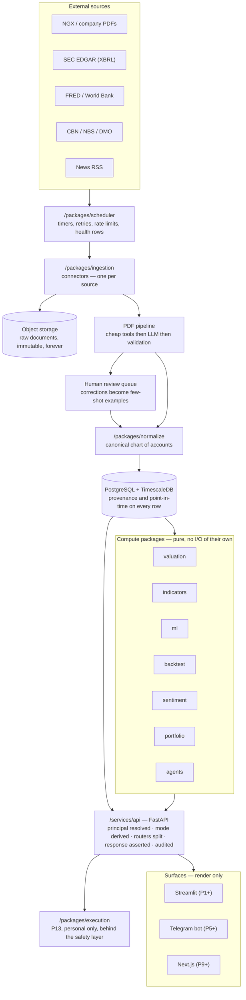

# 01 — Architecture

**What this document is for.** This is the shape of the system: what the pieces are, what talks
to what, and why it is arranged this way rather than some other way. Read it before writing any
code that crosses a boundary between two packages, and read it again whenever you are tempted to
take a shortcut through one. [08_DATA_CONTRACTS.md](08_DATA_CONTRACTS.md) makes the interfaces
precise; this document explains the reasoning behind them.

**Nothing described here exists yet.** As of 2026-08-28 the repository contains specification
documents and this planning set. Every diagram below is a target, not a description of running
code.

---

## Table of contents

1. [The 10,000-foot view](#1-the-10000-foot-view)
2. [Layer by layer](#2-layer-by-layer)
3. [The mode gate in depth](#3-the-mode-gate-in-depth)
4. [The provenance spine](#4-the-provenance-spine)
5. [Point-in-time correctness](#5-point-in-time-correctness)
6. [Versioning and no silent overwrites](#6-versioning-and-no-silent-overwrites)
7. [The correctness substrate](#7-the-correctness-substrate)
8. [Multi-tenancy](#8-multi-tenancy)
9. [Architecture decision records](#9-architecture-decision-records)
10. [Deliberately deferred](#10-deliberately-deferred)

---

## 1. The 10,000-foot view

### How a Nigerian PDF becomes a number on a screen

Follow one figure the whole way. GTCO publishes its 2025 annual report as a 300-page PDF. You
want its revenue on your dashboard, and you want to be able to click that number and see the
page it came from.

1. **A scheduled job notices the document.** The scheduler runs a connector on a timer. The
   connector fetches the listing page, hashes it, and compares against last time. A new document
   appeared, so it downloads the PDF.
2. **The raw file is stored, immutably, forever.** Before anything is parsed, the PDF goes to
   object storage and a `source_documents` row records its hash, URL, and retrieval time. This
   happens first so that every later step can be re-run without re-fetching — and so it still
   works when the source website is gone.
3. **Cheap tools read what they can.** PyMuPDF and pdfplumber pull text and table structure.
   This handles most of the document at almost no cost.
4. **An LLM does the semantic mapping.** It receives the extracted text and tables — not the raw
   pixels, for cost reasons — with a strict JSON schema and an instruction never to infer a
   missing value. It returns line items, each with the label as printed, the page number, and a
   confidence score.
5. **Deterministic validation checks the arithmetic.** Do assets equal liabilities plus equity?
   Does this year's opening balance match last year's closing? Does profit after tax tie between
   two statements? These identities must hold in any correct set of accounts, so a break means
   something is wrong — and it is caught by arithmetic, not by trusting the model.
6. **It either stores or queues.** High confidence and clean validation, it is stored. Otherwise
   it goes to a human review queue, prioritised so the reviewer sees material figures first.
7. **The human correction teaches the system.** A correction is stored as a new version — the
   original is never destroyed — and also as a few-shot example that improves the next
   extraction.
8. **Normalization maps it to a canonical key.** "Gross earnings" in a bank's statement and
   "Revenue" in a manufacturer's both become internal keys that can be compared, through an
   explicit versioned mapping table rather than a guess.
9. **The API serves it, mode-aware.** A request arrives. The server works out who is asking and
   what they are entitled to. The figure — public-tier data — is returned with its provenance
   attached.
10. **The client renders it.** Streamlit today, Next.js from P9. It shows the number, the as-of
    date, and a link to page 94 of the source PDF. It computes nothing.

The number on the screen carries its whole history with it. That is the entire architectural
thesis.



### The five rules the diagram encodes

| Rule | Where you see it |
|---|---|
| **Raw is stored before it is parsed** | Every arrow into the database passes through object storage first |
| **Compute packages never do their own I/O** | They take data in and return data out; the API and ingestion own the edges |
| **Everything reaches a client through the API** | There is no arrow from the database to a surface |
| **Surfaces render, they do not compute** | The three clients have no outbound arrows except back to the API |
| **Execution hangs off the API, last, alone** | It is the only component that can move money, and it is gated by everything upstream |

---

## 2. Layer by layer

### The packages

Import direction is one-way and enforced in CI: `apps/*` and `services/*` may import
`packages/*`; `packages/*` may import `packages/common` and nothing else upward. A violation is
a build failure, not a code-review comment.

| Package | What it does | What it must never do | First appears |
|---|---|---|---|
| **common** | Schemas, provenance types, database session, config, the single unit-conversion point | Import any other package | P0 |
| **compliance** | Mode resolution, router split, response-type assertion, banned-phrase lint, audit writes | Trust anything client-supplied | P0 |
| **ingestion** | Connectors, the PDF pipeline, HITL queue, raw document storage | Interpret meaning — it extracts, it does not judge | P1 |
| **scheduler** | Timers, retries, backoff, per-domain rate limits, `connector_runs` health | Contain business logic | P1 |
| **normalize** | Map source labels to the canonical chart of accounts | Invent a value for a missing item | P2 |
| **valuation** | Ratios, DCF, comps, scenarios | Choose assumptions for the user | P2 |
| **indicators** | RSI, MACD, BB, ATR, OBV, Stochastic — computed and stored | Emit a signal. It produces features only | P6 |
| **backtest** | Harness, purged/CPCV splitters, cost models, DSR | Be optimistic. Its job is to disprove | P7 |
| **ml** | Features, labels, models, calibration | Return an uncalibrated confidence number | P8 |
| **agents** | Bull, bear, risk, arbitrator; memos | Assert anything without a citation | P9 |
| **sentiment** | Bulk scoring, LLM tier for ambiguous items | Be treated as a strong signal | P5 |
| **alerts** | Alert types, idempotent delivery | Send twice | P5 |
| **portfolio** | Positions, cost basis, P&L, Nigerian tax | Assume one user | P10 |
| **execution** | US adapters, NGX manual ticket, safety layer | Act without human confirmation | P13 |

### Why `common` owns unit conversion

[OPERATIONS.md 1.6](../OPERATIONS.md) requires one conversion point. Nigerian statements report
in thousands or millions of Naira, inconsistently, sometimes varying within a single document.
If three packages each convert, they will eventually disagree, and the disagreement will be
silent — one report showing ₦3.36 trillion and another ₦3.36 billion for the same company, with
no error anywhere. One function, one place, tested once.

### Why compute packages do no I/O

A function that takes a DataFrame and returns a DataFrame can be tested with a hand-built input
and a hand-computed expected output. A function that queries the database inside itself cannot —
you need a database to test arithmetic. Since the core financial math is exactly the part that
must be provably correct ([07_TEST_STRATEGY.md](07_TEST_STRATEGY.md) §2), keeping I/O at the
edges is what makes the tests that matter cheap enough to actually write.

### The surfaces

| Surface | Phase | Role |
|---|---|---|
| **Streamlit** | P1+ | Local dashboards and the HITL review UI. Thin client (AD-3). |
| **Telegram bot** | P5+ | Push delivery — briefs and alerts |
| **Next.js** | P9+ | The hosted web app. The only non-Python component in the system (AD-1) |

All three call the same FastAPI. This is what makes the P9 frontend swap a re-skin rather than a
rewrite, and it is the entire justification for standing the API up in P0 (AD-2).

---

## 3. The mode gate in depth

This is the part of the architecture with real legal consequence.
[CLAUDE.md](../CLAUDE.md): *"Never expose personal-mode output to a non-family user pre-licence.
Access control in code, not policy. This is the only line with real legal risk."*

### What the two modes actually are

**Personal mode** is for the owner and family. It may say BUY and SELL, output price targets, and
surface model conviction — because it is their own capital. [CLAUDE.md](../CLAUDE.md) is explicit
that you must **not** add public-facing disclaimers or strip advice features on the assumption
this is a regulated product. It is not, today.

**Public mode** is data only. Statements, ratios, scenarios the user drove themselves, news —
with no verdict attached. This is what the world sees at P12, and what it keeps seeing until an
SEC licence changes `licence_status`.

One codebase, `MODE=personal|public`, never two products.

### The request lifecycle

```mermaid
sequenceDiagram
    participant C as Client
    participant P as Principal resolution
    participant M as Mode derivation
    participant R as Router
    participant A as Response assertion
    participant L as Banned-phrase lint
    participant D as Audit log

    C->>P: request + credential
    P->>P: look up principal; None if anonymous
    P->>M: principal (or None)
    M->>M: entitlements + licence_status -> mode
    Note over M: the request body, headers, query and<br/>cookies are NEVER consulted here.<br/>Default is public.
    M->>R: dispatch to /public/* or /personal/*
    R->>A: response object
    A->>A: is this TYPE legal for this mode?
    Note over A: illegal -> raise 500.<br/>This is our bug, not the caller's error.
    A->>L: response text
    L->>L: advice phrasing in public mode?
    L->>D: principal, mode, endpoint, response type, status
    D->>C: response
```

### The five mechanisms, and what each one alone cannot do

[SPEC.md 1.2](../SPEC.md) requires all five. They overlap deliberately — each covers a different
failure.

**1. Mode derived server-side from the principal.**

```python
async def resolve_mode(request: Request) -> Mode:
    principal = await resolve_principal(request)
    if principal is None:
        return Mode.PUBLIC
    if not principal.entitlements.personal_tier:
        return Mode.PUBLIC
    return Mode.PERSONAL
```

*Alone it fails when:* a developer adds an endpoint that returns advice from the public router
by accident. Mode was correct; routing was not.

*Without it:* a client sends `mode=personal` and is believed. This is the failure with legal
consequence, and it is why [SPEC.md 4.1](../SPEC.md) states the rule as an invariant.

**2. Separate `/public/*` and `/personal/*` routers.**

Not one router with an `if`. Two module trees, two sets of handlers. Advice-generating code is
imported by the personal router and is not reachable from the public one.

*Alone it fails when:* a handler in the personal tree is mounted on the public router by a
copy-paste error.

**3. Response-type assertion.**

```python
PUBLIC_LEGAL_TYPES = {DataSeries, StatementView, RatioSet, ScenarioResult, NewsItem}

def assert_legal(mode: Mode, payload) -> None:
    if mode is Mode.PUBLIC and type(payload) not in PUBLIC_LEGAL_TYPES:
        raise HTTPException(500, "response type illegal for public mode")
```

The allow-list matters. A deny-list would need updating every time someone adds a new
advice-shaped type, and the one they forget is the one that leaks.

**500, not 403.** A public request receiving a personal payload is not the caller doing something
forbidden — it is our code being wrong. It must be impossible to mistake for normal operation.

*Alone it fails when:* advice arrives as prose inside a legal type. A `RatioSet` whose
`commentary` field says "this looks cheap" passes the type check.

**4. Banned-phrase linter.**

Scans outbound public-mode text for advice phrasing. This is the one that catches mechanism 3's
blind spot.

*Alone it fails when:* the advice is phrased in a way the list does not anticipate. It is a net,
not a wall — which is why it is fifth of five and not first of one.

**5. An audit row per request.**

Principal, mode, endpoint, response type, status, timestamp. Written for every request including
failures.

*Alone it prevents nothing* — it is after the fact. But it is the only mechanism that lets you
answer "who saw what, when", which is precisely the question a regulator asks, and the question
you cannot answer retroactively if you did not record it.

> 🔴 **FRAGILE — not because any mechanism is hard, but because all five must be present from
> the first endpoint.** Add the sixth endpoint before the gate exists and you have six endpoints
> to retrofit and no test that tells you which one you missed. This is the entire argument for
> AD-2 (the API in P0). Three approaches to enforcement:
>
> **1. Middleware applied globally, endpoints opt in to nothing (recommended).** The gate runs on
> every request by construction; an endpoint cannot forget it. *Against:* You must be careful
> that `/health` and static assets do not fight the middleware.
>
> **2. A decorator per endpoint.** Explicit and readable at the call site. *Against:* A
> forgotten decorator is an unguarded endpoint, and nothing detects it — the exact failure mode
> that matters most.
>
> **3. A dependency injected per router.** FastAPI-idiomatic, moderately safe. *Against:* Still
> possible to mount a router without it.
>
> **Recommendation: 1, plus a compliance test that enumerates every registered route and asserts
> each is covered.** The test is what turns "we applied it globally" into something you know
> rather than believe. See [07_TEST_STRATEGY.md](07_TEST_STRATEGY.md) §4.

---

## 4. The provenance spine

[CLAUDE.md](../CLAUDE.md): *"Provenance on every figure — source document, page, as-of date.
Non-negotiable."*

### What travels with a value

Per [DATA_FOUNDATION.md 3.6](../DATA_FOUNDATION.md), every number links to:

| Field | Meaning | Why it is needed |
|---|---|---|
| `source_document_id` | The stored immutable document | Lets you reopen the exact file, even if the source site is gone |
| `page` | Page number within it | Makes verification a five-second job instead of a search |
| `retrieved_at` | When we fetched it | Distinguishes "the site was wrong then" from "we parsed it wrong" |
| `extraction_job_id` | Which run produced it | Lets you re-run or invalidate a whole batch when a bug is found |
| `confidence` | Extraction confidence | Drives review routing, and flags weak figures downstream |
| `as_of_date` | The date the value describes | The business date |
| `known_as_of` | When it became knowable | The point-in-time date — see §5 |
| `version` | Incremented on restatement | Corrections never overwrite — see §6 |

### How provenance survives aggregation

This is the part that is easy to get wrong. A single line item has one source page. But a ratio
is computed from two line items, and a DCF from dozens.

**The rule: a derived value carries the union of its inputs' provenance, plus its own
computation record.**

```json
{"metric":"gross_margin","value":0.4686,
 "as_of_date":"2025-09-27","known_as_of":"2025-10-31",
 "computed_from":[
   {"canonical_key":"revenue","value":416161000000,"document_id":883,"page":31},
   {"canonical_key":"cost_of_sales","value":221161000000,"document_id":883,"page":31}],
 "computation":{"formula":"(revenue - cost_of_sales) / revenue",
                "code_version":"valuation@1.4.0"}}
```

The `known_as_of` of a derived value is the **latest** of its inputs — a ratio is only knowable
once its last input is. Getting this backwards is a subtle lookahead bug.

### What the UI renders

Hovering a figure shows: the value, its as-of date, the source document name, the page, and a
link that opens that page. For a derived figure it shows the formula and the inputs, each with
its own provenance.

This is [CLAUDE.md](../CLAUDE.md)'s "show the work in every mode" made concrete, and it is what
[DATA_FOUNDATION.md 3.6](../DATA_FOUNDATION.md) calls "the backbone of the 'instrument, not
judgment' trust promise."

🟢 **SOLID architecturally, 🟡 WATCH in discipline.** The design is simple. The risk is a single
insert path somewhere that omits the columns. *Early-warning signal:* any `NOT NULL` provenance
column you were tempted to make nullable to get a test passing.

---

## 5. Point-in-time correctness

### What lookahead bias is, in plain words

Lookahead bias is using information in a backtest that you could not have had on the day you
pretend to have traded. It does not raise an error. It makes strategies look profitable that
would have lost money. It is the most expensive bug class in this project because **its symptom
is success.**

### The worked example — a restatement poisons a backtest

March 2025. A company reports FY2024 revenue of ₦100 billion. Everyone acts on that number.

September 2025. It restates: FY2024 revenue was actually ₦85 billion. An accounting error.

Now your database holds "FY2024 revenue" and it says ₦85 billion, because that is the truth.

You backtest a strategy that buys companies with revenue growth above 20%. On a March 2025
decision date, your backtester looks up FY2024 revenue and gets **₦85 billion** — the restated
figure, which nobody knew until September. Your strategy correctly avoids a company that was, in
March, universally believed to be growing. It looks prescient. It is time travel.

Deploy it, and it loses money, because in live trading you only ever have the figure that has
been published.

### The two dates

| Column | Answers | Example |
|---|---|---|
| `as_of_date` | What period does this describe? | 2024-12-31 |
| `known_as_of` | When could anyone first have known it? | 2025-03-14 (original) / 2025-09-02 (restated) |

Both versions are stored. Neither overwrites the other.

### The query pattern that prevents it

Every feature query for a decision date `D` asks: *what was the most recent version of this fact
that was knowable on or before D?*

```sql
SELECT DISTINCT ON (security_id, canonical_key)
       security_id, canonical_key, value, as_of_date, known_as_of, version
FROM   statement_line_items
WHERE  known_as_of <= :decision_date
ORDER  BY security_id, canonical_key, known_as_of DESC, version DESC;
```

The `known_as_of <= :decision_date` clause is the entire mechanism. Omit it and you have
lookahead bias. There is no error message either way.

**Architectural consequence:** feature construction must never read the database with a plain
"latest value" query. `/packages/ml` and `/packages/backtest` get their point-in-time accessor
from `/packages/common`, and that accessor requires a decision date as a mandatory argument. Not
optional with a default of "now" — mandatory, so that forgetting it is a `TypeError` at import
time rather than a wrong number in a results table.

> 🔴 **FRAGILE — and the failure is invisible.** Three approaches:
>
> **1. A mandatory-argument accessor in `common`, plus a lint rule banning raw SQL in `ml` and
> `backtest` (recommended).** Forgetting the date is a crash, not a wrong answer. *Against:*
> Requires the discipline to route every read through it.
>
> **2. Database views that embed the point-in-time filter.** The correct query is the only query
> available. *For:* Very strong. *Against:* Views with a parameterised as-of date are awkward in
> Postgres and tend to grow into functions that are harder to test.
>
> **3. Convention and code review.** *Against:* This is not a mechanism. It is a hope. It is
> listed only so it is visibly rejected.
>
> **Recommendation: 1, with the synthetic-data test from
> [07_TEST_STRATEGY.md](07_TEST_STRATEGY.md) as the proof.** Feed the backtester a dataset
> containing a known restatement and assert it returns the *original* figure at the earlier
> decision date. That test failing is the only reliable alarm for this bug class.

---

## 6. Versioning and no silent overwrites

[CLAUDE.md](../CLAUDE.md): *"No silent overwrites — corrections are versioned, attributed, and
noted."*

### The mechanism

A correction never updates a row in place. It writes a new row with an incremented `version`,
and marks the old one superseded:

```
| id | security_id | canonical_key | value        | version | superseded_by | corrected_by | reason        |
|----|-------------|---------------|--------------|---------|---------------|--------------|---------------|
| 5  | 12          | revenue       | 100000000000 | 1       | 9             | NULL         | NULL          |
| 9  | 12          | revenue       |  85000000000 | 2       | NULL          | frank        | FY24 restated |
```

Row 5 is never deleted. It is what the world believed in March, and it is the correct answer to
"what was knowable on 2025-03-14".

### Why this is architectural rather than a database detail

Three separate requirements collapse into this one mechanism:

1. **Point-in-time correctness** (§5) needs the superseded version to still exist.
2. **Trust** — [PROJECT_CONTEXT.md](../PROJECT_CONTEXT.md)'s "instrument, not judgment" promise
   means a user must be able to see that a figure changed and why.
3. **Auditability** — at P12 you may need to show what a user saw on a given date.

An `UPDATE` statement against a figure table destroys all three at once. The architectural rule
is therefore: **no `UPDATE` on any table holding a financial figure.** Inserts and supersession
only. Enforce it in review, and in the repository layer by simply not providing an update method.

🟢 **SOLID.** Well-understood pattern, and the enforcement is a missing method rather than a
discipline.

---

## 7. The correctness substrate

This is **TG2** — six items from [OPERATIONS.md Part 1](../OPERATIONS.md) that no task in
[SPEC.md 4.2](../SPEC.md) schedules. They are architectural because they change the *meaning* of
stored data, not merely its completeness. Built in P3; see
[03_ROADMAP_PART1_PHASES_0-6.md](03_ROADMAP_PART1_PHASES_0-6.md) §P3.3.

Each below is stated as the bug it prevents, because that is the only framing that makes the work
feel proportionate to its cost.

### 7.1 Corporate actions — "the highest-priority gap"

**The bug:** A stock trades at ₦100. A 2-for-1 split makes it ₦50, and nobody gained or lost
anything. Your raw price series shows a 50% overnight crash. RSI reads deeply oversold.
Volatility doubles. A backtest sees a catastrophic loss — or, if short, a windfall — that never
happened. Nothing raises an error.

**The fix:** A `corporate_actions` table drives an adjustment factor. `close_raw` and `close_adj`
are separate columns; raw is never overwritten, because an adjustment you have destroyed cannot
be recomputed when you discover the action was recorded wrong.

**Architectural rule:** anything that consumes a price series for analysis reads `close_adj`.
Anything reporting an actual historical trade price reads `close_raw`. The two are never
interchangeable, and the column names make the choice explicit at every call site.

### 7.2 Trading calendar

**The bug:** A Nigerian public holiday has no price row. Is that a closed market or a failed
scraper? Without a calendar you cannot tell — so you either alert on every holiday, or you
silence the alarm and miss real outages. Meanwhile a "missing" day treated as zero return
depresses your volatility estimate.

**The fix:** A `trading_calendar` table per exchange. Expected-days become computable, which
makes both gap detection and volatility annualization correct.

### 7.3 FX as a first-class table

**The bug:** A 2023 Naira figure converted at today's rate. Given the Naira moved from
**₦907.1/$ to ₦1,535/$ during 2024 alone** ([DATA_FOUNDATION.md 3.3](../DATA_FOUNDATION.md)),
this is not a rounding difference — it is a wrong answer by a large multiple.

**The fix:** `fx_rates` with `as_of_date` and a rate type (NFEM official, parallel, closing,
average). Conversion always takes a date. A conversion function without a date parameter is a
defect.

### 7.4 Stable identity and ticker history

**The bug:** Tickers get reused and companies rename. Key anything on the ticker string and a
rename silently merges two unrelated companies' price histories into one series — which then
produces confident, meaningless analysis.

**The fix:** A surrogate `security_id` as the only key anything joins on. Ticker becomes a
time-bounded attribute in `security_identifiers`, with valid-from and valid-to dates.

### 7.5 Fiscal period alignment

**The bug:** Comparing a June year-end to a December year-end as if they were the same period.
The numbers are both real, the comparison is nonsense, and nothing flags it.

**The fix:** `fiscal_year_end` on the company, and a comparability check that flags mismatched
periods rather than silently aligning them.

### 7.6 One unit conversion point

**The bug:** Nigerian statements report in thousands or millions, inconsistently, sometimes
varying between sections of the same document. A figure off by 1,000× on one line item among
forty is not visually obvious in a table.

**The fix:** `unit_multiplier` captured at extraction ([DATA_FOUNDATION.md 3.2](../DATA_FOUNDATION.md)),
and exactly one function in `/packages/common` that converts. No other module may.

> 🔴 **FRAGILE as a group — every one fails silently, and they compound.** Approaches to
> sequencing are in [03_ROADMAP_PART1_PHASES_0-6.md](03_ROADMAP_PART1_PHASES_0-6.md) §P3.3. The
> architectural point is that all six change what stored data *means*, so retrofitting them
> means recomputing every derived value — and being unsure which ones were affected.

---

## 8. Multi-tenancy

[CLAUDE.md](../CLAUDE.md) names single-user as "the expensive shortcut to avoid."
[PROJECT_CONTEXT.md 4](../PROJECT_CONTEXT.md) explains why: a single-user trading layer is a full
rewrite to open up.

### The principal model

```
principals        — who can authenticate (owner, family member, later public user)
entitlements      — what tier each principal reaches (personal_tier, data_tier, spend_cap)
sessions          — active credentials
licence_status    — system-level: does the SEC licence exist yet?
```

Mode falls out of `entitlements` plus `licence_status`. Nothing else computes it.

### Every table that carries an owner key

| Table | Owner column | Why it must be per-user |
|---|---|---|
| `portfolios` | `principal_id` | Two family members hold different things |
| `positions` | via `portfolio_id` | Follows the portfolio |
| `watchlists` (TG11) | `principal_id` | The daily brief is built from it |
| `alerts` | `principal_id` | Alert rules are personal |
| `alert_deliveries` | `principal_id` | Idempotency is per recipient |
| `risk_limits` | `principal_id` | Different capital, different limits |
| `llm_spend` | `principal_id` | Spend caps are per user |
| `scenarios` | `principal_id` | My bear case is not yours |
| `audit_log` | `principal` | The whole point |

### The rule that is easiest to break

**Position sizing takes account equity as a parameter, never a config constant.**

```python
# WRONG — the shortcut that costs a rewrite
ACCOUNT_EQUITY = 5_000_000
def size_position(signal, price): ...

# RIGHT
def size_position(signal, price, *, account_equity: Decimal, risk_limits: RiskLimits): ...
```

The wrong version is shorter, works perfectly for one user, and is invisible until the day a
second person needs a position size — at which point every caller, every backtest, and every
stored result derived from it is wrong for them.

🟡 **WATCH.** *Early-warning signal:* any module-level constant that describes a person — an
equity figure, a risk tolerance, a Telegram chat ID, an email address. Each one is a
single-tenant assumption wearing a config variable's clothes.

---

## 9. Architecture decision records

Kept in `docs/adr/NNNN-title.md` per [OPERATIONS.md 3.1](../OPERATIONS.md). Seeded in P0.

### ADR-0001 — Storage engine

**Status:** **ACCEPTED 2026-08-30. PostgreSQL 16 + TimescaleDB in every environment and every
phase.** Closed during the pre-build audit; it was the one open decision that P0.4 could not
start without. **TG9 is closed.**
**Context:** [DATA_FOUNDATION.md 4.1](../DATA_FOUNDATION.md) says DuckDB/SQLite for v0.x;
[SPEC.md 3.2](../SPEC.md)'s DDL is Postgres-flavoured; [OPERATIONS.md 2.4](../OPERATIONS.md)
requires a scripted migration. Nobody picked. This is **TG9**.
**Decision:** PostgreSQL from day one. Full reasoning and three approaches in
[03_ROADMAP_PART1_PHASES_0-6.md](03_ROADMAP_PART1_PHASES_0-6.md) §P0.3.
**Consequence:** There is **no SQLite/DuckDB variant of this schema and no migration to
write.** The DDL may use `SERIAL`, `JSONB`, `TIMESTAMPTZ`, plpgsql triggers, partial unique
indexes and `btree_gist` exclusion constraints freely — several correctness guarantees in
[08_DATA_CONTRACTS.md](08_DATA_CONTRACTS.md) depend on exactly those.
**Supersedes:** [06_RISK_REGISTER.md](06_RISK_REGISTER.md) §3.15, which rated "DuckDB/SQLite
for the local phases" 🟢 SOLID, and [08_DATA_CONTRACTS.md](08_DATA_CONTRACTS.md) §1.2's claim
that the same schema runs on SQLite/DuckDB in P0–P8. Both are withdrawn.

### ADR-0002 — `/packages/scheduler` added to the monorepo

**Context:** [SPEC.md 3.1](../SPEC.md)'s layout has no scheduler, though
[DATA_FOUNDATION.md 3.5](../DATA_FOUNDATION.md) names APScheduler and
[OPERATIONS.md 2.3](../OPERATIONS.md) requires connector health tracking. This is **TG8**.
**Decision:** Add it. A connector nobody runs fails silently, and health rows need an owner.
**Consequence:** One more package; job scheduling never leaks into connector code.

### ADR-0003 — Authentication mechanism

**Status:** **ACCEPTED 2026-08-30.** Closed during the pre-build audit: P0.5 cannot be written
while it is open, and the recommendation below had no competing option worth deliberating.
**TG3's mechanism is now specified** — the `principal_tokens` DDL and the `scripts/issue_token.py`
mint path are in [10_PRE_BUILD_CORRECTIONS](10_PRE_BUILD_CORRECTIONS.md) §2.4. Note that
`08 §2.0`'s table 43 is named `sessions`, which is misleading: it is a hashed bearer token, not a
session, and naming it `sessions` invites cookie semantics this design does not want.
**Still open, deliberately:** `SPEC.md` §1.2 mechanism 1 requires *"the owner principal **+ a
second factor**"*, and the P0 design has none. Either restore it on `/personal/*` or record its
deferral to P9's identity provider as ADR-0009 — but do not let a stated requirement lapse
silently. This is **TG3**.
**Decision:** A token table in Postgres now; a hosted identity provider at P9. The
`principals` table and the middleware contract are what matter; the credential mechanism on top
is swappable *because* the contract exists. Three approaches in
[03_ROADMAP_PART1_PHASES_0-6.md](03_ROADMAP_PART1_PHASES_0-6.md) §P0.5.

### ADR-0004 — Python everywhere except the v1.0 frontend

**Decision:** All **14** packages (SPEC.md §3.1's thirteen plus `/packages/scheduler` per
ADR-0002) and the API are Python. The Next.js frontend at P9 is the only non-Python component.
**Alternatives rejected:** An all-Python frontend (Reflex, NiceGUI, or Streamlit as the shipped
product). Rejected because [PROJECT_CONTEXT.md 9](../PROJECT_CONTEXT.md)'s B2B customers touch
the frontend, and Streamlit does not read as a product. It remains correct for v0.x, where the
only user is the builder.
**Consequence:** One TypeScript toolchain to maintain, from P9 only.

### ADR-0005 — FastAPI stands up in P0, not P9

**Context:** [SPEC.md 4.2](../SPEC.md) places the API at T16 (v1.0). But T15 is marked
"front-loaded, all versions" with files `/compliance`, `/api`, and [SPEC.md 4.1](../SPEC.md)
requires mode to be server-derived. A Streamlit-only application has no server from which to
derive it.
**Decision:** The API exists from P0. **This is a deliberate, documented deviation from
SPEC.md's literal task ordering**, not an oversight.
**Consequence:** P0 is longer and produces nothing visible. Every later surface is a client of a
gate that already works.

### ADR-0006 — Streamlit is a thin client

**Decision:** Streamlit renders what the API returns. No SQL, no arithmetic, no business logic in
`apps/streamlit/`.
**Consequence:** The P9 frontend swap is a re-skin. Enforced by an import-linter rule and a CI
grep.

### ADR-0007 — Multi-user from day one

**Decision:** Everything user-scoped is keyed by principal from the first migration. Position
sizing takes equity as a parameter.
**Alternatives rejected:** Single-user now, multi-user at P9 — named in
[CLAUDE.md](../CLAUDE.md) as the expensive shortcut.
**Consequence:** Slightly more schema and signature noise while there is one user. No rewrite
when there are three.

---

## 10. Deliberately deferred

Things the architecture does not do yet, and when it will. Listing them stops each from being
rediscovered as a crisis.

| Deferred | Until | Why it can wait |
|---|---|---|
| Horizontal scaling | Post-P12, if ever | Family-scale load. A single instance is correct until traffic proves otherwise. |
| Caching layer (Redis) | P9 | Postgres is fast enough at this size; caching adds an invalidation problem you do not yet have. |
| Real-time / streaming prices | Not planned | Daily bars are what the backtester and models use ([SPEC.md 2C](../SPEC.md)). |
| Full-text search | P9 | Postgres full-text is sufficient for news until volume argues otherwise. |
| Event sourcing | Not planned | Versioned rows (§6) give the auditability without the complexity. |
| Microservices | Not planned | A monorepo of packages behind one API is right for a solo builder. Splitting it buys deployment independence you do not need and pays in distributed-systems bugs you do not want. |
| Multi-region / HA | Not planned | Backup and a tested restore ([02_INFRASTRUCTURE.md](02_INFRASTRUCTURE.md) §8) cover the actual risk. |
| A public write API | Not planned | The public tier is read-only. |
| Autonomous execution | Never, for NGX; P13 US only, human-confirm by default | [SPEC.md 2I](../SPEC.md): no Nigerian retail broker exposes a programmatic order API, so NGX is a manual ticket by necessity as well as by choice. |

---

**Next:** [08_DATA_CONTRACTS.md](08_DATA_CONTRACTS.md) makes these boundaries precise.
[03_ROADMAP_PART1_PHASES_0-6.md](03_ROADMAP_PART1_PHASES_0-6.md) §P0 builds the spine described
here.
