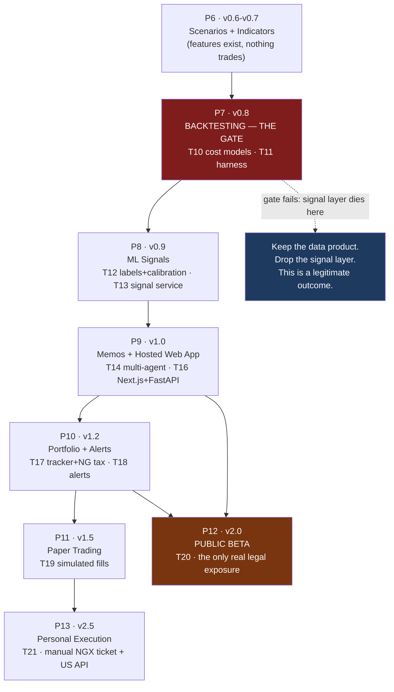

# Roadmap Part 2 — Phases 7 through 13

**What this document is for.** This is the build plan for the second half of the project: the
seven phases that turn a working data product into a trading system, a hosted web app, and
eventually a public product. It covers **P7 (Backtesting) through P13 (Personal Execution)**
in the same shape as [Roadmap Part 1](03_ROADMAP_PART1_PHASES_0-6.md), phase by phase: what
you must have before you start, what a human has to do by hand first, the tasks in build
order, the literal inputs and outputs of each piece, a numbered test checkpoint with exact
commands and exact expected results, the exit criteria, an honest risk assessment, and a list
of the shortcuts you will be tempted to take and what each one costs later. Read it top to
bottom the first time. After that, read one phase at a time, and read the TEST CHECKPOINT
before you write any code for that phase — the test tells you what "done" actually means.

> **Nothing in this project has been built yet.** As of 2026-08-28 the repository contains six
> markdown files, an empty `package.json`, and `node_modules/`. There is no `.git`, no Python,
> no database, no code. Every file path, table, and command in this document describes
> something you are going to create, not something you can go and look at.

---

## Table of contents

- [0. What Part 1 left you](#0-what-part-1-left-you)
  - [0.1 The state of the system at the end of P6](#01-the-state-of-the-system-at-the-end-of-p6)
  - [0.2 What P7-P13 add on top](#02-what-p7-p13-add-on-top)
  - [0.3 Debts and gaps carried forward into P7](#03-debts-and-gaps-carried-forward-into-p7)
  - [0.4 How to read a phase in this document](#04-how-to-read-a-phase-in-this-document)
  - [0.5 The risk marker system](#05-the-risk-marker-system)
- [P7 — Backtesting: THE GATE (v0.8)](#p7--backtesting-the-gate-v08)
- [P8 — ML Signals (v0.9)](#p8--ml-signals-v09)
- [P9 — Memos and Hosted Web App (v1.0)](#p9--memos-and-hosted-web-app-v10)
- [P10 — Portfolio and Alerts (v1.2)](#p10--portfolio-and-alerts-v12)
- [P11 — Paper Trading (v1.5)](#p11--paper-trading-v15)
- [P12 — Public Beta (v2.0)](#p12--public-beta-v20)
- [P13 — Personal Execution (v2.5)](#p13--personal-execution-v25)
- [Decision gates — where to stop, buy, or abandon](#decision-gates--where-to-stop-buy-or-abandon)
- [Appendix A — Gaps surfaced in this document](#appendix-a--gaps-surfaced-in-this-document)
- [Appendix B — Risk marker index](#appendix-b--risk-marker-index)

---

# 0. What Part 1 left you

## 0.1 The state of the system at the end of P6

[Roadmap Part 1](03_ROADMAP_PART1_PHASES_0-6.md) covers P0 through P6. When you arrive at P7,
this is what exists. If any of it does not exist, **you are not ready for P7** — go back.

| Phase | Version | What it left behind |
|---|---|---|
| **P0** Foundation and Rails | pre-v0.1 | The monorepo laid out per [SPEC.md 3.1](../SPEC.md); the full DDL from [SPEC.md 3.2](../SPEC.md) plus the six correctness tables from [OPERATIONS.md Part 1](../OPERATIONS.md); a FastAPI service with `/public/*` and `/personal/*` routers; the compliance middleware core (T15) deriving `mode` from the authenticated principal; a principal/identity model; CI running tests, lint and type checks; an ADR log |
| **P1** Macro Backdrop | v0.1 | FRED, CBN, NBS, DMO series in `macro_observations` with vintages and as-of dates; a Streamlit page that renders them; the provenance-and-charting pattern everything else copies (T1) |
| **P2** US Company Data | v0.2 | `EdgarConnector`, normalized US statements in `statement_line_items`, ratios, a user-driven DCF (T2) |
| **P3** Nigerian Manual Analyzer | v0.3 | Hand-entered NGX statements proving the canonical chart of accounts survives a bank (GTCO) and a devaluation-hit telco (MTN Nigeria); the correctness tables from OPERATIONS Part 1 populated — corporate actions, trading calendar, FX, security identifiers (T3) |
| **P4** Nigerian Automated Ingestion | v0.4 | The PDF to LLM to validation to human-review pipeline; the golden test set; the moat (T4) |
| **P5** News, Sentiment and Daily Brief | v0.5 | RSS ingestion with ticker tagging, tiered sentiment scoring, a scheduled Telegram brief with idempotent delivery (T5, T6, T7) |
| **P6** Scenarios and Indicators | v0.6-v0.7 | The user-driven scenario engine (T8) and the indicator engine (T9) writing RSI/MACD/Bollinger/ATR/OBV/Stochastic into the `indicators` table, keyed `(security_id, date, name, param_hash)` |

Two things about P6 matter enormously for everything that follows.

**First, the indicators are features, not signals.** [SPEC.md 2A](../SPEC.md) is blunt about
this and quotes the canonical survey — Park and Irwin, *Journal of Economic Surveys* 21(4)
(2007) — finding that of 95 modern studies of technical trading, 56 were positive, 20
negative, 19 mixed, and nearly all suffered "data snooping, ex post selection of trading
rules… and difficulties in estimation of risk and transaction costs." Simple technical rules
largely stopped working in US equities around the early 1990s. RSI below 30 is not a reason to
buy anything. It is a column in a table that a properly validated model may or may not find
useful. **P7 exists to find out which.**

**Second, `price_history` had better be real.** Every number P7 produces is a function of the
price series. If that series is wrong — unadjusted for a bonus issue, missing delisted
companies, dated by calendar days instead of trading days — then everything in P7 through P13
is fiction computed to four decimal places. See section 0.3.

## 0.2 What P7-P13 add on top



Read the diagram carefully. **P12 does not depend on P8.** The public beta is a data product.
It ships with statements, ratios, macro, news, and user-driven scenarios and nothing else. If
the signal layer never works, P9's web app, P10's portfolio tracker and P12's public beta all
still ship. That is the point of the branch marked STOP — it is a planned, respectable
outcome, not a failure. [TEAM_BRIEF.md Part 4](../TEAM_BRIEF.md) calls this "the honest
floor": *"If the ML signals never clear the backtest gate… you still built the missing
structured database of Nigerian corporate finance."*

**T15 is not a phase.** The compliance middleware's core lands in P0 and is hardened in every
phase through P12. Each phase below has a "T15 hardening" line in its task list saying exactly
what gets added to the compliance surface at that point. By P12 the compliance test suite must
cover every public endpoint that exists.

## 0.3 Debts and gaps carried forward into P7

These are holes in [SPEC.md 4.2](../SPEC.md)'s T1-T21 task list. They are named in the shared
register as TG1–TG20 ([00_START_HERE.md](00_START_HERE.md) §9). Four land squarely on P7's doorstep, so they are restated here with
what they mean *for you, at this point in the build*. The full treatment lives in
[Risk Register](06_RISK_REGISTER.md); the P0-P6 handling is in
[Roadmap Part 1](03_ROADMAP_PART1_PHASES_0-6.md).

### G1 — Price history ingestion has no T-number 🔴 FRAGILE

**The gap.** T9 (indicators) computes on `price_history`. T11 (the backtest harness) needs
OHLCV bars — open, high, low, close, volume — for every security in the universe over the
whole test window. **No task in T1-T21 ingests daily prices for NGX or for US.** The table is
defined in [DATA_FOUNDATION.md 4.2](../DATA_FOUNDATION.md); nothing fills it.

**What it means at P7.** If P6 shipped without solving this, P7 cannot start. You cannot
backtest without bars. The task must be built — call it `T9a`, a number of ours and not
SPEC's — before or during P6, and it is on the critical path for both phases.

**Three approaches:**

| Approach | What it is | Trade-off | Verdict |
|---|---|---|---|
| **A. Scrape `afx.kwayisi.org/ngx/`** | Free daily HTML price list for the whole NGX board, updated around 16:00 WAT each trading day; per-ticker pages carry price, ISIN, sector, volume ([DATA_FOUNDATION.md 2A](../DATA_FOUNDATION.md)) | Free, and already in the connector plan. But it is a single point of failure with no uptime contract or API agreement, and **it gives you today forward, not history**. Starting a scrape today means your first backtest in year one has one year of bars. | Cheapest, insufficient alone |
| **B. Buy EODHD `.XNSA`** | NGX end-of-day plus fundamentals, around $59.99/mo Fundamentals tier or $99.99/mo All-In-One ([DATA_FOUNDATION.md 2A](../DATA_FOUNDATION.md)) | Costs money and you do not own redistribution rights (see G5). But it gives you **history immediately**, which is the thing a backtest actually needs, and it carries corporate actions. | **Recommended for backtest history** |
| **C. Reconstruct from NGX daily market reports** | NGX publishes daily and weekly market summaries as PDFs | Free and authoritative. But it is another PDF extraction project on top of the one already eating your months ([TEAM_BRIEF.md Part 3](../TEAM_BRIEF.md), bottleneck 1), and daily granularity across ~150 names over 5 years is thousands of documents. | Do not do this for prices |

**Recommendation:** run A from day one so the live series accumulates and you are never
dependent on a vendor for *today*, and buy B once — a single historical pull — to get the
backtest window. Treat the EODHD history as **research data under a vendor licence you may not
redistribute**, tag it as such in the `source` column of `price_history`, and never serve it
through the public tier. That distinction is G5's problem and it is real.

### G2 — OPERATIONS Part 1 has no T-numbers 🔴 FRAGILE

**The gap.** Six correctness completions — corporate actions and price adjustment (1.1),
trading calendar (1.2), FX as a first-class table (1.3), stable identity and ticker history
(1.4), fiscal period alignment (1.5), one unit-conversion point (1.6) — are unscheduled in
SPEC's task list. [OPERATIONS.md](../OPERATIONS.md) calls 1.1 "the highest-priority gap".

**What it means at P7.** Three of the six are direct prerequisites for a backtest that is not
fiction, and OPERATIONS says so in its own priority order: *"Before v0.7 indicators: 1.2
trading calendar, 1.3 FX. Both are prerequisites for a backtest that is not fiction."*
Corporate actions (1.1) is worse — without it, every backtest that spans a Nigerian bonus
issue records a fake ~20% one-day loss and will stop you out of a position that never moved.
P7's entry criteria make all three hard blockers.

**Three approaches to closing it if you arrive at P7 and it is not done:**

| Approach | Trade-off | Verdict |
|---|---|---|
| **A. Stop and build all six tables now** | Costs 5-10 working days before P7 begins; nothing else moves. But everything downstream is correct and you never re-run a backtest suite because a bonus issue was missing. | **Recommended** |
| **B. Build 1.1, 1.2, 1.3 only; defer 1.4, 1.5, 1.6** | Faster (2-4 days) and unblocks P7 with the three that corrupt price series. 1.4 (identity) and 1.5 (fiscal alignment) corrupt *fundamental* features, which P8 needs but P7's price-only strategies do not. 1.6 (units) is already an extractor rule. Risk: you will forget, and P8 gets built on mixed fiscal periods. | Acceptable if you write the ADR and P8's entry criteria enforce it |
| **C. Restrict the P7 universe to securities with no corporate actions in the window** | Zero build cost, and genuinely tempting. But it is **selection bias by construction**: you have chosen a universe on a criterion correlated with company behaviour (companies that never issue bonus shares are a different population), and you will have proven a strategy on names you cannot actually trade. | Do not do this |

### G5 — The data-licensing gate has no task 🟡 WATCH at P7, 🔴 FRAGILE at P12

At P7 this is a bookkeeping discipline: **every row you load carries the source it came from
and the terms that source came under.** At P12 it becomes the thing that can stop the launch.
[PROJECT_CONTEXT.md 9.3](../PROJECT_CONTEXT.md) calls it "the one that kills deals." Full
treatment in [P12](#p12--public-beta-v20).

### G6 — No task covers the golden test set 🟡 WATCH

[TEAM_BRIEF.md 2.2-C](../TEAM_BRIEF.md) calls it "the highest leverage task in the project"
and T4's acceptance criteria depend on golden files existing. By P7 you either have it, or the
extraction-accuracy numbers you are quoting are unmeasured. It is a P3/P4 concern; it appears
here only because P8's fundamental features inherit whatever quality the extractor actually
has, and you cannot state that number without a golden set.

### G3 and G4 — auth and backup

**G3 (auth/identity has no task of its own)** matters at P9 and becomes legally load-bearing at
P12. **G4 (backup and disaster recovery is unscheduled)** should have been closed in P0. If you
reach P7 with months of extraction on one laptop and no restore drill, stop and read
[OPERATIONS.md 2.1](../OPERATIONS.md) before doing anything else. A backup you have never
restored is not a backup.

## 0.4 How to read a phase in this document

Every phase below has the same twelve sections, in the same order:

| Section | What it answers |
|---|---|
| **In one sentence** | What this phase produces |
| **Why this phase is here now** | Why it is not earlier or later. Ordering is an argument, not a preference |
| **Entry criteria** | A checklist. Every box must be ticked before the first line of code |
| **Manual work required first** | Human work with no code involved. Usually the thing that delays the phase |
| **The build, task by task** | The SPEC T-numbers, decomposed into work units with files and acceptance |
| **Expected inputs** | Literal. Real table rows, real JSON, real file paths |
| **Expected outputs** | Literal. Shapes, types, an example record |
| **TEST CHECKPOINT** | Numbered tests, exact command, exact expected result. At least one is a by-hand-and-by-eye check with no test runner involved |
| **Exit criteria** | A checklist. Every box must be ticked before the next phase |
| **What could go wrong** | Risk markers. Every 🔴 FRAGILE item gets three approaches and a recommendation |
| **What you will be tempted to skip** | The shortcut, and the bill it generates later |

**By-hand-and-by-eye checks.** Every phase has at least one test you run with a calculator, a
spreadsheet or your own eyes rather than pytest. This is deliberate. An automated test proves
the code does what the test says; only a hand check proves the test says the right thing. When
the test suite and your arithmetic disagree, your arithmetic is the referee until you can
explain the difference.

## 0.5 The risk marker system

- 🟢 **SOLID** — well understood, low variance, proven approach. Failure is obvious and cheap
  to fix. No reason to worry here.
- 🟡 **WATCH** — will work, but has a known failure mode, a cost curve, or a dependency that
  can move. Each one states the early-warning signal.
- 🔴 **FRAGILE** — genuinely likely to go wrong, or the estimate could be off by multiples.
  **Every 🔴 item gets at least three distinct approaches with trade-offs and a
  recommendation.** This is an explicit requirement from the owner.

Ratings here extend, and never contradict,
[DATA_FOUNDATION.md 8.2-8.3](../DATA_FOUNDATION.md), [SPEC.md Part 6](../SPEC.md) and
[TEAM_BRIEF.md Part 3](../TEAM_BRIEF.md). Where a source document already made an honest
assessment, it wins.

---

# P7 — Backtesting: THE GATE (v0.8)

**Spec version:** v0.8 · **Tasks:** T10 (cost models), T11 (harness + purged/CPCV + DSR) ·
**Effort:** 3–5 weeks

## In one sentence

At the end of P7 you own a backtester that tries hard to prove your strategies are worthless,
models the real cost of trading on the NGX down to the ₦4 alert fee, and has been verified
against synthetic data where you already know the right answer.

## Why this phase is here now — and why it is the most important phase in the project

**P7 comes before P8 (ML signals). This inverts the intuitive order and it is the single most
important sequencing decision in this build.**

The reason is in [SPEC.md 2C](../SPEC.md), which calls backtesting "the immune system", and
cites two literatures that should be read before writing a line of P8:

- **Harvey, Liu & Zhu** (*Review of Financial Studies* 29(1):5–68), verbatim: *"A new factor
  needs to clear a much higher hurdle, with a t-statistic greater than 3.0. We argue that most
  claimed research findings in financial economics are likely false."*
- **Bailey, Borwein, López de Prado & Zhu** — "Pseudo-Mathematics and Financial Charlatanism"
  and "The Probability of Backtest Overfitting": the probability of selecting an overfit
  strategy grows rapidly with the number of trials.

### Why a backtester that lies to you is worse than no backtester

With no backtester, you know you do not know. You would size positions cautiously, or not trade
at all.

With a backtester that lies, you have a number. The number says Sharpe 2.1. You believe it,
because you built the thing that produced it. You size accordingly. And the strategy loses money
in a way you did not prepare for, because you were not uncertain — you were confident and wrong.

Every bias in the taxonomy below **inflates** returns. None of them make a strategy look worse
than it is. A backtester with a bug is therefore not a coin flip; it is systematically
optimistic. That asymmetry is why this phase is built before there is any signal to test, and
why [SPEC.md 4.1](../SPEC.md) makes it an invariant: **no signal trades without a passing
recorded `backtest_run`.**

## Entry criteria

- [ ] P6 complete — indicators computed and stored
- [ ] **TG1 fully closed** — price history for both markets, with volume (participation caps
      need it)
- [ ] **TG2 fully closed** — corporate actions applied; `close_raw` and `close_adj` both present
      and distinct
- [ ] Trading calendar populated for the NGX
- [ ] Delisted securities retained in `securities` with `delisted_date`
      ([SPEC.md 2C](../SPEC.md)) — without this, survivorship bias is unavoidable
- [ ] Point-in-time accessor from [01_ARCHITECTURE.md](01_ARCHITECTURE.md) §5 in place and tested

If any of these is not genuinely true, stop and close it. A backtester built on unadjusted
prices or a survivor-only universe produces confident nonsense, and you will not be able to tell.

## Manual work required first

| Task | Role | Effort | Blocking? |
|---|---|---|---|
| **Verify the NGX fee stack against a real contract note** | Owner | ~2 hours | **Blocking** |
| **Pre-register the universe and window** | Owner | ~1 hour | **Blocking** — selection bias prevention |

The first is worth insisting on. [SPEC.md 2C](../SPEC.md) gives ranges — brokerage
0.75%–1.35%, CSCS "some cite 0.06%–0.3%" — because the real number depends on your broker.
**Take an actual contract note from your own broker and reconcile every line.** Your cost model
should reproduce that note to the naira. Everything in P7 and P11 and P13 depends on this number
being right, and a cost model that is 1% optimistic turns a losing strategy into a winning one on
paper.

## The build, task by task

### P7.1 — The bias taxonomy, and preventing each in code (T11)

[SPEC.md 2C](../SPEC.md) enumerates six. Each is given here with the fake profit it manufactures.

**1. Look-ahead bias.** Using data timestamped after the decision.
*Manufactures:* Perfect timing. The strategy sells before crashes it could not have seen.
*Prevention:* Point-in-time feature store; every feature carries `known_as_of`; every join
filters `known_as_of <= decision_date`. See [01_ARCHITECTURE.md](01_ARCHITECTURE.md) §5.

**2. Survivorship bias.** Testing only on companies that still exist.
*Manufactures:* Systematically inflated returns, because the companies that went to zero are
missing from the universe. On the NGX, where delistings are not rare, this is large.
*Prevention:* `securities` retains delisted rows with `delisted_date`; the universe as of any
date includes everything listed *then*.

**3. Data-snooping / overfitting.** Trying many strategies and reporting the best.
*Manufactures:* An edge that is pure selection. Try 500 random strategies and the best will look
excellent.
*Prevention:* **Track trial count K.** Apply the Deflated Sharpe Ratio. Lock a one-touch holdout.

**4. Restatement bias.** Using the corrected version of a financial statement.
*Manufactures:* Prescience — avoiding companies whose problems were not yet public.
*Prevention:* Version every statement with `statement_version` and `first_available_date`; use
the version known at the decision date. Worked example in
[01_ARCHITECTURE.md](01_ARCHITECTURE.md) §5.

**5. Selection bias.** Choosing the universe or window after seeing results.
*Manufactures:* Whatever you want it to.
*Prevention:* **Pre-register a fixed universe and window before running anything.** Write it
down, with a date.

**6. The adjusted-price sin.** Mixing adjusted and raw prices, or using an adjustment factor
computed with knowledge of future corporate actions.
*Manufactures:* Subtle, pervasive distortion.
*Prevention:* Store raw prices plus a separate adjustment-factor series; **reconstruct
point-in-time adjusted prices only up to the decision date**; never mix.

That last one is subtler than it looks. Today's adjusted price series for a 2019 date reflects
every split since 2019. A trader in 2019 saw none of them. Correct point-in-time adjustment
means adjusting only for actions that had already occurred.

### P7.2 — `NGXCostModel` (T10)

The full stack from [SPEC.md 2C](../SPEC.md), verified 2026. **NGX round-trip costs are unusually
heavy and will dominate any high-turnover backtest.**

| Component | Rate | Side | Notes |
|---|---|---|---|
| Brokerage commission | ~0.75%–1.35% | both | Traditional up to 1.35%; CardinalStone lowest tracked at 1.20%; Chaka ~0.5% or ₦100 min; Bamboo ~1%. **Negotiable — verify yours.** |
| SEC fee | 0.3% | both | |
| NGX fee | 0.3% | sell | |
| CSCS fee | 0.3% | sell | Some sources cite 0.06%–0.3% — **[NEEDS VERIFICATION] against your contract note** |
| Stamp duty | 0.075% | buy | |
| VAT | 7.5% | both | **On brokerage + regulatory fees, not on principal** |
| CSCS trade alert | ~₦4–6 flat | per ticket | Flat fee — matters enormously for small tickets |

**The number to calibrate against.** NairaCompare (2026), quoted in [SPEC.md 2C](../SPEC.md): a
typical NGX trade *"needs roughly a 4.5 percent margin just to break even once all fees are
added… a stock must rise about 4.5% before you make a single naira of profit on a quick
buy-and-sell."* A round trip commonly costs ~2%–4%; app platforms adding a 1% platform
commission push all-in buy cost to ~3.46%–4.06%.

**Your unit test asserts the round trip lands in that band.** If your model says 1.2%, it is
wrong, and every strategy you test will look profitable.

**Three market-structure rules that are not fees but change fills:**

**Settlement: T+3.** No same-day round trips. Model the capital lock-up — proceeds are not
available to redeploy for three days, which caps turnover in a way naive backtests miss.

**Price band: ±10%, and it HALTS the stock for the day when hit.** This is not a NYSE-style
pause-and-resume or an LSE 8% breaker. It stops trading. *"A fill at the band price is often
impossible — a backtest that assumes it is fictional"* ([SPEC.md 2C](../SPEC.md)). Your engine
must refuse fills at the band.

**The movement threshold — and note it is in regulatory flux.** Per Nairametrics (May 30, 2026),
a stock requires **100,000 shares to change hands before its price can move at all.** A revised
tiered rule (Group A ≥₦1,000: 10,000 units; Group B ₦500–999.99: 50,000; Group C <₦500:
100,000) was SEC-approved 16 June 2026 and scheduled for 17 August 2026, but was **postponed a
day before rollout** (Nairametrics, 16 August 2026). **The flat 100,000-unit rule remains in
force as of this writing.** Encode it as configuration with an effective-date, not as a
constant — [TEAM_BRIEF.md Part 3](../TEAM_BRIEF.md) names regulatory drift as a standing risk and
prescribes a quarterly review.

**Participation cap.** Many NGX stocks barely trade. Thin volume plus the band means assuming
you filled at the close is often unreal. Cap fills at X% of that day's volume, and drop illiquid
names from the universe entirely.

### P7.3 — `USCostModel` (T10)

Simpler, and honest about what "commission-free" means. Alpaca and major US brokers charge no
commission, but *"the honest cost is the spread you cross, not zero"*
([SPEC.md 2C](../SPEC.md)). Model bid-ask spread plus market impact.

### P7.4 — Validation methodology (T11)

> **Standard k-fold cross-validation is INVALID for time series.** It shuffles future into past
> and leaks overlapping labels. [SPEC.md 2C](../SPEC.md): *"Do not use it."* If you have used
> scikit-learn's `cross_val_score` on financial data before, that is the habit to break here.

**In plain terms.** Cross-validation splits data into chunks, trains on some and tests on
others. With ordinary data the chunks are interchangeable. With time series they are not:
training on 2024 and testing on 2023 means your model has seen the future. Worse, if your labels
span several days — as triple-barrier labels do — a label in the training set can overlap a
period in the test set, leaking information even when the split looks clean.

**Walk-forward.** Expanding or rolling window: train on the past, test forward. Honest, simple,
and gives one path.

**Purged k-fold with embargo** (López de Prado). *Purging* removes training observations whose
labels overlap the test period. *Embargo* adds a gap after each test block, because
serial correlation means the days immediately after still carry information. Both are needed;
purging alone leaves the leak at the boundary.

**Combinatorial Purged CV (CPCV).** Generates C(N,K) train/test combinations, producing **many
out-of-sample paths and a distribution of performance rather than a single number.** This is the
one that answers "was I lucky?" — a strategy strong on one path and weak on twenty others is
noise, and only CPCV shows you that.

**Libraries** ([SPEC.md 2C](../SPEC.md)): `eslazarev/purged-cross-validation` (MIT,
sklearn-compatible, implements purged/embargoed/CPCV plus PSR/DSR/MinTRL) and `skfolio`'s
`CombinatorialPurgedCV`.

**Reserve a final locked holdout, touched exactly once.** Not once per week. Once.

### P7.5 — Metrics, and what DSR actually does

**The familiar ones:** Sharpe (mean excess return / σ, annualized), Sortino (downside deviation
only), Calmar (annual return / max drawdown), plus max drawdown, hit rate, profit factor.

**PSR — Probabilistic Sharpe Ratio** (Bailey & López de Prado): the probability that the true
Sharpe exceeds a benchmark, correcting for skew, kurtosis and track length. A Sharpe of 1.5 over
six months means much less than over six years, and PSR says so numerically.

**DSR — Deflated Sharpe Ratio** (Bailey & López de Prado, *Journal of Portfolio Management*
40(5):94–107, 2014). In plain words: **a Sharpe ratio adjusted downward for how many strategies
you tried before finding this one, and for how non-normal its returns are.** It answers the only
question that matters — did I find an edge, or did I get lucky after 500 attempts?

[SPEC.md 2C](../SPEC.md)'s illustration is worth internalising: **a nominal Sharpe of 2.0 can
deflate to DSR 0.30** (likely curve-fit), while **a Sharpe of 1.0 with few trials can hold at
DSR 0.85**. The headline Sharpe told you almost nothing; the trial count told you everything.

**Report DSR with every strategy and record trial count K.** K is a number you must honestly
track — every parameter you tried, every variant you discarded. Under-reporting K inflates DSR,
and you would only be deceiving yourself.

### P7.6 — Engine choice

[SPEC.md 2C](../SPEC.md)'s recommendation for this project, in order:

1. **Roll your own vectorized daily backtester first** — to bake in the NGX cost, band and
   liquidity model exactly, and for the learning value.
2. **Use `vectorbt` for fast idea triage** — a 5-year, 500-stock momentum backtest in ~0.7s
   versus backtrader's 14.2s. Weak execution semantics, so it answers "does this even have
   alpha?" and nothing more.
3. **When a strategy graduates toward capital, re-run it in an event-driven engine**
   (NautilusTrader, or backtrader if you accept its maintenance state) for realistic fills.

Notes on the others: **backtrader** is mature but development has slowed and multiple 2026
sources advise against starting new projects on it. **vectorbt PRO** is a paid fork (~$499) and
the split has fragmented the community. **zipline-reloaded** has painful bundle ingestion.
**PyBroker** is ML-first with built-in walk-forward. **QuantConnect LEAN** brings ecosystem
lock-in.

### P7.7 — The backtest gate itself

[SPEC.md 2C](../SPEC.md)'s hard rule. No signal reaches personal capital unless it passes
**pre-registered** criteria:

- [ ] **DSR ≥ 0.95** given recorded K
- [ ] **Positive net-of-cost return** after the full NGX cost stack
- [ ] Drawdown within tolerance
- [ ] **Stable across CPCV paths** — not one lucky path
- [ ] **Beats the logistic-regression baseline** out-of-sample
- [ ] **Beats buy-and-hold** out-of-sample

Fail any one → it stays in research and never trades.

"Pre-registered" is doing real work in that sentence. The thresholds are written down *before*
you see results. Choosing them afterwards is how a gate becomes a formality.

Implementation: a `backtest_runs` row records every run with its parameters, K, all metrics, and
a pass/fail. A `signals` row **cannot be inserted without a `backtest_run_id` that passed** —
enforce it with a foreign key and a check constraint, not with application logic. See
[08_DATA_CONTRACTS.md](08_DATA_CONTRACTS.md) §8.

## Expected inputs

Point-in-time features; raw prices plus adjustment factors; `NGXCostModel` / `USCostModel`;
participation cap; price-band halt logic; delisted securities; a pre-registered universe and
window.

## Expected outputs

```
backtest_runs
| id | strategy | universe | start      | end        | k_trials | sharpe | dsr  | net_return | max_dd | passed |
|----|----------|----------|------------|------------|----------|--------|------|------------|--------|--------|
| 17 | mom_12_1 | NGX30    | 2019-01-01 | 2025-12-31 | 34       | 1.42   | 0.71 | 0.083      | -0.21  | false  |
| 18 | mom_12_1 | NGX30    | 2019-01-01 | 2025-12-31 | 34       | 1.42   | 0.71 | -0.014     | -0.21  | false  |
```

Run 18 is the same strategy net of the full NGX cost stack. That sign flip — from +8.3% to
−1.4% — is the entire reason T10 exists, and it is the most common single finding in Nigerian
equity backtests given a ~4.5% break-even.

Plus: an equity curve, a per-trade blotter, turnover, and a CPCV distribution rather than one
number.

## TEST CHECKPOINT — P7

The synthetic-data tests are **mandatory** per [SPEC.md 4.4](../SPEC.md). They are how you prove
the backtester is not lying.

| # | Check | Expected |
|---|---|---|
| 1 | **Synthetic: known-profitable series** | Feed a series engineered to return exactly X% at known Sharpe. The backtester reports **those numbers**, within tolerance. |
| 2 | **Synthetic: pure random walk** | Reports **~zero edge net of costs.** If a random walk shows an edge, the engine has a bug and every other result is void. |
| 3 | **NGX round-trip cost** | A round trip on a typical ticket costs ~2%–4%; break-even ~4.5% |
| 4 | **Cost model vs a real contract note** | Reproduces your broker's note **to the naira** |
| 5 | VAT base | Applied to brokerage + regulatory fees, **not** to principal |
| 6 | Flat alert fee | ₦4–6 per ticket dominates a very small trade's cost — verify it is not applied proportionally |
| 7 | **Band halt** | No fill is generated at or beyond ±10% |
| 8 | Movement threshold | Below 100,000 shares traded, no price move is modelled |
| 9 | T+3 lock-up | Proceeds unavailable to redeploy for 3 trading days |
| 10 | Participation cap | No fill exceeds X% of that day's volume |
| 11 | **Survivorship** | A universe as of 2020 includes companies delisted in 2022 |
| 12 | **Look-ahead** | Inject a feature with a future `known_as_of`; the harness must **refuse or exclude** it |
| 13 | **Restatement** | A known restatement: the backtest uses the **original** figure at the earlier date |
| 14 | Purged CV | Overlapping labels are purged; the embargo gap is applied |
| 15 | CPCV | Produces a **distribution** across paths, not one number |
| 16 | K recorded | Every run records its trial count |
| 17 | DSR sanity | A high-Sharpe, high-K run deflates substantially |
| 18 | **Gate enforcement** | Inserting a `signals` row with a failing `backtest_run_id` **raises at the database level** |
| 19 | Adjusted prices point-in-time | Adjustment reflects only actions before the decision date |
| 20 | Compliance green | `pytest tests/compliance` passes |

**By hand and by eye:**

21. **Run your best-looking strategy and then deliberately try to break it.** Change the start
    date by three months. Drop the five best-performing securities. Add 50bp to costs. A real
    edge degrades gracefully; an overfit one collapses. Do this before you believe any result.

22. **Read a trade blotter line by line for one month.** Check the fills against the actual price
    data. Look specifically for a fill on a day the stock was halted, a fill larger than the
    day's volume, and a same-day round trip. Each of those is a bug the summary statistics will
    never show you.

23. **Compute one round-trip cost by hand** for a ₦500,000 trade, every line item, and compare
    with the model. Then do it for a ₦20,000 trade, where the flat ₦4–6 alert fee is
    proportionally much larger.

24. **Count your trials honestly, out loud.** Every parameter you tried. Every variant you
    abandoned. That is K. If the number embarrasses you, that is the number doing its job.

## Exit criteria

- [ ] Checks 1–24 pass
- [ ] **Both synthetic tests pass** — the profitable series reports correct numbers, the random
      walk reports ~zero edge net of costs
- [ ] Cost model reconciles to a real contract note
- [ ] Band halt, T+3, participation cap, and movement threshold all modelled and tested
- [ ] Purged CV, CPCV, PSR and DSR implemented; K recorded on every run
- [ ] The gate is enforced **in the database**, not in application code
- [ ] Universe and window pre-registered, in writing, with a date
- [ ] Tracker updated

## What could go wrong

| Risk | Marker | Detail |
|---|---|---|
| **The backtester is subtly optimistic** | 🔴 FRAGILE | The central risk of the whole project. Every bias inflates. Checks 1, 2, 12, 13 are the defence — none is optional. |
| **Cost model too optimistic** | 🔴 FRAGILE | At ~4.5% break-even, a 1% error flips losers into winners. Check 4 against a real note. |
| **Overfitting through iteration** | 🔴 FRAGILE | You will run hundreds of variants. Honest K plus DSR plus a genuinely one-touch holdout. |
| **Band/liquidity modelled optimistically** | 🔴 FRAGILE | *"A backtest that assumes it is fictional."* Checks 7, 8, 10, 22. |
| Regulatory drift in the movement rule | 🟡 WATCH | Already moved once in 2026 and was postponed. Config with effective-dates; quarterly review. |
| Engine choice churn | 🟡 WATCH | Roll your own first; treat vectorbt as triage only. |
| Metric implementation errors | 🟡 WATCH | Use the library implementations for PSR/DSR rather than hand-rolling. |
| The arithmetic of Sharpe/Sortino/Calmar | 🟢 SOLID | Textbook, exactly testable. |
| CV libraries | 🟢 SOLID | `purged-cross-validation` is MIT and sklearn-compatible. |

> ### 🔴 The three approaches to the central risk — how much do you trust your own engine?
>
> **1. Roll your own, validated only by synthetic tests (recommended, per
> [SPEC.md 2C](../SPEC.md)).** *For:* You control the NGX cost, band and liquidity model exactly;
> the learning is the point; synthetic tests are a genuinely strong check. *Against:* One
> implementation, one set of blind spots.
>
> **2. Roll your own, then cross-validate against an established engine.** Run the same strategy
> through yours and through `vectorbt` or `backtrader` with costs disabled, and require the gross
> results to agree. *For:* Catches implementation bugs your synthetic tests did not think of.
> *Against:* Extra work, and the engines differ in fill semantics, so reconciling the difference
> takes judgement.
>
> **3. Use an established engine and bolt the NGX model on.** *For:* Fewer bugs in the core.
> *Against:* You inherit its fill assumptions, which are exactly what is wrong for the NGX — the
> band halt and the 100,000-share movement rule are not in any off-the-shelf engine.
>
> **Recommendation: 1 for the build, then 2 once before any capital moves.** The cross-check is
> a day's work and it is the last chance to catch a systematic error before it costs money.

## What you will be tempted to skip

| Shortcut | Costs |
|---|---|
| "Costs are roughly 1%, close enough" | Every losing strategy looks profitable. This is the most expensive rounding error available to you. |
| "I'll count trials later" | K is unrecoverable after the fact, and DSR without honest K is decoration. |
| "The random-walk test is obviously going to pass" | It is the one test that catches a whole class of engine bug. Run it. |
| "Standard k-fold is fine, it's only slightly leaky" | [SPEC.md 2C](../SPEC.md) says invalid, not suboptimal. |
| "I'll peek at the holdout just once more" | Then it is not a holdout, and you no longer have an out-of-sample estimate at all. |

---

# P8 — ML Signals (v0.9)

**Spec version:** v0.9 · **Tasks:** T12 (pipeline), T13 (signal service + gate) ·
**Effort:** 3–5 weeks · **Personal mode only**

## In one sentence

At the end of P8 the system produces calibrated probabilities — "this setup has historically
resolved favourably 61% of the time" — and refuses to emit any signal that has not passed a
recorded backtest.

## Why this phase is here now

Because P7 exists. That is the entire reason it is ninth and not third. An ML model without a
trustworthy backtester is a story generator: it will always produce a number, and you would have
no way to distinguish an edge from a fit.

## Entry criteria

- [ ] **P7 complete, both synthetic tests passing** — non-negotiable
- [ ] Purged CV / CPCV available
- [ ] Point-in-time feature store working and tested
- [ ] Universe and window pre-registered

## The build, task by task

### P8.1 — Features

[SPEC.md 2B](../SPEC.md): returns, volatility, indicators, **lagged point-in-time fundamentals**,
macro vintages, sentiment.

"Macro vintages" means the value of a macro series *as first published*, not as later revised —
FRED's ALFRED gives this directly, which is why P1 preferred those endpoints. Nigerian macro is
harder, and the CPI rebasing to a 2024 base and GDP rebasing to 2019
([DATA_FOUNDATION.md B](../DATA_FOUNDATION.md)) are exactly the kind of revision that creates
lookahead if you use today's series for a 2022 decision.

**Every feature read goes through the point-in-time accessor.** No exceptions, and no raw SQL in
`/packages/ml` — see [01_ARCHITECTURE.md](01_ARCHITECTURE.md) §5.

### P8.2 — Triple-barrier labelling, in plain words

The under-discussed decision, per [SPEC.md 2B](../SPEC.md): *what are you actually predicting?*

Naive approach: "will the price be higher in 10 days?" This ignores the path. A position that
drops 30% before recovering is not the same as one that drifts up quietly, and a real trader
would have been stopped out of the first.

**Triple-barrier labelling** sets three barriers from the moment of entry:

1. An **upper** barrier — the profit target
2. A **lower** barrier — the stop loss
3. A **vertical** barrier — a time limit

The label is *whichever barrier is touched first*. That is a question a trader can actually act
on.

**Vol-scaled** means the barriers are set in units of that security's own volatility, not fixed
percentages. A 5% move in a quiet stock and a 5% move in a volatile one are not comparable
events.

### P8.3 — Meta-labelling

A second model that predicts *whether the primary model's signal will be correct*. The primary
model decides direction; the meta-model decides whether to act, and how large. In practice it
raises precision — filtering out low-quality signals — at the cost of taking fewer trades. Given
the NGX's ~4.5% break-even, taking fewer and better trades is precisely the right trade-off.

### P8.4 — Models

XGBoost plus a **logistic-regression baseline** ([SPEC.md 2B](../SPEC.md)). The baseline is not
a formality — the backtest gate requires beating it out-of-sample. A gradient-boosted model that
cannot beat logistic regression is telling you the signal is linear or absent, and either way
the complexity is unjustified.

**Sample-uniqueness weights.** Overlapping labels mean observations are not independent; days
that share a label window carry duplicated information. Weighting by uniqueness stops the model
over-weighting crowded periods.

### P8.5 — Probability calibration — replacing fake confidence

[SPEC.md 2B](../SPEC.md) is pointed about this: calibration *"replaces Document B's fake
'confidence: 72'."*

**The problem in plain words.** A classifier outputs a number between 0 and 1. It is tempting to
read 0.72 as "72% likely". For most models that is simply false — the number is a score, not a
probability, and the model may output 0.72 for events that happen 45% of the time.

**Calibration fixes it** by fitting a mapping from raw score to observed frequency, so that
"0.72" means "of all the times this model said 0.72, about 72% resolved favourably."

**Method:** `CalibratedClassifierCV`, comparing **sigmoid (Platt scaling)** against **isotonic
regression**, choosing by **Brier score** ([SPEC.md 2B](../SPEC.md)). Sigmoid assumes a
particular distortion shape and needs less data; isotonic is flexible but can overfit on small
samples.

**Brier score** in plain terms: the mean squared error of probability forecasts. Lower is
better. It rewards both being right and being appropriately uncertain.

Store `calibrated_prob`, never the raw score, and never a number invented for display.

**Why this matters for position sizing:** Kelly and fractional-Kelly sizing
([SPEC.md 2D](../SPEC.md)) take a probability as input. Feed them an uncalibrated score and the
sizing is wrong in proportion to the miscalibration — systematically over-sizing when the model
is overconfident, which is the worst direction to be wrong in.

### P8.6 — Realistic expectations

[SPEC.md 2B](../SPEC.md) gives sourced expectations, and it is worth reading them before you have
a result to be disappointed by. Financial ML operates at low signal-to-noise. Accuracy modestly
above 50% on a well-constructed label can be genuinely valuable; accuracy of 70% almost always
means a leak. **Be more suspicious of a great result than a mediocre one** — a mediocre result is
consistent with reality, while a great one is consistent with both a real edge and a bug, and
the bug is far more common.

### P8.7 — Signal service and the gate (T13)

Signals are **personal mode only**. A signal cannot be issued without a passing
`backtest_run_id` ([SPEC.md 4.1](../SPEC.md)), enforced by the database constraint from P7.7.

Every signal carries: `calibrated_prob`, the model id and version, the `backtest_run_id` that
authorised it, the feature values that produced it, and the as-of dates of those features.
[CLAUDE.md](../CLAUDE.md): "Show the work in every mode — even a BUY carries its assumptions,
inputs, and as-of dates."

## Expected outputs

```
signals
| id | security_id | date       | direction | calibrated_prob | model_id | backtest_run_id | principal_id |
|----|-------------|------------|-----------|-----------------|----------|-----------------|--------------|
| 3  | 44          | 2026-08-27 | long      | 0.61            | 12       | 44              | 1            |
```

```json
GET /personal/signals/3
{"security":"GTCO","direction":"long","calibrated_prob":0.61,
 "model":{"id":12,"name":"xgb_meta","version":"2.1.0","brier":0.211,
          "calibration":"isotonic"},
 "authorised_by_backtest":{"run_id":44,"dsr":0.96,"k_trials":34,
                           "net_return_after_costs":0.061,"beats_logreg":true,
                           "beats_buy_and_hold":true},
 "features_as_of":"2026-08-26",
 "show_the_work":{"rsi14":62.4,"vol_20d":0.31,"revenue_growth_yoy":0.18,
                  "sentiment_7d":0.12}}
```

## TEST CHECKPOINT — P8

| # | Check | Expected |
|---|---|---|
| 1 | **No lookahead** | Every feature read carries a decision date; raw SQL in `/packages/ml` fails lint |
| 2 | Triple-barrier labels | Hand-verify 10 labels against the price path |
| 3 | Vol scaling | Barriers differ between a quiet and a volatile security |
| 4 | Sample-uniqueness weights | Overlapping labels are down-weighted |
| 5 | **Purged CV used** | Standard k-fold appears nowhere in `/packages/ml` |
| 6 | **Calibration improves Brier** | Calibrated Brier < uncalibrated |
| 7 | Sigmoid vs isotonic compared | Both fitted; the choice recorded with its Brier |
| 8 | **Reliability diagram** | Predicted 0.6 bucket resolves ~60% of the time |
| 9 | Baseline comparison | Logistic regression trained and reported alongside |
| 10 | **Gate enforced** | A signal with a failing `backtest_run_id` cannot be inserted |
| 11 | **Personal only** | `/public/signals` does not exist; the compliance suite proves it |
| 12 | Show-the-work | Every signal returns its features and their as-of dates |
| 13 | Multi-user | Signals are per principal; sizing takes equity as a parameter |
| 14 | Compliance green | Full suite passes |

**By hand and by eye:**

15. **Read the reliability diagram, do not just compute it.** Plot predicted probability against
    observed frequency in buckets. A well-calibrated model sits near the diagonal. If your 0.8
    bucket resolves 55% of the time, the model is overconfident and any Kelly sizing built on it
    will over-bet — which is exactly how accounts blow up.

16. **Take your best model and look for the leak.** If out-of-sample accuracy is above ~60%,
    assume a bug until proven otherwise. Check: does any feature use a future `known_as_of`? Do
    labels overlap the test set? Is the universe survivor-only? [SPEC.md 2B](../SPEC.md)'s
    realistic expectations are the yardstick.

17. **Trace one signal end to end by hand.** From the raw prices and statements, through
    features, label, model, calibration, to the stored `calibrated_prob`. Once. It is slow and it
    is the only way to know the pipeline does what you think.

## Exit criteria

- [ ] Checks 1–17 pass
- [ ] `calibrated_prob` stored; Brier reported; calibration method recorded
- [ ] Purged CV throughout; standard k-fold nowhere
- [ ] Beats logistic regression **and** buy-and-hold out-of-sample
- [ ] Signals personal-mode only, gated in the database
- [ ] Every signal shows its work
- [ ] Tracker updated

## What could go wrong

| Risk | Marker | Detail |
|---|---|---|
| **A leak makes the model look good** | 🔴 FRAGILE | The most likely failure, and it presents as success. Check 16 is the discipline; suspicion is the tool. |
| **Uncalibrated probabilities drive sizing** | 🔴 FRAGILE | Systematic over-betting. Checks 6, 8, 15. |
| **Overfitting through iteration** | 🔴 FRAGILE | Same as P7: honest K, DSR, one-touch holdout. |
| Label design does not match how you would trade | 🟡 WATCH | Triple-barrier with vol scaling is the mitigation. Warning: a strategy with a great label score you would never actually execute. |
| Disappointment leading to threshold-lowering | 🟡 WATCH | The gate is pre-registered for exactly this moment. |
| Regime change | 🟡 WATCH | Nigerian markets since the 2023 float are not the prior regime. Warning: OOS performance decaying with time. |
| XGBoost / sklearn mechanics | 🟢 SOLID | Mature, well-documented. |
| Calibration libraries | 🟢 SOLID | `CalibratedClassifierCV` is standard. |

## What you will be tempted to skip

| Shortcut | Costs |
|---|---|
| "Calibration is cosmetic" | Every position size built on the probability is wrong. |
| "The baseline is a formality" | You never learn the complexity bought you nothing. |
| "70% accuracy — ship it" | It is a leak. It is essentially always a leak. |
| "Just lower the DSR threshold slightly" | The gate stops existing, and P7 was wasted. |

---

# P9 — Memos & Hosted Web App (v1.0)

**Spec version:** v1.0 · **Tasks:** T14 (multi-agent memo), T16 (hosted web app) ·
**Effort:** 4–6 weeks

## In one sentence

At the end of P9 the system writes a cited investment memo arguing both sides of a company, and
your family logs into a real web application to read it.

## Why this phase is here now

Two things converge. The memo (T14) needs the extracted Nigerian statements from P4 and the
calibrated models from P8 — it is the first feature that consumes the entire stack. The web app
(T16) needs the compliance middleware (P0), signals (P8), and memos (T14) to have something
worth logging in for. [TEAM_BRIEF.md Part 4](../TEAM_BRIEF.md)'s stage gate for v1.0 is *"family
members log in unprompted"* — which is only possible once there is something there they cannot
get elsewhere.

## Entry criteria

- [ ] P8 complete; signals gated and calibrated
- [ ] P4 extraction quality good enough that a memo's citations are trustworthy
- [ ] Compliance suite green — it is about to matter far more
- [ ] LLM spend caps per principal working ([02_INFRASTRUCTURE.md](02_INFRASTRUCTURE.md) §10)

## The build, task by task

### P9.1 — Framework choice for the agents

[SPEC.md 2E](../SPEC.md), verified 2026:

- **AutoGen is in maintenance mode**; Microsoft directs new users to the Microsoft Agent
  Framework. The community fork **AG2** is pre-1.0.
- **LangGraph is the production choice**: graph state machines, checkpointing, time-travel
  debugging, native human-in-the-loop, LangSmith observability, v1.0 stability — *"best for
  auditable, regulated workflows (this is one)."*
- **CrewAI**: fastest role-based prototyping; weaker observability and checkpointing.

**[SPEC.md 2E](../SPEC.md)'s recommendation:** prototype Bull/Bear/Risk/Arbitrator in **CrewAI**
for speed, then migrate the production memo pipeline to **LangGraph** for auditability,
checkpointing and human-in-the-loop.

### P9.2 — The four agents

| Agent | Job | Constraint |
|---|---|---|
| **Bull** | The strongest evidence-based long case | Cites only `statement_line_items` / filings, with provenance IDs |
| **Bear** | The mirror — strongest short or avoid case | Same data, forced citations |
| **Risk** | Quantifies downside: leverage, liquidity (**NGX free float and volume**), FX exposure, concentration, macro stress | |
| **Arbitrator** | Weighs all three | **Public mode: bull / bear / risks / "what you should verify" — NO verdict. Personal mode: may add a recommendation and position sizing.** |

**Anti-sycophancy design** ([SPEC.md 2E](../SPEC.md)) — this is the part that makes the output
worth reading:

- Run **Bull and Bear independently, with no shared context**, before the Arbitrator sees either.
  Agents that see each other's work converge, and convergence looks like agreement while being
  contamination.
- Require each to **attack the other's strongest point**.
- **Penalise unsupported claims.**
- The Arbitrator must **cite which data points moved its conclusion.**

**Grounding:** RAG over `statement_line_items` with provenance and as-of dates. **Every numeric
claim carries a source document ID or the compliance linter strips it.** The invariant holds
here too: never infer missing financial data.

### P9.3 — Memo template

[SPEC.md 2E](../SPEC.md): Executive summary → Bull case (cited) → Bear case (cited) → Risk
factors (including NGX liquidity and FX) → **Recommendation + sizing (personal only) / "What to
verify" (public)** → Data-provenance appendix with as-of dates.

### P9.4 — Cost control

[SPEC.md 2E](../SPEC.md): a token budget per memo; caching by **content hash of the input data
bundle** (the same company with the same underlying data produces the same memo — do not pay
twice); **model tiering** — a cheap Haiku-class model for ticker tagging and sentiment, an
expensive Sonnet- or Opus-class model only for the arbitrator and memo synthesis; and a hard
monthly spend cap with alerting.

### P9.5 — The web app (T16)

Next.js frontend, FastAPI backend, on Railway or Render, with auth
([SPEC.md 4.2](../SPEC.md) T16). **This is the only non-Python component in the entire system**
(ADR-0004).

Because of ADR-0005, the API already exists and already enforces the mode gate. P9's frontend
work is therefore genuinely a frontend project — rendering, navigation, auth session handling —
not a backend project wearing a frontend hat. That is the payoff for P0 being longer.

**Auth upgrades here** (ADR-0003): the P0 token table gives way to a hosted identity provider,
because real sessions, password reset and MFA now matter. The `principals` table does not
change — that is what made the swap cheap.

## Expected outputs

```json
GET /public/memos/88
{"security":"GTCO","generated_at":"2026-08-27T10:00:00Z","mode":"public",
 "sections":{
   "bull_case":[{"claim":"Net interest income grew 34% year on year",
                 "citation":{"document_id":219,"page":47,"as_of":"2025-12-31"}}],
   "bear_case":[{"claim":"Impairment charges rose 61%",
                 "citation":{"document_id":219,"page":52,"as_of":"2025-12-31"}}],
   "risks":["Free float is thin; the participation cap binds at ~X% of daily volume",
            "FX exposure material given the post-2023 float"],
   "what_to_verify":["Confirm the impairment trend in the Q1 2026 filing"]},
 "verdict":null}
```

`"verdict": null` in public mode is not a placeholder. It is the contract, enforced by the
response-type assertion. The personal-mode response for the same company carries a
`recommendation` and `sizing` block.

## TEST CHECKPOINT — P9

| # | Check | Expected |
|---|---|---|
| 1 | **Citations enforced** | A claim with no `document_id` is stripped before output |
| 2 | Citations resolve | Every cited page exists in the cited document |
| 3 | **No inferred figures** | The memo never states a number absent from the source |
| 4 | Bull/Bear independence | Neither sees the other's output before the Arbitrator |
| 5 | **Public mode has no verdict** | `verdict` is null; the compliance suite proves it structurally |
| 6 | **Personal mode has a verdict** | Recommendation and sizing present, with the work shown |
| 7 | Content-hash caching | Same input bundle → cache hit, no second LLM charge |
| 8 | Model tiering | Cheap model for tagging; expensive only for synthesis |
| 9 | Spend cap | Simulate the cap; generation halts, does not silently continue |
| 10 | Web app auth | Session handling; unentitled users see public mode only |
| 11 | **Mode gate through the web app** | Every P0 mode test re-run against the deployed app |
| 12 | Compliance suite green | Full suite, including banned-phrase lint on memo prose |

**By hand and by eye:**

13. **Read a memo as an adversary.** Pick the three strongest claims and check each citation
    against the actual PDF page. A memo with one fabricated citation is worse than no memo,
    because it reads exactly like a good one.
14. **Read the bull and bear cases for the same company back to back.** If the bear case is
    visibly weaker, the anti-sycophancy design has failed and the Arbitrator is inheriting a
    biased input.
15. **Log in as a family member on a real device.** Not localhost. The v1.0 stage gate is
    *unprompted* use, and that does not happen if the login is awkward on a phone.

## Exit criteria

- [ ] Checks 1–15 pass
- [ ] Memos generate with enforced citations for both markets
- [ ] Public mode structurally cannot emit a verdict
- [ ] Web app deployed, family logging in
- [ ] Spend caps per principal enforced
- [ ] Tracker updated

## What could go wrong

| Risk | Marker | Detail |
|---|---|---|
| **Fabricated or mismatched citations** | 🔴 FRAGILE | Destroys trust permanently. Enforce structurally; check 13 by hand. |
| **Advice leaks into public memos as prose** | 🔴 FRAGILE | Type assertion plus banned-phrase lint plus check 12. This is the legal-risk line. |
| LLM cost overrun | 🟡 WATCH | Caching + tiering + hard cap. Warning: cost per memo not falling as the cache warms. |
| Memos read as plausible but say nothing | 🟡 WATCH | The common LLM failure. Warning: you stop reading them. |
| Agent framework churn | 🟡 WATCH | AutoGen already in maintenance mode. LangGraph for production is the mitigation. |
| Next.js build | 🟢 SOLID | Ordinary frontend work against an API that already exists. |
| Hosting on Railway/Render | 🟢 SOLID | Well-trodden for this scale. |

> **On the academic backdrop** — [SPEC.md 2E](../SPEC.md) reviews TradingAgents
> (arXiv:2412.20138), FinRobot, FinGPT and the 2024–2026 follow-ups honestly, and the caveat is
> worth carrying into P9: independent readers flagged TradingAgents' results as *"too
> optimistic,"* with concerns about data leakage and LLMs having been pretrained on the test
> period. Treat multi-agent outperformance as **unproven for live trading.** The memo is a
> research aid that shows its sources. It is not an oracle, and P8's gate — not the memo — is
> what authorises capital.

---

# P10 — Portfolio & Alerts (v1.2)

**Spec version:** v1.2 · **Tasks:** T17 (portfolio + NG tax), T18 (alerts) · **Effort:** 2–3 weeks

## In one sentence

At the end of P10 the system knows what you actually own, what it cost, what it is worth, what
tax you owe on it, and tells you when something needs attention.

## Entry criteria

- [ ] P2 complete (T17 depends on it), corporate actions working (positions must survive splits)
- [ ] P5 complete (T18 depends on the alerts foundation)

## The build

### P10.1 — Portfolio schema and P&L

Positions (security, quantity, average cost basis), transactions (buy, sell, dividend, corporate
action), realised and unrealised P&L, dividends, corporate actions
([SPEC.md 2H](../SPEC.md)).

**Corporate actions must adjust positions, not just prices.** A 2-for-1 split doubles your share
count and halves your cost basis. Get this wrong and every P&L figure after it is wrong.

### P10.2 — Nigerian tax handling

[SPEC.md 2H](../SPEC.md), verified:

- **CSCS:** shares held electronically under a CHN; **T+3 settlement**; the broker issues a
  contract note.
- **Dividends:** subject to **10% withholding tax**. Track gross and net separately.
- **Capital gains tax — Nigeria Tax Act 2025, effective 1 January 2026.** This is a real and
  recent change. Per the Act's Explanatory Memorandum, gains on disposal of shares in Nigerian
  companies *"shall not be chargeable gains where the (i) disposal proceeds, in aggregate, is
  **less than ₦150,000,000** and the chargeable gain **does not exceed ₦10,000,000 in any 12
  consecutive months**"* (raised from the prior ₦100m), or where proceeds are reinvested in the
  same year of assessment. Above those thresholds, gains are chargeable. **For individuals, CGT
  is no longer a flat 10%** — gains fold into progressive personal income tax bands (0%–25%).
  For companies the rate rose to effectively 30%.

**The tracker must compute a rolling 12-month proceeds and gains total per person** to flag when
the exemption is exceeded, and compute after-withholding dividend income.

"Per person" is doing real work in that sentence — this is a per-principal calculation, and it is
one of the clearest illustrations of why single-user was never an option.

🟡 **WATCH — tax rules move.** The CGT treatment changed in January 2026 and
[TEAM_BRIEF.md Part 3](../TEAM_BRIEF.md) names regulatory drift as a standing risk with a
prescribed quarterly review. Encode thresholds as dated configuration, never as constants. Mark
anything you have not confirmed against the Act itself as **[NEEDS VERIFICATION]** and confirm
before relying on it for a filing.

### P10.3 — Alerts (T18)

Types ([SPEC.md 2G](../SPEC.md)): price threshold, new filing detected, unusual volume, macro
release, **signal fired (personal only)**, risk-limit breached.

**Idempotency via an `alert_deliveries` table keyed by a content hash**, so the same alert never
sends twice. Alert rules and deliveries are per principal.

## TEST CHECKPOINT — P10

| # | Check | Expected |
|---|---|---|
| 1 | Cost basis | Multiple buys at different prices → correct weighted average |
| 2 | **Split adjusts positions** | 2-for-1 doubles quantity, halves basis, leaves value unchanged |
| 3 | Realised vs unrealised | Partial sale splits correctly |
| 4 | Dividend WHT | 10% withheld; gross and net both recorded |
| 5 | **CGT rolling window** | Proceeds crossing ₦150m in 12 months raises the flag |
| 6 | **CGT gains threshold** | Gains crossing ₦10m in 12 months raises the flag |
| 7 | Per-principal tax | Two principals' thresholds computed independently |
| 8 | T+3 | Settlement modelled; proceeds not immediately available |
| 9 | **Alert idempotency** | Same trigger twice → one delivery |
| 10 | Signal alerts personal only | The compliance suite proves a public principal cannot receive one |
| 11 | Risk-limit alerts per principal | Limits are per user, not global |
| 12 | Compliance green | Full suite |

**By hand and by eye:**

13. **Reconcile against a real broker statement.** Positions, cost basis, dividends received.
    Any discrepancy is either a bug or a corporate action you did not record — both worth
    finding.
14. **Walk one CGT calculation by hand** through the ₦150m/₦10m rolling test, including a
    reinvestment case. This is money and it is a recent rule change; do not trust it untested.

## Exit criteria

- [ ] Checks 1–14 pass · positions survive corporate actions · tax computed per principal ·
      alerts idempotent · tracker updated

## What could go wrong

| Risk | Marker | Detail |
|---|---|---|
| Tax rules misapplied or stale | 🔴 FRAGILE | Real money, recent change. Dated config; quarterly review; verify against the Act. |
| Corporate actions missed in positions | 🔴 FRAGILE | Silently wrong P&L forever. Check 2 and 13. |
| Duplicate alerts | 🟡 WATCH | Content-hash idempotency. Warning: any repeat. |
| Alert fatigue | 🟡 WATCH | Warning: you mute the bot. |
| P&L arithmetic | 🟢 SOLID | Deterministic and exactly testable. |

---

# P11 — Paper Trading (v1.5)

**Spec version:** v1.5 · **Tasks:** T19 · **Effort:** 1–2 weeks · **A required gate before P13**

## In one sentence

At the end of P11 signals produce simulated fills using **the same** cost model, band logic and
participation cap as the backtester, and you watch them for long enough to see whether live
behaviour matches the backtest.

## Why this phase is here now

[SPEC.md 2H](../SPEC.md): *"Paper trading: simulate fills using the SAME NGX cost model,
price-band halt logic, and participation cap as the backtester — before any real capital. This is
v1.5 and a required gate before v2.5 execution."*

The word **same** is the point. Not a reimplementation — the identical `NGXCostModel` object. If
paper trading uses a second implementation, a divergence between them is a bug you will discover
with real money.

Paper trading catches what a backtest structurally cannot: signals arriving after the close,
data being late, a stock halted exactly when you wanted to trade, your own hesitation.

## The build

Simulated fills through the shared cost model; a paper portfolio per principal; the same alerting
and reporting as live; and a **comparison report** — paper results against the backtest's
expectation over the same window.

## TEST CHECKPOINT — P11

| # | Check | Expected |
|---|---|---|
| 1 | **Shared cost model** | Paper trading imports the same class as the backtester — verify by import, not by inspection |
| 2 | Band halt | No paper fill at ±10% |
| 3 | Participation cap | No fill exceeds the cap |
| 4 | T+3 | Capital locked as in the backtest |
| 5 | Per principal | Two principals' paper portfolios are independent |
| 6 | Signals flow through | Fired signal → paper order → simulated fill → position |
| 7 | Comparison report | Paper vs backtest expectation over the same window |
| 8 | Compliance green | Personal mode only |

**By hand and by eye:**

9. **Run it for at least one full month before considering P13.** A week tells you nothing.
10. **Compare paper results with the backtest's expectation.** A large gap means the backtest is
    optimistic in a way the synthetic tests did not catch — investigate before any capital moves.
    This is the last cheap opportunity to find that out.

## Exit criteria

- [ ] Checks 1–10 pass · ≥1 month of paper trading recorded · paper results reconciled against
      backtest expectation · tracker updated

## What could go wrong

| Risk | Marker | Detail |
|---|---|---|
| Paper diverges from backtest | 🔴 FRAGILE | Means one of them is wrong. **Do not proceed to P13 until reconciled.** |
| Cost model reimplemented | 🟡 WATCH | Check 1. Import, do not copy. |
| Impatience — one week is enough | 🟡 WATCH | It is not. |
| Simulation mechanics | 🟢 SOLID | Reuses proven components. |

---

# P12 — Public Beta (v2.0)

**Spec version:** v2.0 · **Tasks:** T20 · **Effort:** 3–5 weeks

## In one sentence

At the end of P12 people who are not family can use the system — and it is structurally incapable
of giving them advice.

## Why this phase carries the only real legal exposure in the project

[CLAUDE.md](../CLAUDE.md): *"Never expose personal-mode output to a non-family user pre-licence.
Access control in code, not policy. **This is the only line with real legal risk.**"*

Every earlier phase could be wrong and cost you time or money. This one can cost you a regulatory
problem. Everything built since P0 — the mode gate, the routers, the type assertions, the linter,
the audit log — exists for this phase.

## Entry criteria

- [ ] Compliance suite **completely** green, no skips, no xfails
- [ ] Every data source's redistribution rights confirmed and recorded (TG5)
- [ ] Legal and privacy obligations reviewed against [DATA_FOUNDATION.md PART 6](../DATA_FOUNDATION.md)

## What switches on at public launch

From [DATA_FOUNDATION.md 6.6](../DATA_FOUNDATION.md):

| Area | Personal (now) | Public (P12) |
|---|---|---|
| **SEC CMO registration** | Not required — no advice to others, no management of others' money | Required **only if** you add advice or management. Stay data-only and it is not. |
| **NDPA / NDPC** | De minimis | Likely **DCPMI**: register, appoint a DPO, expect audits |
| **Data redistribution** | Own-use is fine | Must license NGX/vendor data, **or** serve only derived analytics |
| **Disclaimers / ToS / privacy** | Light | Full ToS, privacy policy, consent |
| **Auth / multi-tenancy / security** | Optional | Mandatory |

### ISA 2025 — where the line actually is

[DATA_FOUNDATION.md 6.1](../DATA_FOUNDATION.md): presenting data and letting the user model their
own assumptions is a **data/analytics product, not a CMO activity**. You cross into **investment
advice** (registrable) the moment you tell a specific person what to buy, sell or hold, or issue
tailored recommendations or price targets. You cross into **fund/portfolio management** the
moment you manage someone else's money at discretion.

The capital thresholds are why this matters commercially: SEC Circular 26-1 (16 January 2026)
raised **full-scope fund managers to ₦5 billion** (from ₦150 million), limited-scope to ₦2
billion, PE managers ₦500m, VC managers ₦200m, with a compliance deadline of **30 June 2027**.

*"Staying a pure instrument keeps you outside CMO registration — **enforce this in code, not just
in a disclaimer.**"* That sentence is the entire justification for the architecture in
[01_ARCHITECTURE.md](01_ARCHITECTURE.md) §3.

**SEC sandbox:** SEC Nigeria runs a regulatory incubation track for novel capital-market fintech.
[DATA_FOUNDATION.md 6.1](../DATA_FOUNDATION.md) advises that if v2.0 ever drifts toward advice or
tokenisation, **apply to the sandbox rather than launch unlicensed** — and confirm current terms
with the SEC directly.

### NDPA 2023 — the concrete trigger

[DATA_FOUNDATION.md 6.2](../DATA_FOUNDATION.md): the NDPC Guidance Notice (14 February 2024)
deems an entity a **Data Controller/Processor of Major Importance if it processes the personal
data of more than 200 data subjects in six months.** Registration is required within six months,
plus a **DPO** and possible annual audits. **Failure to register can attract fines of up to 2% of
annual gross revenue or ₦10 million, whichever is greater.**

Also required at public launch: a lawful basis (consent or contract), data-subject rights (access
and erasure), **72-hour breach notification**, and documented adequate safeguards for
cross-border transfer if you host abroad.

**Design consequence, stated now rather than then:** keep user data minimal, segregate it, and
keep the auth layer swappable — which ADR-0003 already does.

### Data licensing — the deal-killer (TG5)

[DATA_FOUNDATION.md 6.3](../DATA_FOUNDATION.md): **NGX market data is governed by a Data
Agreement restricting redistribution.** Vendors license data for *your* use, not for you to
re-serve raw.

So a public product must do one of three things: (a) license redistribution from NGX or a vendor;
(b) present only **derived or transformed analytics** — ratios, explanations — rather than raw
redistributable feeds; or (c) show data with the delays and attribution the source permits.

This is why the licensing register (TG5) was built in P0. If it was skipped, P12 requires
reconstructing the provenance of every source you have ever ingested, which
[PROJECT_CONTEXT.md 9.3](../PROJECT_CONTEXT.md) identifies as *"the one that kills deals."*

## TEST CHECKPOINT — P12

| # | Check | Expected |
|---|---|---|
| 1 | **No public endpoint can emit advice** | The compliance suite proves it exhaustively across every registered route |
| 2 | Route coverage | Every registered route is enumerated and asserted to be gate-covered |
| 3 | Mode cannot be forced | Every P0 vector re-run against production |
| 4 | Type assertion in production | A personal payload on a public route raises |
| 5 | Banned-phrase lint | Advice prose in public mode is caught |
| 6 | Audit completeness | Every request writes a row, including failures |
| 7 | **Licence status gate** | Flipping `licence_status` is what opens advice — nothing else |
| 8 | **Redistribution** | Every served figure comes from a source whose `redistribution_allowed` is true, or is derived |
| 9 | Data-subject rights | Access and erasure both work end to end |
| 10 | Breach process | The 72-hour notification runbook exists and has been walked through |
| 11 | Rate limiting / abuse | Public endpoints survive load and hostile input |
| 12 | Secrets | No credential reachable from the public surface |

**By hand and by eye:**

13. **Try to obtain advice as an anonymous user for thirty minutes.** Every endpoint, odd
    parameters, malformed headers, path casing, trailing slashes, a stale personal token. You are
    trying to break the one rule with legal consequence. Do this properly.
14. **Have someone else try**, without your assumptions about how it works.
15. **Read the audit log** for both sessions. Confirm every attempt is recorded.

## Exit criteria

- [ ] Checks 1–15 pass
- [ ] Compliance suite exhaustive over all routes, zero skips
- [ ] Redistribution confirmed per source
- [ ] NDPA obligations met — DPO if DCPMI, ToS, privacy policy, consent, breach runbook
- [ ] Public surface is data-only; `licence_status` gates advice and nothing else does
- [ ] Tracker updated

## What could go wrong

| Risk | Marker | Detail |
|---|---|---|
| **Advice leaks to a public user** | 🔴 FRAGILE | The one with legal consequence. Five overlapping mechanisms plus checks 1, 13, 14. |
| **Redistributing licensed data** | 🔴 FRAGILE | Deal-killer per [PROJECT_CONTEXT.md 9.3](../PROJECT_CONTEXT.md). TG5 is the mitigation; derived-only is the safe default. |
| **NDPA non-registration** | 🔴 FRAGILE | Up to 2% of gross revenue or ₦10m. The 200-subject threshold arrives faster than expected. |
| Regulatory drift | 🟡 WATCH | It moved three times during planning alone. Quarterly review as ADRs. |
| Abuse / load | 🟡 WATCH | First real exposure. |
| The compliance machinery itself | 🟢 SOLID | Built in P0 and exercised every phase since. |

---

# P13 — Personal Execution (v2.5)

**Spec version:** v2.5 · **Tasks:** T21 · **Effort:** 3–5 weeks · **Personal mode only**

## In one sentence

At the end of P13 US orders can be placed through a broker API behind a hard safety layer, and
NGX orders produce a printed ticket that you place by hand and confirm back into the system.

## Why NGX is manual — and it is not a choice

[SPEC.md 2I](../SPEC.md), from targeted research: **"No mainstream Nigerian retail broker or app
exposes an open, self-service REST/FIX API for programmatic NGX equity order placement."**

Bamboo, Chaka/Hisa, Trove, Risevest, Meritrade, Stanbic IBTC, CardinalStone, ARM,
Afrinvest/PlutusNeo, InvestNaija, i-invest and Cowrywise are all apps where **a human places the
order.** Digital sub-brokers route through a sponsoring NGX dealing member (Chaka via Citi
Investment Capital; Bamboo via Lambeth Capital). Direct NGX FIX/DMA is restricted to **Trading
License Holders** using a certified order-management system.

A few B2B/embedded APIs claim NGX routing — Trove's partner API via Sigma Securities, Cowrywise's
embedded API via Meristem, mystocks.africa's beta "Partner API" — but all require commercial
partner onboarding, gate production access, route through licensed dealing members, and in
mystocks.africa's case are **unverified vendor marketing.**

**Therefore the manual execution layer is a necessity, not a design preference.** The system
generates an order ticket — security, side, quantity, limit price, rationale, risk checks passed
— the human places it in their broker app, and the human confirms the actual fill back into the
system, which updates positions and P&L.

## Entry criteria

- [ ] **P11 complete: ≥1 month of paper trading, reconciled against backtest expectation**
- [ ] Every signal traceable to a passing `backtest_run`
- [ ] Risk limits configured per principal
- [ ] You have decided the maximum capital at risk and written it down

## The hard safety layer

[SPEC.md 2I](../SPEC.md) requires all of these, for both US and NGX:

- **Pre-trade assertions** — position within limits; asset on the whitelist; calibrated
  probability ≥ threshold; daily-loss halt not tripped; price-band sanity
- **A kill switch**
- **Max-daily-loss halt**
- **Position limits**
- **Allowed-asset whitelist**
- **A required human confirmation step in personal mode before any order**

*"Level 4 'autonomous' execution is US-only (Alpaca/IBKR), gated behind proven L1–L3, and
defaults to human-confirm."*

**Position sizing** ([SPEC.md 2D](../SPEC.md)): fractional Kelly at **0.25–0.5×** is standard —
full Kelly assumes you know your edge exactly, and you do not. Alternatives are fixed-fractional
(risk a fixed % of equity per trade), volatility targeting, and ATR-based sizing. On stops,
[SPEC.md 2D](../SPEC.md) is honest: *"stops cap losses but whipsaw in noisy/illiquid markets
(acute on NGX with the band) — backtest them explicitly, don't assume they help."*

Sizing takes **account equity as a per-user parameter** ([PROJECT_CONTEXT.md 4](../PROJECT_CONTEXT.md)).

## TEST CHECKPOINT — P13

| # | Check | Expected |
|---|---|---|
| 1 | **Every assertion blocks** | Violate each precondition individually; each blocks the order |
| 2 | **Kill switch** | Halts everything immediately, mid-flight |
| 3 | Daily-loss halt | Trips at the configured loss and stops new orders |
| 4 | Whitelist | An off-whitelist asset is refused |
| 5 | **Human confirmation required** | No order transmits without an explicit confirm |
| 6 | Probability threshold | Below-threshold signals do not reach an order |
| 7 | **Signals require a passing backtest** | Enforced at the database level |
| 8 | NGX ticket completeness | Ticket carries security, side, quantity, limit, rationale, checks passed |
| 9 | Fill confirmation | Human-entered fill updates positions and P&L correctly |
| 10 | US API | Paper endpoint first, always |
| 11 | Per-principal limits | Two principals' limits are independent |
| 12 | Compliance green | Personal mode only; no execution surface in public mode |

**By hand and by eye:**

13. **Rehearse the kill switch under load**, with orders in flight. Time it. If you cannot stop
    the system in seconds, you do not have a kill switch.
14. **Place the first ten real orders manually from tickets, and reconcile every fill.** The
    ticket is a recommendation to yourself; treat it as one.
15. **Start with capital you are willing to lose entirely**, regardless of what the backtest says.
    P7's DSR is a probability statement, not a promise.

## Exit criteria

- [ ] Checks 1–15 pass · every safety mechanism tested by deliberate violation · kill switch
      rehearsed · NGX ticket + fill confirmation working · US API on paper first · tracker updated

## What could go wrong

| Risk | Marker | Detail |
|---|---|---|
| **A safety assertion is missing or bypassable** | 🔴 FRAGILE | Real money. Test every one by deliberate violation, not by reading the code. |
| **Backtest was optimistic after all** | 🔴 FRAGILE | Why P11 exists. Small capital first, regardless of the numbers. |
| Manual ticket transcription error | 🟡 WATCH | Human in the loop is the point and also a failure mode. Reconcile every fill. |
| Slippage worse than modelled | 🟡 WATCH | Warning: realised costs drifting above modelled. |
| Broker API changes (US) | 🟡 WATCH | `ib_async` / `alpaca-py` |
| Emotional override of the system | 🟡 WATCH | The quietest risk. Warning: overriding the size, or trading a name the system did not surface. |
| Order-ticket generation | 🟢 SOLID | Deterministic formatting of decisions already made. |

---

# Decision gates — where to stop, buy, or abandon

Grounded in [SPEC.md PART 6](../SPEC.md) and
[DATA_FOUNDATION.md 318](../DATA_FOUNDATION.md). These exist because the moment you need them is
the moment you will least want to honour them — which is precisely why they are written down in
advance, with numbers.

| # | Gate | Trigger | The correct call |
|---|---|---|---|
| **G-A** | **P4 extraction accuracy** | Below 85% on the golden set after **two weeks** | **Buy EODHD and move on.** [TEAM_BRIEF.md Part 3](../TEAM_BRIEF.md) states this explicitly. Not a failure — a purchase. |
| **G-B** | **P4 timebox** | Three weeks with no other phase touched | Stop. Ship what works; return later. [TEAM_BRIEF.md Part 3](../TEAM_BRIEF.md) item 4: the realistic failure is all three products half-built. |
| **G-C** | **P7 synthetic tests** | Random-walk series shows an edge | **Stop everything.** The engine has a bug and every result is void. Not negotiable. |
| **G-D** | **P7 cost reality** | Strategies are profitable gross and losing net of the ~4.5% NGX round trip | This is information, not defeat. Pivot to lower-turnover strategies, or accept that NGX systematic trading is not viable for you and keep the data product. |
| **G-E** | **P8 backtest gate** | DSR < 0.95, or it fails to beat logreg or buy-and-hold | It stays in research. **Do not lower the threshold.** Lowering it means P7 was theatre. |
| **G-F** | **P8 accuracy suspiciously high** | OOS accuracy > ~60% | Assume a leak. Find it before believing it. |
| **G-G** | **P11 paper vs backtest** | Material divergence over a month | Do not proceed to P13. Reconcile first. |
| **G-H** | **Review capacity** | The correction queue grows week over week and the correction rate is not falling | The feedback loop is broken, or coverage exceeds capacity. Cut the universe rather than the review. |
| **G-I** | **Cost** | Monthly spend exceeds the cap two months running | Re-tier the models, widen the cache, or cut coverage. |
| **G-J** | **P12 compliance** | Any public route can emit advice | **Do not launch.** No exceptions, no timeline pressure. |
| **G-K** | **Data licensing** | Any served source cannot state redistribution rights | Serve derived analytics only, or license it. [PROJECT_CONTEXT.md 9.3](../PROJECT_CONTEXT.md). |
| **G-L** | **Attrition** | Months pass with no progress | [TEAM_BRIEF.md Part 3](../TEAM_BRIEF.md) names attrition as the most common quiet killer. **The data layer is the part worth finishing regardless** — it is valuable whatever happens to the other two. |

**The standing rule underneath all of them** ([CLAUDE.md](../CLAUDE.md)): *when time is scarce,
the data layer wins.* If everything is half-done, finish the data layer completely and let the
rest wait. It is the only piece that is valuable regardless of what happens to the trading system
or the public product.

---

**End of Part 2.** Phases P0–P6 are in
[03_ROADMAP_PART1_PHASES_0-6.md](03_ROADMAP_PART1_PHASES_0-6.md). Track progress in
[00_START_HERE.md](00_START_HERE.md) §6.
