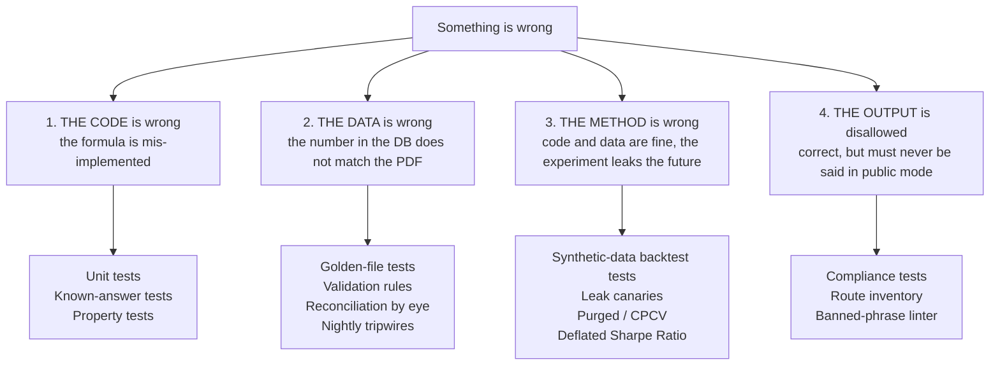

# 07 — Test Strategy: How to Prove It Works

> **What this document is for.** The owner asked for *"test check points checking the
> functionality and see if everything works."* This is that document. It defines how, at
> every phase from P0 to P13, you prove that what you just built actually works — and, more
> importantly, that it is **not quietly lying to you**. A financial data system fails
> differently from ordinary software: the common failure is not a crash, it is a number that
> is wrong but plausible, rendered on a chart that draws perfectly, feeding a backtest that
> reports a confident Sharpe ratio. This document is the machinery for catching that class of
> failure. It owns the *framework* — the seven test layers, the invariant suite, the
> cross-phase gates, the CI wiring, the manual QA scripts, the regression protocol. The
> per-phase build detail lives in [03_ROADMAP_PART1_PHASES_0-6.md](03_ROADMAP_PART1_PHASES_0-6.md)
> and [04_ROADMAP_PART2_PHASES_7-13.md](04_ROADMAP_PART2_PHASES_7-13.md); those documents own
> the phase-local specifics and this one owns the standard they must meet.

> **Nothing in this document exists yet.** As of 2026-08-28 the repository contains six
> markdown files, an empty `package.json`, and `node_modules/`. There is no `.git`, no Python,
> no code, no tests. Every command written below is a command that **will** exist once the
> phase that builds it is complete. Read them as specifications of what the command must
> print, not as things you can run today.

---

## Table of contents

| § | Section | What you get from it |
|---|---|---|
| [0](#0-how-to-read-this-document) | How to read this document | Conventions, markers, where the commands come from |
| [1](#1-the-testing-philosophy-for-this-project) | The testing philosophy for this project | Why financial software has an unusual testing problem, and what follows from it |
| [2](#2-the-seven-test-layers) | The seven test layers | Each layer: when it runs, what it proves, what it cannot prove, a worked example |
| [3](#3-the-invariant-test-suite) | The invariant test suite | One real test per SPEC §4.1 invariant, plus five derived from OPERATIONS |
| [4](#4-test-checkpoints-per-phase-p0p13) | Test checkpoints per phase, P0–P13 | The exit gate for each phase as a numbered checklist with exact commands |
| [5](#5-how-to-test-the-things-that-are-hard-to-test) | How to test the hard things | LLM extraction, live scrapers, backtests, memo quality, calibration |
| [6](#6-test-data-management) | Test data management | Fixtures, the golden corpus, synthetic generators, the contamination trap |
| [7](#7-regression-protocol) | Regression protocol | What happens when a bug is found; the no-silent-overwrite correction path |
| [8](#8-manual-qa-scripts) | Manual QA scripts | Literal step-by-step scripts a human runs, with expected observations |
| [9](#9-coverage-targets-and-what-they-do-and-do-not-mean) | Coverage targets | Why line coverage is a weak signal here and what to measure instead |
| [10](#10-ci-wiring) | CI wiring | Which layers run per-commit, nightly, and only at a phase gate |
| [11](#11-risk-register-for-the-test-strategy-itself) | Risk register for the test strategy | Which tests give real confidence and which are theatre |
| [12](#12-gaps-surfaced) | Gaps surfaced | G6 restated, plus G7–G13 found while writing this |
| [A](#appendix-a--test-layout-markers-and-naming) | Appendix A | Test directory layout, pytest markers, naming rules |
| [B](#appendix-b--command-cheat-sheet) | Appendix B | Every command in one place |
| [C](#appendix-c--the-master-gate-checklist) | Appendix C | Copy-paste gate checklist |

---

## 0. How to read this document

### 0.1 The risk markers

Per the shared agent brief, every approach in this document carries an honest rating. A
document where everything is green is useless.

| Marker | Means |
|---|---|
| 🟢 **SOLID** | Well understood, low variance, proven. Failure is obvious and cheap to fix. Stop worrying about this one. |
| 🟡 **WATCH** | It will work, but it has a known failure mode, a cost curve, or a dependency that can move. The early-warning signal is stated. |
| 🔴 **FRAGILE** | Genuinely likely to go wrong, or the effort estimate could be off by multiples. **Every 🔴 item below gives at least three distinct approaches with trade-offs and a recommendation.** |

Applied to *testing approaches themselves*, these markers answer a question the owner should
keep asking: **does this test give me real confidence, or is it theatre?** A test that passes
because the table is empty is theatre. A test that asserts `response.status_code == 200` on an
endpoint returning a wrong number is theatre. Section 11 lists the theatre explicitly.

### 0.2 Where the commands come from

Commands assume the stack settled in the shared brief and the source documents:

- **Python 3.12**, pinned in `.python-version` (OPERATIONS.md §2.6).
- **`uv`** as package manager with a committed `uv.lock` (OPERATIONS.md §2.6). So every
  command is prefixed `uv run` — that is what guarantees the same dependency versions on your
  Windows laptop and in CI.
- **pytest** as the test runner (DATA_FOUNDATION.md §7.3).
- **ruff + black** for lint and format, **Pydantic v2** at every boundary (DATA_FOUNDATION.md §7.3).
- **Alembic** for migrations, adopted from the first schema (OPERATIONS.md §2.4).
- Test tree at `/tests` with `unit`, `golden`, `compliance`, `synthetic-backtest`
  subdirectories (SPEC.md §3.1 monorepo layout).

Where a command is one this document *proposes* rather than one the source docs already
specify — for example `uv run python -m tools.phase_gate` — it is marked **[PROPOSED]**. Those
are small tools you build once in P0 and use for years.

### 0.3 What this document does not own

| Topic | Owner |
|---|---|
| Phase-by-phase build steps and per-phase TEST CHECKPOINT detail | [03_ROADMAP_PART1_PHASES_0-6.md](03_ROADMAP_PART1_PHASES_0-6.md), [04_ROADMAP_PART2_PHASES_7-13.md](04_ROADMAP_PART2_PHASES_7-13.md) |
| CI runner choice, hosting, secret storage, backup mechanics | [02_INFRASTRUCTURE.md](02_INFRASTRUCTURE.md) |
| Module input/output schemas the tests assert against | [08_DATA_CONTRACTS.md](08_DATA_CONTRACTS.md) |
| The full risk register for the project, not just for testing | [06_RISK_REGISTER.md](06_RISK_REGISTER.md) |
| Architecture of the mode gate, provenance, point-in-time | [01_ARCHITECTURE.md](01_ARCHITECTURE.md) |
| Definitions of every term | [09_GLOSSARY.md](09_GLOSSARY.md) |

Where this document and a roadmap document both describe a phase gate, **this document defines
the standard and the roadmap defines the specifics**. If they disagree, that is a bug — report
it rather than picking one.

---

## 1. The testing philosophy for this project

### 1.1 The problem, in plain terms

In ordinary software, bugs announce themselves.

You click **Save** in a web app and the page returns a 500 error. A stack trace appears in the
log. A user complains. The failure is loud, immediate, and attributable. Your test suite mostly
needs to answer one question: *did it crash?* Assert a 200 response, assert the row was
written, move on. This is why so much testing advice is about exceptions, status codes, and
"happy path versus error path".

**Almost none of that applies here.** In a financial data system the characteristic bug looks
like this:

> MTN Nigeria's FY2024 revenue is ₦3,360,000,000,000 — 3.36 trillion naira
> (DATA_FOUNDATION.md §3.3). The statement prints it as `3,360,000` under a header saying
> *"in thousands of naira"*. The extractor stores `3,360,000` and forgets the
> `unit_multiplier` of 1,000. Or it stores it correctly and the ratio engine multiplies again.

Now trace what happens:

- The database write succeeds. No exception.
- The API returns 200. No exception.
- The Streamlit page renders a revenue chart. It draws fine.
- The gross-margin ratio computes to a perfectly ordinary-looking percentage, because cost of
  sales was scaled the same wrong way.
- The DCF produces a valuation. It has a number in it.
- The ML feature `log_revenue` shifts by `ln(1000) = 6.9`, which the model happily fits.
- You look at the screen and see a company. Nothing tells you it is one thousand times too
  small or too large.

Nothing crashed. Nothing was red. And every downstream layer — ratios, screening, comps,
features, memos, signals — is now built on that number. OPERATIONS.md §1.6 names this exact
failure: *"you get a silent 1,000× error that looks plausible on a log axis."*

This is the shape of nearly every serious bug in this system.

### 1.2 The silent-failure catalogue

These are not hypotheticals. Every one is named in the source documents as a real, expected
failure mode. Read this list as the threat model your test suite exists to defeat.

| # | Silent failure | What you would see | Source |
|---|---|---|---|
| 1 | Unit multiplier applied zero times or twice | A plausible chart, off by 1,000× | OPERATIONS.md §1.6 |
| 2 | Bonus issue not adjusted — a 1-for-4 bonus drops the price ~20% overnight for no economic reason | A backtest reporting a fake 20% single-day loss; stop-losses "triggering" on events that never happened; garbage momentum features | OPERATIONS.md §1.1 |
| 3 | Scraper returns HTTP 200, parser matches nothing, **zero rows land, no error raised** | A chart that flat-lines. You notice weeks later. | OPERATIONS.md §2.3 |
| 4 | The LLM invents a number that is not in the PDF | A statement that balances and looks right | DATA_FOUNDATION.md §8.2 item 3 |
| 5 | A restated 2023 figure, published in 2024, used in a decision dated 2023 | An impressive backtest Sharpe ratio | SPEC.md §2C, "restatement bias" |
| 6 | Standard k-fold cross-validation on time series shuffles future into past | A model that looks predictive and is not | SPEC.md §2C, *"k-fold CV is INVALID for time series"* |
| 7 | 500 strategies tried, best one reported | A Sharpe of 2.0 that deflates to a DSR of 0.30 | SPEC.md §2C, Bailey / López de Prado |
| 8 | Ticker reused or reassigned — GTBank became GTCO in 2021 | One company's new prices silently joined to another's old history | OPERATIONS.md §1.4 |
| 9 | Fiscal periods mis-aligned — a December-FY company compared to a March-FY one as "FY2024" | A screen comparing two different economies during a currency collapse | OPERATIONS.md §1.5 |
| 10 | FX translated with one rate for everything instead of IAS 21's average / closing / historical split | A balance sheet that no longer balances, which then trips your own validation and sends *clean* extractions to human review | OPERATIONS.md §1.3 |
| 11 | Backtest fills at the ±10% band price, where no fill was possible | Returns that were never available to anyone | SPEC.md §2C |
| 12 | Missing line item stored as `0` instead of `NULL` | Ratios computed from a zero that actually means "we don't know" | SPEC.md §4.1 invariant 4 |
| 13 | An advice-shaped phrase reaches a public response | Regulatory exposure under ISA 2025 — no error, just a sentence | SPEC.md §1.2 |
| 14 | A source page freezes: identical content every day, HTTP 200 | Stale data presented as current | OPERATIONS.md §2.3 |

Notice the common structure of all fourteen:

1. **The output is plausible.** It is inside the range a human would accept without pausing.
2. **No exception is raised.** The code did exactly what it was told.
3. **It compounds.** The wrong number flows into ratios, features, backtests, memos, and
   eventually a position size.

TEAM_BRIEF.md Part 3 calls this out under "the quieter risks": *"Silent data corruption. The
worst failure mode: nothing crashes, numbers are just wrong."*

### 1.3 What follows from this — six principles

**Principle 1 — The absence of an exception is not evidence of correctness.**
"The pipeline ran green" tells you the code executed. It tells you nothing about whether the
numbers are right. Every test in this project must assert a **value**, a **relationship**, or a
**provenance link** — never merely that something completed. A test whose only assertion is
`assert result is not None` should be deleted: it costs maintenance and buys nothing.

**Principle 2 — Prefer failing loudly over defaulting quietly.**
Most silent bugs in the catalogue above start with a piece of code being *helpful*: a
`fillna(0)`, a bare `except: pass`, a default FX rate, a guessed unit. Code that refuses to
guess is far easier to test, because the failure becomes visible where it happens instead of
six layers downstream. This is the same rule SPEC.md §4.1 states as invariant 4 (*"Never infer
missing financial data"*) — and it is a testability rule as much as a correctness rule.

**Principle 3 — Tests check the code; tripwires check the corpus.**
These are two different things, both required, and confusing them is a common mistake:

| | **Tests** | **Tripwires** |
|---|---|---|
| Run against | Fixtures — small, fixed, hand-made inputs | The real, live database |
| Run when | Every commit, in CI | Nightly, on a schedule |
| Catch | "This function computes the wrong number" | "Something among the 40,000 stored figures is wrong" |
| Example | `test_current_ratio_known_answer` | "No `statement_line_items` row lacks a resolvable `source_document_id` and `page`" |
| Fails how | CI red, blocks the merge | Telegram alert into the same channel as the daily brief (OPERATIONS.md §2.3) |

A test suite alone cannot catch failure 3 in the catalogue — zero rows landing silently —
because that failure lives in the data, not the code. A tripwire catches it the same night.

**Principle 4 — Every guard needs a positive control.**
A guard that has never fired is indistinguishable from a guard that *cannot* fire. In a
laboratory, a *positive control* is a sample you know should test positive, run alongside the
real samples, to prove the test itself works.

So: **every invariant test ships with a twin that deliberately constructs the violation and
asserts the check catches it.**

```python
def test_every_figure_has_provenance(db):
    """The real check. Passes today."""
    orphans = db.query(LINE_ITEMS_WITHOUT_PROVENANCE_SQL)
    assert orphans == [], f"{len(orphans)} figures have no source document"


def test_provenance_check_catches_a_violation(db):
    """POSITIVE CONTROL. Proves the check above is capable of failing."""
    db.insert_line_item(source_document_id=None, value=42)
    orphans = db.query(LINE_ITEMS_WITHOUT_PROVENANCE_SQL)
    assert len(orphans) == 1
```

Without the second test, the first passes on an empty database in P0 and keeps passing for
months while quietly checking nothing. This is the cheapest anti-theatre measure in the
document, and it is **mandatory** for every test in `tests/invariants/` and
`tests/compliance/`.

**Principle 5 — Test the method, not only the code.**
There is a category of bug where the code is correct, the data is correct, and *the answer is
still wrong* — because the experiment was designed badly. Look-ahead bias is the canonical
example: every line of the backtester works exactly as written, and the result is fiction,
because a feature carried information from the future. SPEC.md §2C's entire bias taxonomy lives
in this category. No amount of unit testing touches it. Section 2.5 (synthetic-data tests) and
Section 5.3 exist specifically for this.

**Principle 6 — The system's job is to be believed.**
The whole product thesis (PROJECT_CONTEXT.md §9.3) is *point-in-time integrity and provenance
you can defend* — the thing institutional buyers pay a premium for and cheap vendors skip. A
system that is believed must be tested for believable wrongness, not just for crashes. This is
why the golden set (Section 2.3) is described in TEAM_BRIEF.md §2.2-C as *"the highest leverage
task in the project"*: without hand-verified ground truth you cannot state an accuracy number
honestly to yourself, to your family, or to a buyer.

### 1.4 The four kinds of wrong

Every test layer in Section 2 exists to catch one of four kinds of wrong. Keeping them distinct
is what stops you from over-testing one and ignoring another.



Most engineering-blog testing advice addresses only box 1. **Box 3 is the one that costs real
money**, because it produces a confident, well-tested, fully green system that recommends
trades on an edge that does not exist. SPEC.md Part 6 ranks *"Overfitting / data-snooping"* as
risk number 1 for exactly this reason.

### 1.5 The honest statement of what testing can and cannot do here

Testing **can** prove:

- A formula matches a hand-computed answer.
- A stored number matches the PDF it came from — for the filings you checked.
- A public endpoint cannot structurally emit an advice-shaped field.
- The backtester reports the right numbers on data whose right answer you constructed.
- A number never changed without a version, an author, and a note.

Testing **cannot** prove:

- That your extraction is right on the 97 filings you did not hand-check. It gives you a
  *measured rate* on a sample and a *tripwire* on the rest.
- That a strategy will make money. The backtest gate (SPEC.md §2C) is a filter that removes
  strategies which are obviously fooling you. It is not evidence of future profit. SPEC.md Part
  6 is blunt: *"expect a thin, fragile edge at best, especially on NGX."*
- That an LLM-written memo is true. Citation checks prove every number in it came from your
  database; they do not prove the argument is sound.
- That a source will still be there tomorrow.

Say this out loud once, early, so a green CI badge never becomes a substitute for judgment.
**Green means "no known lie was detected by the checks we wrote."** That is genuinely valuable,
and it is strictly less than "correct".

---

## 2. The seven test layers

Each layer catches a different class of lie. None subsumes another, and the ordering is roughly
cheapest-and-fastest first.

### Layer 1 — Unit tests

**Runs:** every commit, seconds. **Proves:** a pure function does what its name says.
**Cannot prove:** that the function is being called with the right data, or that the right
function is being called at all.

```python
def test_null_input_yields_null_ratio():
    assert compute_ratios({"net_income": None, "revenue": 100})["net_margin"] is None
```

That test encodes [SPEC.md §4.1](../SPEC.md)'s "never infer missing financial data". The
temptation it guards against is real: returning `0` makes a chart render.

🟢 **SOLID.** Cheap, fast, and the failure is loud.

### Layer 2 — Known-answer tests

**Runs:** every commit. **Proves:** the arithmetic matches a value computed independently, by
hand, before the code existed. **Cannot prove:** the formula is the *right* formula for the
question.

Required by [SPEC.md §4.4](../SPEC.md) for valuation and indicator math. The discipline that
makes them worth anything: **compute the expected value in a spreadsheet first, then write the
test.** A test whose expected value came from running the code proves only that the code is
deterministic.

```python
# Expected values hand-computed in tests/known_answer/rsi14_worksheet.md
def test_rsi14_matches_hand_computed():
    prices = [44.34, 44.09, 44.15, 43.61, 44.33, 44.83, 45.10, 45.42,
              45.84, 46.08, 45.89, 46.03, 45.61, 46.28, 46.28]
    assert rsi(prices, period=14)[-1] == pytest.approx(70.53, abs=0.01)
```

**Why this specific test matters:** libraries differ on smoothing convention — Wilder's smoothing
versus a simple moving average. Both are "RSI". They give different numbers. Without a
hand-computed vector you will never discover which one you are using, and a subtly different RSI
is a subtly different model in P8.

🟢 **SOLID**, and disproportionately valuable for the effort.

### Layer 3 — Golden-file tests

**Runs:** every commit (fast subset), full set nightly. **Proves:** extraction of a fixed PDF
produces the expected normalized JSON. **Cannot prove:** extraction works on documents unlike the
golden set.

This is **G6/TG6** — [TEAM_BRIEF.md §2.2-C](../TEAM_BRIEF.md) calls building the golden set *"the
highest leverage task in the project"*, and **no task in [SPEC.md §4.2](../SPEC.md) creates it**,
while T4's acceptance criteria assume it exists. It is built in P3.

**What makes a golden set trustworthy:**

- **Hand-verified, and double-checked by a second person.** One person's reading is one person's
  assumptions.
- **≥10 pairs, including ≥2 banks.** [TEAM_BRIEF.md Part 3](../TEAM_BRIEF.md): *"GTCO's income
  statement has no 'revenue' line… A schema built on MTN will not survive a bank."* A golden set
  of only industrials tells you the extractor works right up until it meets a bank.
- **Version-controlled**, PDF and JSON together.
- **Deliberately varied** — scanned and native, borderless and bordered, different year-ends.

> 🔴 **FRAGILE — the contamination trap.** If you tune the extractor until the golden set passes,
> the golden set stops measuring accuracy and starts measuring how hard you tuned. It becomes a
> training set wearing a test set's clothes. Three approaches:
>
> **1. Hold back a locked subset (recommended).** Ten pairs: seven for iteration, three sealed and
> run only at the phase gate. *For:* Cheap, and gives an honest number when it matters. *Against:*
> Three pairs is a small sample, so the estimate is noisy.
>
> **2. Grow the set continuously.** Every reviewed filing becomes a new golden pair. *For:* The
> set outgrows any tuning. *Against:* Reviewer time is the project's scarcest resource
> ([TEAM_BRIEF.md Part 3](../TEAM_BRIEF.md) item 5).
>
> **3. Rely on random sampling of production output instead** (§8.2). *For:* Measures the real
> distribution, not a curated one. *Against:* Slower feedback; cannot run in CI.
>
> **Recommendation: 1 and 3 together.** The locked subset for the gate, random sampling for the
> truth. Never quote the tuned subset's number as your accuracy.

### Layer 4 — Property-based tests

**Runs:** every commit. **Proves:** an invariant holds across many generated inputs, including
ones you would not have thought to write. **Cannot prove:** anything about specific real
documents.

```python
@given(prices=st.lists(st.floats(1, 10_000), min_size=30),
       split_ratio=st.integers(2, 10))
def test_adjusted_series_is_continuous_across_split(prices, split_ratio):
    adj = apply_corporate_actions(prices, split_at=15, ratio=split_ratio)
    jump = abs(adj[15] / adj[14] - 1)
    assert jump < 0.5   # a real move, not a mechanical cliff
```

Good invariants here: a balance sheet balances; adjusted prices are continuous across splits;
`known_as_of >= as_of_date` always; a ratio with any null input is null; converting a currency and
converting back returns the original within tolerance.

🟡 **WATCH.** Genuinely powerful, and it takes practice to state a property that is both true and
useful. A property that is nearly true produces flaky failures, which trains you to ignore the
suite. *Early-warning signal:* any property test you have marked `xfail` or "flaky".

### Layer 5 — Synthetic-data tests for the backtester

**Runs:** every commit, and always before a phase gate. **Proves:** the backtester reports the
right answer when the right answer is known in advance.

[SPEC.md §4.4](../SPEC.md) calls these **mandatory**, and gives both directions:

```python
def test_profitable_synthetic_series_reports_correct_numbers():
    """A series engineered to yield a known return at a known Sharpe."""
    data = make_synthetic(annual_return=0.20, annual_vol=0.15, seed=42)
    r = run_backtest(always_long, data, cost_model=ZeroCostModel())
    assert r.annual_return == pytest.approx(0.20, abs=0.01)
    assert r.sharpe == pytest.approx(1.33, abs=0.05)

def test_random_walk_shows_no_edge_net_of_costs():
    """The single most important test in this project."""
    data = make_random_walk(seed=7, days=2500)
    r = run_backtest(momentum_strategy, data, cost_model=NGXCostModel())
    assert r.net_return < 0.01
    assert r.dsr < 0.5
```

**In plain words: this proves the backtester isn't lying to you.** If a pure random walk shows an
edge, something in the engine is manufacturing profit — a lookahead, a fill that could not have
happened, a cost that was not charged. Every other backtest result is then void, and you would
have no way to know.

🟢 **SOLID and non-negotiable.** It is the highest-value test in the entire document set, and
running it costs seconds.

### Layer 6 — Compliance tests

**Runs:** every commit, and exhaustively before P12. **Proves:** no public endpoint can emit
advice. **Cannot prove:** that advice is absent from prose the linter did not anticipate.

Enforcing [SPEC.md §1.2](../SPEC.md)'s five mechanisms and [CLAUDE.md](../CLAUDE.md)'s
legal-risk line.

```python
@pytest.mark.parametrize("vector", [
    {"json": {"mode": "personal"}},
    {"headers": {"X-Mode": "personal"}},
    {"params": {"mode": "personal"}},
    {"cookies": {"mode": "personal"}},
])
def test_mode_cannot_be_forced(vector):
    assert client.get("/public/ping", **vector).json()["mode"] == "public"

def test_every_registered_route_is_gate_covered():
    """The test that turns 'we applied it globally' into something you know."""
    for route in app.routes:
        assert route_has_mode_middleware(route), f"{route.path} is unguarded"
```

That second test is the important one. Global middleware is the right approach
([01_ARCHITECTURE.md](01_ARCHITECTURE.md) §3), but "we applied it globally" is a belief until a
test enumerates every route and checks.

🟢 **SOLID structurally** for types and routing; 🟡 **WATCH** for the banned-phrase linter, which
is a net rather than a wall.

### Layer 7 — Reconciliation / by-eye tests

**Runs:** by a human, at every phase gate and on a sampling schedule. **Proves:** the number in
the database matches the number in the source document. **Cannot prove:** anything at scale.

This is the only layer that validates the entire chain against external reality. Every automated
layer tests the system against itself; this one tests it against the world. Scripts are in §8.

🟢 **SOLID** for what it covers, 🔴 **FRAGILE as a strategy on its own** — it does not scale, and
it depends on a human being conscientious on a Tuesday.

### Which layer catches which lie

| The lie | Caught by |
|---|---|
| A ratio computes wrongly | Known-answer (L2) |
| A missing value became zero | Unit (L1), property (L4) |
| Extraction misread a page | Golden (L3), reconciliation (L7) |
| A split corrupted the price series | Property (L4), by-eye plot (L7) |
| The backtester invents profit | **Synthetic (L5)** |
| Lookahead bias | Synthetic (L5), invariant suite (§3) |
| Advice leaks to a public user | Compliance (L6) |
| A scraper silently returns nothing | Connector health (§3, `rows_written`) |
| The mapping is right but means something different | **Reconciliation (L7) only** |

That last row is worth sitting with. "Gross earnings" mapped to `revenue` produces a real number
from a real page with valid provenance. Every automated test passes. Only a human who understands
bank accounting catches it.

---

## 3. The invariant test suite

[SPEC.md §4.1](../SPEC.md)'s build-time invariants, each as a real test. **These may never be
skipped, marked `xfail`, or made conditional.** Mark them `@pytest.mark.invariant` and fail CI if
any is deselected.

| # | Invariant | The test | Fails when |
|---|---|---|---|
| **I1** | Backtest gate before capital | Insert a `signals` row referencing a failing `backtest_run_id` | The DB trigger does not raise |
| **I2** | Never infer missing financial data | Ingest a filing lacking a line item | `value` is not NULL |
| **I3** | Point-in-time only | Query a known restatement at a pre-restatement date | The restated figure is returned |
| **I4** | Mode is server-derived | All four injection vectors | Any returns `personal` |
| **I5** | One task, one PR, tests required | CI config check | Branch protection or the test gate is off |

Plus five derived from [OPERATIONS.md](../OPERATIONS.md) and [CLAUDE.md](../CLAUDE.md):

| # | Invariant | The test |
|---|---|---|
| **I6** | Provenance on every figure | `SELECT count(*) FROM statement_line_items WHERE source_document_id IS NULL` → `0` |
| **I7** | No silent overwrites | No `UPDATE` path exists on figure tables; corrections insert a version |
| **I8** | Adjusted prices used for analysis | Indicators computed across a known split are continuous |
| **I9** | One unit-conversion point | No module outside `common` performs a scale or FX conversion |
| **I10** | Licensing before ingestion | A connector without `declare_licence()` cannot register |

```python
@pytest.mark.invariant
def test_I3_restatement_not_visible_before_it_happened():
    facts = get_facts_as_known(security_id=12, keys=["revenue"],
                               decision_date=date(2025, 6, 1))
    assert facts["revenue"].value == Decimal("100000000000")  # original
    assert facts["revenue"].known_as_of == date(2025, 3, 14)
```

**I3 is the one to write first and never remove.** Lookahead bias is the most expensive bug in
the project and its symptom is success.

---

## 4. Test checkpoints per phase, P0–P13

The per-phase checkpoints live in the roadmap documents, where they sit next to the work they
verify: [03_ROADMAP_PART1_PHASES_0-6.md](03_ROADMAP_PART1_PHASES_0-6.md) for P0–P6 and
[04_ROADMAP_PART2_PHASES_7-13.md](04_ROADMAP_PART2_PHASES_7-13.md) for P7–P13. This document owns
the framework and the cross-phase gates below; duplicating the detail here would guarantee the two
drift apart.

**The universal gate — every phase, without exception:**

```bash
pytest -m invariant          # all ten, zero skips
pytest tests/compliance      # all pass
pytest tests/unit tests/known_answer
lint-imports                 # one-way package direction
alembic upgrade head && alembic downgrade base && alembic upgrade head
```

**Additional gates that switch on and then stay on:**

| From | Gate |
|---|---|
| P1 | Every connector writes a `connector_runs` row; `status='ok' AND rows_written=0` alerts |
| P2 | Known-answer tests for every ratio and DCF path |
| P3 | Golden set ≥10 pairs incl. ≥2 banks; correction versioning tested |
| P4 | Locked golden subset at threshold; extraction sampling (§8.2) run and recorded |
| P6 | Indicators verified continuous across a known split |
| **P7** | **Both synthetic tests pass.** Cost model reconciles to a real contract note |
| P8 | Calibration improves Brier; reliability diagram inspected by eye |
| P11 | Paper trading imports the *same* cost-model class as the backtester |
| P12 | Compliance suite exhaustive over every registered route; zero skips |

A phase is ✅ only when its gate passes. Code written but unverified is 🧪, and 🧪 is not
permission to start the next phase.

---

## 5. How to test the things that are hard to test

### 5.1 LLM extraction — non-deterministic output

**The problem:** the same PDF can produce slightly different JSON on two runs, so exact-match
assertions are flaky.

**Techniques, in order of value:**

1. **Assert on values, not on prose.** `line_items[canonical_key].value` must match exactly.
   `extraction_notes` is free text and is not asserted.
2. **Set temperature to 0** and pin the model version. Record both in `extraction_jobs`. When
   quality shifts, the first question is what changed.
3. **Assert the deterministic validators**, not the model: does the balance sheet balance, does
   cross-year tie. These are arithmetic and they are stable regardless of phrasing.
4. **Threshold, not exact match.** "≥ N of M golden line items exact" rather than "all".
5. **Run flaky-sensitive cases three times** and require consistency. Instability itself is a
   finding worth acting on.

🟡 **WATCH.** *Early-warning signal:* golden pass rate varying by more than a couple of points
between runs on unchanged code.

### 5.2 Scrapers against a live, changing site

**The problem:** the site is not under your control, and CI must not depend on it.

- **CI tests parse against stored raw fixtures**, never the live site. `parse()` is pure, so this
  is exactly what it is for.
- **A separate nightly job hits the live source** and alerts on structural change.
- **The real detector is `rows_written = 0` with `status='ok'`.** That is the classic silent
  failure: the page loads, the parser runs, the selector matches nothing, no exception is raised.
- **Hash the listing page** and alert on change ([DATA_FOUNDATION.md §3.5](../DATA_FOUNDATION.md)).

🔴 **FRAGILE — free sources have no contract** ([TEAM_BRIEF.md Part 3](../TEAM_BRIEF.md) item 3).
Three approaches: (1) cache every raw response permanently, so you keep what you fetched even if
the site vanishes — recommended, and it costs almost nothing; (2) subscribe to a paid fallback now
(EODHD `.XNSA`) — removes the risk, costs money before you know you need it; (3) write the paid
fallback connector but do not subscribe, so switching is a decision rather than a scramble.
**Recommendation: 1 and 3 together**, which is [TEAM_BRIEF.md](../TEAM_BRIEF.md)'s own strategy.

### 5.3 A backtest whose correct answer is unknown

You cannot test a real strategy's result, because nobody knows it. You *can* test the engine:

- **Synthetic data where the answer is known** (Layer 5) — the primary tool.
- **Degradation testing.** Shift the start date by three months; drop the five best performers;
  add 50bp to costs. A real edge degrades gracefully; an overfit one collapses.
- **Cross-engine reconciliation.** Run the same strategy through your engine and through
  `vectorbt` with costs disabled; gross results should agree. [SPEC.md §2C](../SPEC.md) recommends
  rolling your own for the NGX specifics; this is how you check it once before capital moves.
- **Blotter inspection** (§8.4) — a fill on a halted day, a fill exceeding daily volume, or a
  same-day round trip is a bug that summary statistics will never show you.

### 5.4 Multi-agent memo quality

**Testable mechanically:** every claim carries a `document_id` and `page`; every cited page exists;
no number appears that is absent from the database; public memos have `verdict = null`; Bull and
Bear ran without shared context.

**Not testable mechanically:** whether the argument is any good. §8.5 gives the human script.

🟡 **WATCH.** Citation checks prove the numbers came from your database. They do not prove the
reasoning is sound, and a fluent memo built on a real number can still be wrong.

### 5.5 Calibrated probabilities

**Brier score** — the mean squared error of probability forecasts. Lower is better; it rewards
both being right and being appropriately uncertain. Assert calibrated Brier < uncalibrated.

**Reliability diagram** — bucket predictions (0.0–0.1, 0.1–0.2, …) and plot predicted probability
against observed frequency. A well-calibrated model sits near the diagonal.

```python
def test_calibration_improves_brier():
    assert brier(calibrated.predict_proba(X_test), y_test) \
         < brier(raw.predict_proba(X_test), y_test)

def test_reliability_within_tolerance():
    for lo, hi, predicted, observed in reliability_buckets(model, X, y):
        assert abs(predicted - observed) < 0.10, f"bucket {lo}-{hi} miscalibrated"
```

**Why this is not cosmetic:** Kelly and fractional-Kelly sizing ([SPEC.md §2D](../SPEC.md)) take a
probability as input. If the model says 0.8 for events that happen 55% of the time, sizing
over-bets in proportion to the miscalibration — systematically, and in the worst direction.

---

## 6. Test data management

| Kind | Location | Rules |
|---|---|---|
| **Golden PDFs + JSON** | `tests/golden/` | Version-controlled together. Never edited to make a test pass — if the expectation is wrong, a *human* re-verifies against the PDF and records why. |
| **Locked golden subset** | `tests/golden/locked/` | Run only at the phase gate. Never used for tuning. |
| **Raw connector fixtures** | `tests/fixtures/raw/` | Stored HTTP responses so `parse()` is testable offline |
| **Known-answer worksheets** | `tests/known_answer/*.md` | The spreadsheet reasoning, in the repo, next to the test |
| **Synthetic generators** | `tests/synthetic/` | Seeded. Same seed, same series, forever. |
| **Contract-note reconciliation** | `tests/fixtures/contract_notes/` | Real notes with account details redacted |

**The contamination trap, stated plainly:** any data you tune against stops being test data. This
applies to the golden set (§2, Layer 3) and to model training in P8. Keep the locked subset
locked, keep the P7 holdout one-touch, and be honest with yourself about which numbers came from
which.

---

## 7. Regression protocol

When a bug is found, in this order:

1. **Reproduce it** with the smallest possible input.
2. **Write the failing test first**, before the fix. A bug without a test returns.
3. **Fix it.**
4. **Ask what class it belongs to** — if one ratio mishandled a null, check every ratio.
5. **Correct the affected data**, and do it the versioned way: a new row with `superseded_by`,
   `corrected_by`, `correction_reason`. Never an `UPDATE`
   ([CLAUDE.md](../CLAUDE.md)).
6. **If an extraction job was systematically wrong**, invalidate the batch by
   `extraction_job_id` rather than hunting rows individually. This is why that column exists.
7. **Record it** in the ADR log if it changes a decision.

**Data bugs are worse than code bugs here**, because the wrong number may already have been read,
quoted, or traded on. The versioned correction path is what makes that recoverable and visible.

---

## 8. Manual QA scripts

Literal scripts. Run them; do not skim them.

### 8.1 Macro figure reconciliation — P1, then monthly

1. Open the dashboard. Note the CBN MPR value **and its as-of date**.
2. Open `cbn.gov.ng/rates/` in another tab.
3. **Confirm both the value and the date match.**
4. Repeat for NBS CPI against the actual NBS release PDF.

> A right number with the wrong date is a wrong number. It means your `as_of_date` mapping is
> broken, and that error propagates silently into every valuation discounted at that rate.

### 8.2 Extraction sampling — P4, then per ingestion batch

1. `SELECT ... FROM statement_line_items WHERE extraction_method='llm_hybrid' ORDER BY random() LIMIT 20;`
2. **These must not be golden-set rows** — the extractor may be fitted to those.
3. For each: open `source_documents.storage_key`, go to `page`, find the figure.
4. Record: exact match / wrong value / wrong page / wrong canonical key / should have been null.
5. Compute the error rate. **This, not the golden pass rate, is your true accuracy.**
6. Plot it over time. If it is not improving, the few-shot feedback loop is broken — diagnose
   immediately, because a flat correction rate means P4 has no exit
   ([TEAM_BRIEF.md Part 3](../TEAM_BRIEF.md) item 5).

**Sampling rate:** 20 per batch at first; drop to 10 once the rate is stable and falling; return
to 20 whenever the prompt, the model, or the chart of accounts changes.

### 8.3 Corporate action verification — P3, then per action

1. Pick a security with a known split.
2. Plot `close_raw` and `close_adj` on one chart across the ex-date.
3. **Raw has a cliff. Adjusted does not.** If adjusted also has a cliff, the factor is not applied.
4. Confirm the position quantity and cost basis also adjusted (P10) — prices are only half of it.

### 8.4 Backtest blotter inspection — P7, before any capital

1. Export one month of trades.
2. Read every line against the price data. Specifically look for:
   - a fill on a day the stock was **halted** (±10% band)
   - a fill larger than that day's **volume × participation cap**
   - a **same-day round trip** (T+3 makes it impossible)
   - a fill at a price outside that day's high–low range
3. Any one of these is a bug the summary statistics will never surface.

### 8.5 Memo adversarial read — P9, per memo template change

1. Read the memo. Pick the **three strongest claims**.
2. Open each cited document at the cited page. **Confirm the number is there and means what the
   memo says it means.**
3. Read bull and bear back to back. If the bear case is visibly weaker, the anti-sycophancy design
   has failed and the Arbitrator is inheriting a biased input.
4. Ask: did this tell me something I did not know? A fluent memo that says nothing is a cost with
   no benefit.

### 8.6 Mode-gate adversarial session — P0, and again before P12

Thirty minutes, honestly. Try: `mode` in body, header, query, cookie; nested JSON; a
`/personal/` path with odd casing; a trailing slash; an expired token; a token for a
different principal; a personal token against a public route and vice versa.

**You are looking for any path where the answer is not `public`.** Before P12, have someone else
do it too — they lack your assumptions about how it works. Then read `audit_log` and confirm every
attempt was recorded.

---

## 9. Coverage targets and what they do and do not mean

**Line coverage is a weak signal here** and chasing it produces tests that execute code without
asserting anything meaningful.

| Instead of | Measure |
|---|---|
| Line coverage % | **Invariant coverage** — all ten present and passing, always |
| Line coverage % | **Golden-set size and breadth** — how many pairs, how many banks, scanned vs native |
| Line coverage % | **Sampled extraction error rate** (§8.2) and its trend |
| Line coverage % | **Correction rate** and whether it is falling |
| Line coverage % | **Known-answer coverage** — what fraction of financial formulas have a hand-computed vector |
| Line coverage % | **Route gate coverage** — every registered route asserted covered |

A useful floor: **90%+ on `packages/valuation`, `packages/indicators`, `packages/backtest` and
`packages/compliance`** — pure math and the compliance gate, where a line not executed by any test
is a line nobody has checked. Elsewhere, do not optimise the number.

---

## 10. CI wiring

| Stage | Per commit | Nightly | Phase gate |
|---|---|---|---|
| `ruff` lint + format | ✅ | | |
| `mypy` | ✅ | | |
| `lint-imports` (one-way direction) | ✅ | | |
| Unit + known-answer | ✅ | | |
| **Invariant suite** | ✅ | ✅ | ✅ |
| **Compliance suite** | ✅ | ✅ | ✅ (exhaustive) |
| **Synthetic backtest** | ✅ | ✅ | ✅ |
| Property-based | ✅ (fast) | ✅ (full) | |
| Golden set | ✅ (subset) | ✅ (full) | ✅ (**locked** subset) |
| Migration up/down/up | ✅ | | ✅ |
| Secret scan | ✅ | | |
| Live-source structural check | | ✅ | |
| Manual QA scripts (§8) | | | ✅ |

Full YAML skeleton in [02_INFRASTRUCTURE.md](02_INFRASTRUCTURE.md) §7.

**One rule:** a red invariant or compliance test **blocks the merge**, with no override. Everything
else can be triaged.

---

## 11. Risk register for the test strategy itself

Which of these tests give real confidence, and which are theatre.

| Test layer | Marker | Honest assessment |
|---|---|---|
| **Synthetic backtest (L5)** | 🟢 SOLID | The highest-value test in the project. Seconds to run, catches a whole class of engine bug. |
| **Invariant suite (§3)** | 🟢 SOLID | Directly encodes the rules with the worst consequences. |
| **Known-answer (L2)** | 🟢 SOLID | Catches library-convention mismatches nothing else would. |
| **Compliance — types and routing (L6)** | 🟢 SOLID | Structural. A bug cannot bypass a CHECK constraint or an allow-list. |
| **Reconciliation (L7)** | 🟢 SOLID for what it covers | The only layer testing against external reality. Does not scale. |
| Golden files (L3) | 🟡 WATCH | Real value, but contamination-prone. The locked subset is the mitigation. |
| Property-based (L4) | 🟡 WATCH | Powerful; flaky properties train you to ignore failures. |
| **Banned-phrase linter** | 🟡 WATCH | A net, not a wall. Cannot anticipate every phrasing. Never the only defence. |
| **Line coverage %** | 🔴 Theatre | Optimising it produces assertion-free tests. Measure §9's list instead. |
| **A green CI badge as proof of correctness** | 🔴 Theatre | Green means "no known lie was detected by the checks we wrote." Strictly less than correct. |

---

## 12. Gaps surfaced

Confirmed: **G6/TG6** — no task builds the golden test set, though T4's acceptance depends on it.
Built in P3; see §2 Layer 3.

Further gaps found while writing this document:

| ID | Gap | Consequence |
|---|---|---|
| **TG13** | **No task defines the extraction accuracy *threshold*.** T4's criterion is "≥ threshold" and the number is never set. [TEAM_BRIEF.md Part 3](../TEAM_BRIEF.md) gives 85% as the *abandon* trigger, which is a floor, not a target. | The P4 gate is unfalsifiable until a number is written down. **Set it before P4 starts.** |
| **TG14** | **Nothing specifies who double-checks the golden set.** [TEAM_BRIEF.md §2.2-C](../TEAM_BRIEF.md) requires a second person; the roles list assumes one exists. | A solo builder must either recruit one or accept that the golden set encodes one person's assumptions — and say so. |
| **TG15** | **No test asserts the paper trader and backtester share a cost model *instance*.** [SPEC.md §2H](../SPEC.md) says "the SAME" model; only an import-identity assertion proves it. | Two implementations drift, and you discover it with real money. Added as a P11 check. |
| **TG16** | **The banned-phrase list has no owner or review cadence.** | It ages badly, and a stale list gives false confidence at exactly the phase with legal exposure (P12). |

---

## Appendix A — test layout, markers and naming

```
tests/
  unit/            fast, pure, no I/O
  known_answer/    hand-computed vectors + the .md worksheets that justify them
  golden/          PDF + expected JSON pairs
    locked/        gate-only; never used for tuning
  property/        hypothesis-based invariants
  synthetic/       backtester correctness, seeded generators
  compliance/      mode gate, routing, response types, banned phrases
  fixtures/
    raw/           stored HTTP responses
    contract_notes/  real notes, redacted
```

**Markers:** `@pytest.mark.invariant` (never skippable), `slow`, `live` (touches the network,
excluded from CI), `gate` (phase-gate only).

**Naming:** `test_<what>_<condition>_<expected>`. `test_ratio_with_null_input_returns_none` beats
`test_ratio_2`.

---

## Appendix B — command cheat sheet

```bash
pytest -m invariant                       # the ten that may never be skipped
pytest tests/compliance -v                # mode gate
pytest tests/synthetic -v                 # is the backtester lying?
pytest tests/known_answer -v              # does the math match hand computation
pytest tests/golden -v                    # extraction, tuned subset
pytest tests/golden/locked -v             # extraction, honest number (gate only)
pytest tests/golden -k bank               # the coverage gap that bites
pytest -m "not slow and not live"         # the fast loop
lint-imports                              # one-way package direction
alembic upgrade head && alembic downgrade base && alembic upgrade head
gitleaks detect --no-git
psql quant -c "SELECT connector_name, rows_written FROM connector_runs \
               WHERE status='ok' AND rows_written=0;"   # silent failures
```

---

## Appendix C — the master gate checklist

Copy this into the phase's PR description.

```
PHASE GATE — P__

[ ] pytest -m invariant            — 10/10, zero skips
[ ] pytest tests/compliance        — all pass
[ ] pytest tests/synthetic         — both directions pass
[ ] pytest tests/unit tests/known_answer
[ ] pytest tests/golden/locked     — at threshold (from P4)
[ ] lint-imports                   — clean
[ ] migrations up/down/up          — clean
[ ] gitleaks                       — no findings
[ ] phase-specific checks from the roadmap document — all pass
[ ] manual QA script(s) for this phase — run, results recorded
[ ] tracker in 00_START_HERE.md §6 updated
[ ] any new gap recorded as TG__

Sampled extraction error rate (P4+): ____%   Trend: ↑ / → / ↓
Notes / anything deferred:
```
